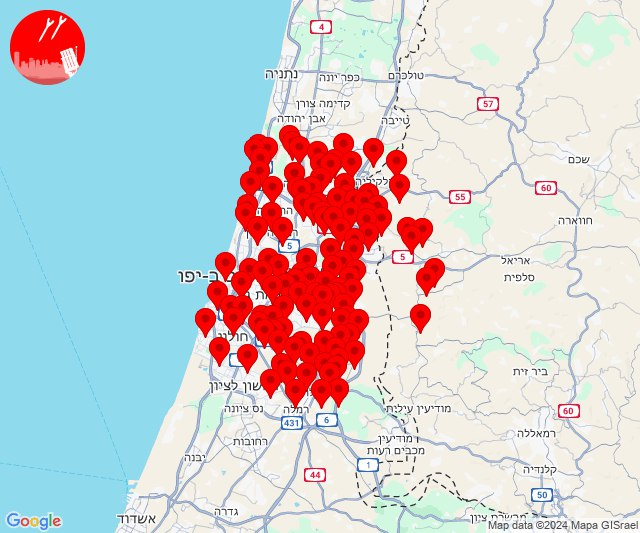

# Alerts for 2024-12-16

## 13:20

🔴 צבע אדום (16/12/2024):

15:18:
• דן: תל אביב - דרום העיר ויפו, תל אביב - מזרח, תל אביב - מרכז העיר, תל אביב - עבר הירקון, אור יהודה, אזור, בני ברק, בת ים, גבעת השלושה, גבעת שמואל, גבעתיים, גת רימון, הרצליה - מרכז וגליל ים, חולון, יהוד מונוסון, כפר סירקין, מעש, מקווה ישראל, סביון, פתח תקווה, קריית אונו, רמת גן - מזרח, רמת גן - מערב, רמת השרון, גני תקווה, מגשימים, בית עלמין מורשה, סינמה סיטי גלילות, מתחם פי גלילות (דקה וחצי)
• שרון: גבעת חן, אלישמע, ג'לג'וליה, גני עם, הוד השרון, חגור, חורשים, ירקונה, כפר ברא, כפר מל''ל, כפר קאסם, נווה ירק, עדנים, רמות השבים, שדי חמד, תחנת רכבת ראש העין, מרכז אזורי דרום השרון (דקה וחצי)
• ירקון: כפר דניאל, אלעד, בארות יצחק, בני עטרות, גבעת כ''ח, מזור, נופך, נחלים, נחשונים, עינת, ראש העין, רינתיה, תעשיון חצב, אזור תעשייה חבל מודיעין, בית נחמיה, בית עריף, ברקת, חדיד, טירת יהודה, כפר טרומן, שוהם, אזור תעשייה אפק ולב הארץ, איירפורט סיטי (דקה וחצי)
• השפלה: ראשון לציון - מזרח, ראשון לציון - מערב, אחיסמך, באר יעקב, בן שמן, גינתון, כפר נוער בן שמן, לוד, ניר צבי, רמלה, תעשיון צריפין, אחיעזר, בית דגן, זיתן, חמד, חניון הנתיב מהיר, יגל, כפר חב''ד, משמר השבעה, צפריה, גנות (דקה וחצי)

15:19:
• דן: הרצליה - מערב, כפר שמריהו (דקה וחצי)
• שרון: רעננה, אורנית, בית ברל, גן חיים, ירחיב, כפר סבא, מתן, נווה ימין, ניר אליהו, נירית, צופית, רמת הכובש, שדה ורבורג, אלקנה, ארסוף, בני ציון, בצרה, חרוצים, רשפון, שערי תקווה, שפיים, מתחם "חנה וסע" שפיים (דקה וחצי)

15:20:
• שרון: אייל, אלפי מנשה, עץ אפרים, צופים (דקה וחצי)
• שומרון: עלי זהב, פדואל, עופרים (דקה וחצי)

צופר - צבע אדום

## 13:20

