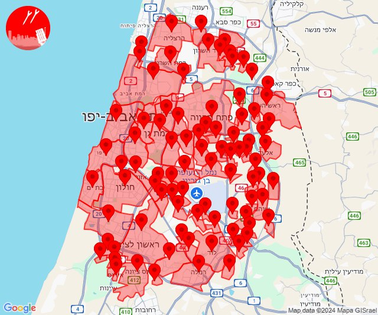
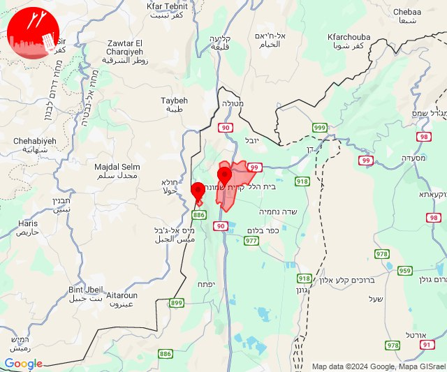
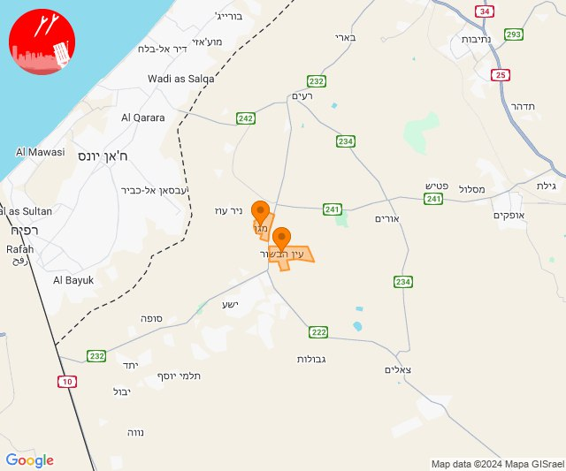
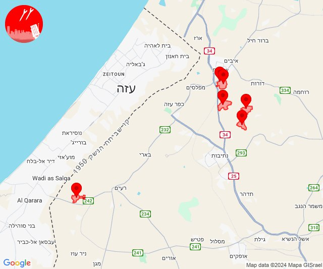

# Alerts for 2024-12-19

## 00:36

🔴 צבע אדום (19/12/2024):

02:36:
• דן: תל אביב - דרום העיר ויפו, תל אביב - מזרח, תל אביב - מרכז העיר, תל אביב - עבר הירקון, אור יהודה, אזור, בני ברק, בת ים, גבעת השלושה, גבעת שמואל, גבעתיים, גת רימון, הרצליה - מרכז וגליל ים, חולון, יהוד מונוסון, כפר סירקין, מעש, מקווה ישראל, סביון, פתח תקווה, קריית אונו, רמת גן - מזרח, רמת גן - מערב, רמת השרון, גני תקווה, מגשימים, בית עלמין מורשה, סינמה סיטי גלילות, מתחם פי גלילות (דקה וחצי)
• שרון: גבעת חן, גני עם, הוד השרון, ירקונה, נווה ירק, עדנים, תחנת רכבת ראש העין, מרכז אזורי דרום השרון (דקה וחצי)
• השפלה: נצר סרני, פארק תעשיות פלמחים, ראשון לציון - מזרח, ראשון לציון - מערב, אחיסמך, אירוס, באר יעקב, בית חנן, בן שמן, גינתון, גן שורק, כפר נוער בן שמן, לוד, נטעים, ניר צבי, נס ציונה, רמלה, תעשיון צריפין, אחיעזר, בית דגן, זיתן, חמד, חניון הנתיב מהיר, יגל, כפר חב''ד, משמר השבעה, צפריה, גנות (דקה וחצי)
• ירקון: אלעד, בארות יצחק, בני עטרות, גבעת כ''ח, מזור, נופך, נחלים, נחשונים, עינת, ראש העין, רינתיה, תעשיון חצב, אזור תעשייה חבל מודיעין, בית נחמיה, בית עריף, ברקת, חדיד, טירת יהודה, כפר טרומן, שוהם, אזור תעשייה אפק ולב הארץ, איירפורט סיטי (דקה וחצי)

צופר - צבע אדום

## 00:36

## 08:52

🔴 צבע אדום (19/12/2024):

10:52:
• קו העימות: מנרה, קריית שמונה (מיידי)

צופר - צבע אדום

## 08:52

## 09:46

✈️ חדירת כלי טיס עוין (19/12/2024):

11:45:
• עוטף עזה: מגן 

11:46:
• עוטף עזה: עין הבשור 

צופר - צבע אדום

## 09:46

## 13:32

🔴 צבע אדום (19/12/2024):

15:31:
• עוטף עזה: כיסופים (15 שניות)

15:32:
• עוטף עזה: גבים, מכללת ספיר, יכיני (15 שניות)
• מערב הנגב: זרועה, ניר משה (30 שניות)

צופר - צבע אדום

## 13:32

