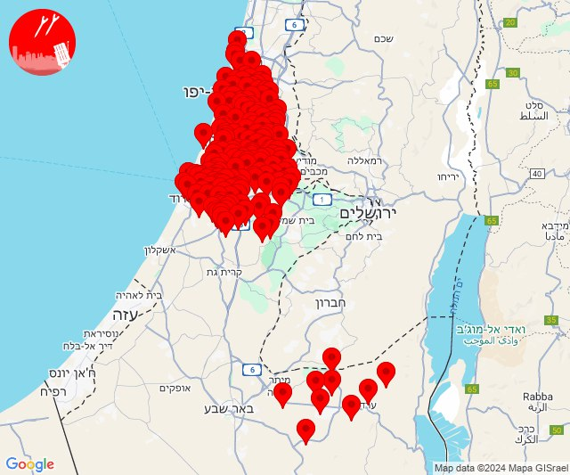

# Alerts for 2024-12-23

## 23:46

🔴 צבע אדום (24/12/2024):

01:44:
• דן: תל אביב - דרום העיר ויפו, תל אביב - מזרח, תל אביב - מרכז העיר, תל אביב - עבר הירקון, אור יהודה, אזור, בני ברק, בת ים, גבעת שמואל, גבעתיים, גת רימון, הרצליה - מערב, חולון, יהוד מונוסון, מעש, מקווה ישראל, סביון, פתח תקווה, קריית אונו, רמת גן - מזרח, רמת גן - מערב, גני תקווה, מגשימים, בית עלמין מורשה, סינמה סיטי גלילות, מתחם פי גלילות (דקה וחצי)
• השפלה: גיבתון, גן שלמה, נצר סרני, פארק תעשיות פלמחים, ראשון לציון - מזרח, ראשון לציון - מערב, רחובות, אזור תעשייה נשר - רמלה, אזור תעשייה רגמ, אחיסמך, אירוס, באר יעקב, בית חנן, בית עובד, בן שמן, גינתון, גן שורק, ישרש, כפר נוער בן שמן, לוד, מצליח, נטעים, ניר צבי, נס ציונה, עיינות, רמלה, תעשיון צריפין, אחיעזר, בית דגן, בית חשמונאי, בית עוזיאל, גזר, גני הדר, גני יוחנן, זיתן, חולדה, חמד, חניון הנתיב מהיר, יגל, יד רמב''ם, יסודות, יציץ, כפר ביל''ו, כפר בן נון, כפר חב''ד, כפר שמואל, כרמי יוסף, מזכרת בתיה, משמר איילון, משמר דוד, משמר השבעה, נען, נצר חזני, סתריה, עזריה, פדיה, פתחיה, צפריה, קריית עקרון, רמות מאיר, גנות (דקה וחצי)
• ירקון: גמזו, כפר דניאל, בארות יצחק, בני עטרות, בית עריף, חדיד, כפר טרומן, איירפורט סיטי, מודיעין - ישפרו סנטר (דקה וחצי)
• לכיש: פלמחים, גבעת ברנר (דקה וחצי)
• שפלת יהודה: בקוע, גיזו, הראל, טל שחר, כפר אוריה, מיני ישראל - נחשון, נווה שלום, נחשון, צלפון, רטורנו - גבעת שמש, תעוז (דקה וחצי)

01:45:
• לכיש: אשדוד - א,ב,ד,ה, אשדוד - אזור תעשייה צפוני ונמל, אשדוד - ג,ו,ז, בני דרום, ניר גלים, אורות, אזור תעשייה באר טוביה, אחווה, אל עזי, בית אלעזרי, בית חלקיה, בני ראם, גדרה, גני טל, חפץ חיים, יבנה, יד בנימין, ינון, כפר אחים, כפר הנגיד, כפר הרי''ף וצומת ראם, ערוגות, קדרון, קריית מלאכי, רבדים, תימורים, תלמי יחיאל, אזור תעשייה כנות, אזור תעשייה רבדים, ביצרון, בית גמליאל, בן זכאי, בני עי''ש, בניה, גבעת וושינגטון, גן הדרום, גן יבנה, חצב, חצור, כנות, כפר אביב, כפר מרדכי, כרם ביבנה, מישר, מפעל אגריגדה, משגב דב, מתחם בני דרום, נווה מבטח, עשרת, קבוצת יבנה, שדמה, תחנת רכבת קריית מלאכי - יואב, אזור תעשייה גדרה, מעון צופיה, עזריקם, קדמה, שתולים, אזור תעשייה תימורים, פארק תעשייה ראם (45 שניות, דקה)
• השפלה: גאליה (דקה)
• שפלת יהודה: כפר מנחם, גפן, לוזית, עגור, שדות מיכה, תירוש (דקה)

01:46:
• דרום הנגב: אל פורעה, כסייפה, מרעית, ערד, ערערה בנגב, תל ערד, כפר הנוקדים, סעווה (דקה וחצי)
• יהודה: הר עמשא (דקה וחצי)

צופר - צבע אדום

## 23:46

