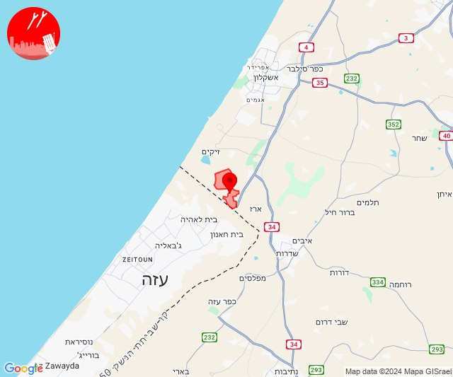

# Alerts for 2024-12-25

## 02:22

🔴 צבע אדום (25/12/2024):

04:21:
• שפלת יהודה: אביעזר, אדרת, בית שמש, גבעות עדן, נווה מיכאל - רוגלית, נתיב הל''ה, אזור תעשייה ברוש, אזור תעשייה הר טוב - צרעה, בקוע, גיזו, הראל, טל שחר, ישעי, כפר אוריה, לטרון, מיני ישראל - נחשון, מסילת ציון, נווה שלום, נחשון, צלפון, צרעה, רטורנו - גבעת שמש, תעוז, תרום, גפן, זכריה, נחושה, עגור, צפרירים, שדות מיכה, שריגים - לי-און, תירוש, גבעת ישעיהו, צומת האלה (דקה וחצי, דקה)
• יהודה: תלם, אדורה (דקה וחצי)
• דן: תל אביב - דרום העיר ויפו, תל אביב - מרכז העיר, תל אביב - עבר הירקון, הרצליה - מערב, כפר שמריהו, תל אביב - מזרח, אור יהודה, אזור, בני ברק, בת ים, גבעת השלושה, גבעת שמואל, גבעתיים, גת רימון, הרצליה - מרכז וגליל ים, חולון, יהוד מונוסון, כפר סירקין, מעש, מקווה ישראל, סביון, פתח תקווה, קריית אונו, רמת גן - מזרח, רמת גן - מערב, רמת השרון, גני תקווה, מגשימים, בית עלמין מורשה, סינמה סיטי גלילות, מתחם פי גלילות (דקה וחצי)
• שרון: ארסוף, געש, יקום, מכון וינגייט, רשפון, שפיים, מתחם "חנה וסע" שפיים, גבעת חן, רעננה, גני עם, הוד השרון, ירקונה, כפר מל''ל, עדנים, רמות השבים, תחנת רכבת ראש העין, מרכז אזורי דרום השרון (דקה וחצי)
• השפלה: גיבתון, גן שלמה, נצר סרני, פארק תעשיות פלמחים, ראשון לציון - מזרח, ראשון לציון - מערב, רחובות, אזור תעשייה נשר - רמלה, אזור תעשייה רגמ, אחיסמך, אירוס, באר יעקב, בית חנן, בית עובד, בן שמן, גינתון, גן שורק, ישרש, כפר נוער בן שמן, לוד, מצליח, נטעים, ניר צבי, נס ציונה, עיינות, רמלה, תעשיון צריפין, אחיעזר, בית דגן, בית חשמונאי, בית עוזיאל, גזר, גני הדר, גני יוחנן, זיתן, חולדה, חמד, חניון הנתיב מהיר, יגל, יד רמב''ם, יסודות, יציץ, כפר ביל''ו, כפר בן נון, כפר חב''ד, כפר שמואל, כרמי יוסף, מזכרת בתיה, משמר איילון, משמר דוד, משמר השבעה, נען, נצר חזני, סתריה, עזריה, פדיה, פתחיה, צפריה, קריית עקרון, רמות מאיר, גנות, גאליה (דקה וחצי, דקה)
• ירקון: גמזו, כפר דניאל, מבוא מודיעים, מודיעין - ליגד סנטר, מודיעין מכבים רעות, נוף איילון, שעלבים, אלעד, בארות יצחק, בני עטרות, גבעת כ''ח, מזור, נופך, נחלים, נחשונים, עינת, רינתיה, תעשיון חצב, אזור תעשייה חבל מודיעין, בית נחמיה, בית עריף, ברקת, חדיד, טירת יהודה, כפר טרומן, נאות קדומים, שוהם, איירפורט סיטי, מודיעין - ישפרו סנטר (דקה וחצי)
• לכיש: פלמחים, גבעת ברנר, בית אלעזרי, בית חלקיה, בני ראם, גדרה, גני טל, חפץ חיים, יבנה, יד בנימין, כפר הנגיד, קדרון, רבדים, אזור תעשייה כנות, אזור תעשייה רבדים, בית גמליאל, בן זכאי, בני עי''ש, בניה, גבעת וושינגטון, חצב, כנות, כפר אביב, כפר מרדכי, כרם ביבנה, מישר, מפעל אגריגדה, משגב דב, מתחם בני דרום, נווה מבטח, עשרת, קבוצת יבנה, שדמה, תחנת רכבת קריית מלאכי - יואב, אזור תעשייה גדרה, מעון צופיה (דקה וחצי, דקה)

04:22:
• שרון: נווה ירק (דקה וחצי)

צופר - צבע אדום

## 02:22

## 15:27

✈️ חדירת כלי טיס עוין (25/12/2024):

17:26:
• עוטף עזה: חוף זיקים 
• מערב לכיש: אזור תעשייה הדרומי אשקלון 

17:27:
• עוטף עזה: חוף זיקים, זיקים, כרמיה 
• מערב לכיש: אשקלון - דרום, אשקלון - צפון 

צופר - צבע אדום

## 15:27

## 22:00

🔴 צבע אדום (26/12/2024):

00:00:
• עוטף עזה: נתיב העשרה (15 שניות)

צופר - צבע אדום

## 22:00

