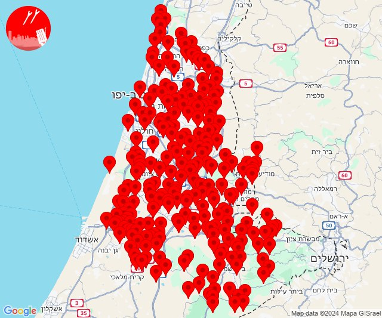
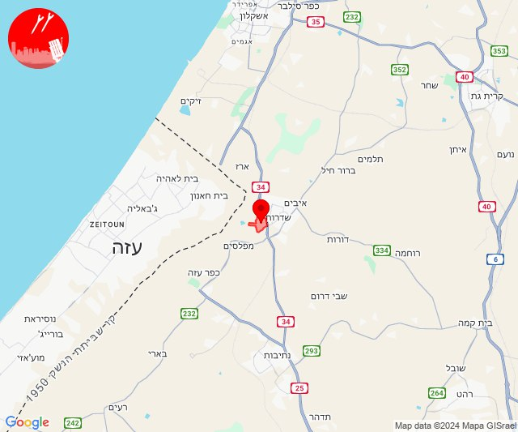

# Alerts for 2024-12-27

## 01:29

🔴 צבע אדום (27/12/2024):

03:29:
• דן: אור יהודה, גת רימון, יהוד מונוסון, מעש, סביון, קריית אונו, רמת גן - מזרח, גני תקווה, מגשימים, תל אביב - דרום העיר ויפו, תל אביב - מזרח, בת ים, אזור, חולון, מקווה ישראל, רמת גן - מערב, תל אביב - מרכז העיר, תל אביב - עבר הירקון, בני ברק, גבעת השלושה, גבעת שמואל, גבעתיים, הרצליה - מערב, הרצליה - מרכז וגליל ים, כפר סירקין, כפר שמריהו, פתח תקווה, רמת השרון, בית עלמין מורשה, סינמה סיטי גלילות, מתחם פי גלילות (דקה וחצי)
• ירקון: גמזו, חשמונאים, כפר דניאל, כפר רות, לפיד, מבוא מודיעים, מודיעין - ליגד סנטר, מודיעין מכבים רעות, מתתיהו, נוף איילון, שילת, שעלבים, בארות יצחק, בני עטרות, גבעת כ''ח, נופך, נחלים, רינתיה, אזור תעשייה חבל מודיעין, בית נחמיה, בית עריף, ברקת, חדיד, טירת יהודה, כפר טרומן, נאות קדומים, שוהם, איירפורט סיטי, מודיעין - ישפרו סנטר, מבוא חורון, מודיעין עילית, אלעד, מזור, נחשונים, עינת, ראש העין, תעשיון חצב, אזור תעשייה אפק ולב הארץ, כפר האורנים (דקה וחצי)
• השפלה: אזור תעשייה נשר - רמלה, אזור תעשייה רגמ, אחיסמך, באר יעקב, בן שמן, גינתון, כפר נוער בן שמן, לוד, מצליח, ניר צבי, רמלה, תעשיון צריפין, אחיעזר, בית דגן, בית חשמונאי, גזר, זיתן, חמד, חניון הנתיב מהיר, יגל, יד רמב''ם, כפר בן נון, כפר חב''ד, כפר שמואל, משמר איילון, משמר השבעה, עזריה, צפריה, גנות, גיבתון, גן שלמה, ראשון לציון - מערב, רחובות, נצר סרני, פארק תעשיות פלמחים, ראשון לציון - מזרח, בית חנן, בית עובד, גן שורק, ישרש, נטעים, עיינות, אירוס, נס ציונה, גני הדר, יציץ, נען, פתחיה, רמות מאיר, בית עוזיאל, כפר ביל''ו, סתריה, פדיה, גני יוחנן, חולדה, יסודות, כרמי יוסף, מזכרת בתיה, משמר דוד, נצר חזני, קריית עקרון, גאליה (דקה וחצי, דקה)
• שרון: גבעת חן, רעננה, גני עם, הוד השרון, ירקונה, כפר מל''ל, נווה ירק, עדנים, רמות השבים, תחנת רכבת ראש העין, ארסוף, געש, רשפון, שפיים, מתחם "חנה וסע" שפיים, מרכז אזורי דרום השרון (דקה וחצי)
• לכיש: פלמחים, גבעת ברנר, אחווה, אל עזי, בית אלעזרי, בית חלקיה, בני ראם, גדרה, גני טל, חפץ חיים, יבנה, יד בנימין, ינון, כפר הנגיד, כפר הרי''ף וצומת ראם, קדרון, רבדים, תלמי יחיאל, אזור תעשייה כנות, אזור תעשייה רבדים, ביצרון, בית גמליאל, בן זכאי, בני עי''ש, בניה, גבעת וושינגטון, חצב, כנות, כפר אביב, כפר מרדכי, כרם ביבנה, מישר, מפעל אגריגדה, משגב דב, מתחם בני דרום, נווה מבטח, עשרת, קבוצת יבנה, שדמה, תחנת רכבת קריית מלאכי - יואב, אזור תעשייה גדרה, מעון צופיה, פארק תעשייה ראם (דקה וחצי, 45 שניות, דקה)
• שפלת יהודה: אביעזר, אדרת, אזור תעשייה הר טוב - צרעה, אשתאול, בית שמש, בקוע, גבעות עדן, גיזו, הראל, זנוח, טל שחר, ישעי, כפר אוריה, לטרון, מחסיה, מיני ישראל - נחשון, מסילת ציון, נווה מיכאל - רוגלית, נווה שלום, נחם, נחשון, נתיב הל''ה, צלפון, צרעה, רטורנו - גבעת שמש, שער הגיא, תעוז, תרום, בית מאיר, בר גיורא, יד השמונה, כסלון, מטע, נווה אילן, נטף, נס הרים, רמת רזיאל, שואבה, שורש, אזור תעשייה ברוש, כפר מנחם, גפן, זכריה, לוזית, עגור, צפרירים, שדות מיכה, שריגים - לי-און, תירוש, גבעת ישעיהו, צומת האלה (דקה וחצי, דקה)
• שומרון: נילי (דקה וחצי)

צופר - צבע אדום

## 01:29

## 14:31

🔴 צבע אדום (27/12/2024):

16:31:
• עוטף עזה: ניר עם (15 שניות)

צופר - צבע אדום

## 14:31

