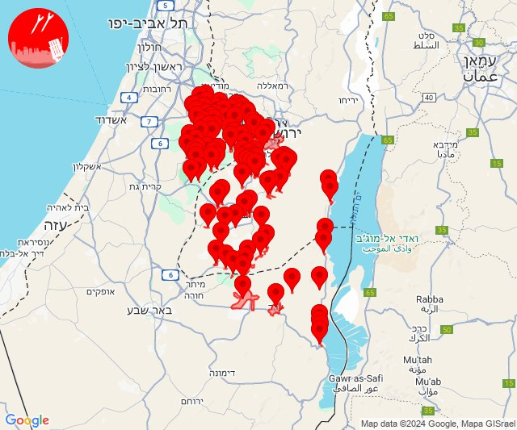
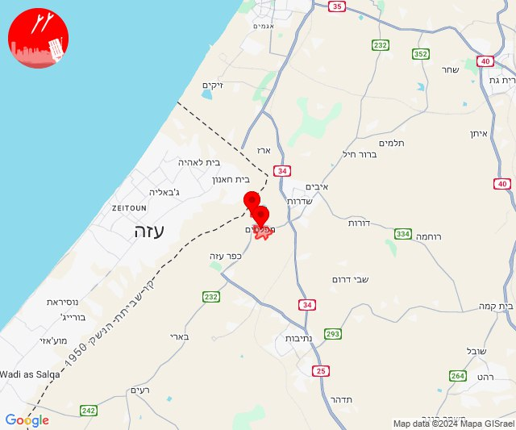
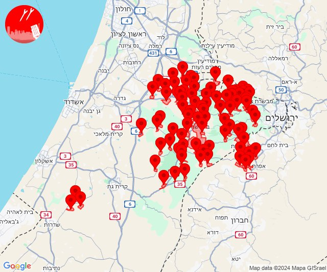

# Alerts for 2024-12-28

## 00:12

🔴 צבע אדום (28/12/2024):

02:11:
• ירושלים: ירושלים - דרום, אבן ספיר, אורה, עמינדב (דקה וחצי)
• שפלת יהודה: צובה, אביעזר, אדרת, אזור תעשייה הר טוב - צרעה, אשתאול, בית שמש, גבעות עדן, גיזו, הראל, זנוח, ישעי, כפר אוריה, לטרון, מחסיה, מסילת ציון, נווה מיכאל - רוגלית, נווה שלום, נחם, נחשון, נתיב הל''ה, צלפון, צרעה, רטורנו - גבעת שמש, שער הגיא, תעוז, תרום, בית מאיר, בר גיורא, גבעת יערים, יד השמונה, כסלון, מבוא ביתר, מטע, נווה אילן, נס הרים, עין ראפה, צור הדסה, קריית יערים, רמת רזיאל, שואבה, שורש, אזור תעשייה ברוש (דקה וחצי)
• דרום הנגב: ערד, תל ערד, כפר הנוקדים (דקה וחצי)
• יהודה: אלון שבות, אלעזר, אפרת, ביתר עילית, בת עין, הר גילה, כפר אלדד, כפר עציון, כרמי צור, מגדל עוז, מיצד, מעלה עמוס, מעלה רחבעם, נווה דניאל, נוקדים, פארק תעשיות מגדל עוז, פני קדם, ראש צורים, שדה בר, תלם, תקוע, אדורה, אדוריים, בית חג"י, בית יתיר, הר עמשא, כרמל, מעון, מעלה חבר, נגוהות, סוסיא, עשהאל, עתניאל, קריית ארבע, שמעה, שני ליבנה, צומת הגוש, היישוב היהודי חברון, גבעות (דקה וחצי, דקה)
• ים המלח: מצדה, מרחצאות עין גדי (דקה וחצי)

02:12:
• שפלת יהודה: זכריה, כפר זוהרים, נחושה, עגור, צפרירים, שדות מיכה, שריגים - לי-און, גבעת ישעיהו, צומת האלה (דקה)
• ים המלח: מצוקי דרגות, מצפה שלם, בתי מלון ים המלח, מלונות ים המלח מרכז, נווה זוהר, עין בוקק, עין גדי (דקה וחצי)

צופר - צבע אדום

## 00:12

## 14:00

🔴 צבע אדום (28/12/2024):

16:00:
• עוטף עזה: מפלסים, מטווח ניר עם (15 שניות)

צופר - צבע אדום

## 14:00

## 14:15

🔴 צבע אדום (28/12/2024):

16:14:
• שפלת יהודה: בית נקופה, צובה, קריית ענבים, אבו גוש, גבעת יערים, יד השמונה, נווה אילן, עין נקובא, עין ראפה, קריית יערים, רמת רזיאל, שואבה, שורש, כסלון (דקה וחצי)
• מערב הנגב: ברור חיל (30 שניות)
• מערב לכיש: חלץ (30 שניות)
• לכיש: תלמים (30 שניות)

16:15:
• שפלת יהודה: כפר מנחם, בית גוברין, בית ניר, גפן, זכריה, כפר זוהרים, לוזית, נחושה, עגור, צפרירים, שדות מיכה, שריגים - לי-און, תירוש, גבעת ישעיהו, צומת האלה, מעלה החמישה, אביעזר, אדרת, אזור תעשייה הר טוב - צרעה, אשתאול, בית שמש, בקוע, גבעות עדן, גיזו, הראל, זנוח, טל שחר, ישעי, כפר אוריה, לטרון, מחסיה, מיני ישראל - נחשון, מסילת ציון, נווה מיכאל - רוגלית, נווה שלום, נחם, נחשון, נתיב הל''ה, צלפון, צרעה, רטורנו - גבעת שמש, שער הגיא, תעוז, תרום, בית מאיר, בר גיורא, כפר הנוער קריית יערים, מבוא ביתר, מטע, נטף, נס הרים, צור הדסה, אזור תעשייה ברוש (דקה, דקה וחצי)
• ירקון: מבוא חורון (דקה וחצי)
• יהודה: אלון שבות, ביתר עילית, בת עין, כפר עציון, נווה דניאל, ראש צורים, גבעות (דקה וחצי)
• השפלה: חולדה, יסודות, כפר בן נון, כרמי יוסף, משמר דוד (דקה וחצי)
• ירושלים: אבן ספיר, עמינדב (דקה וחצי)

צופר - צבע אדום

## 14:15

