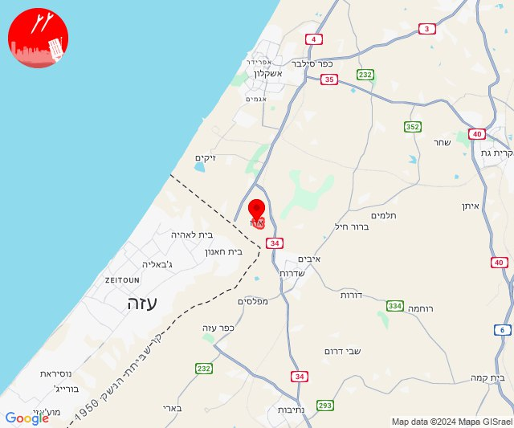
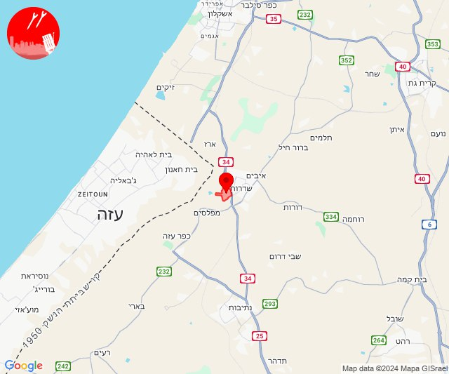
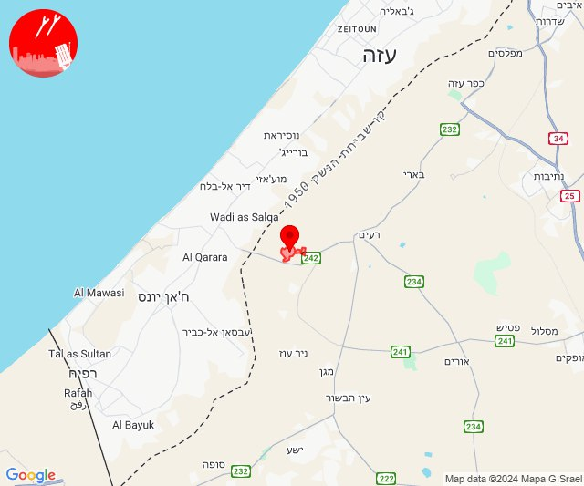
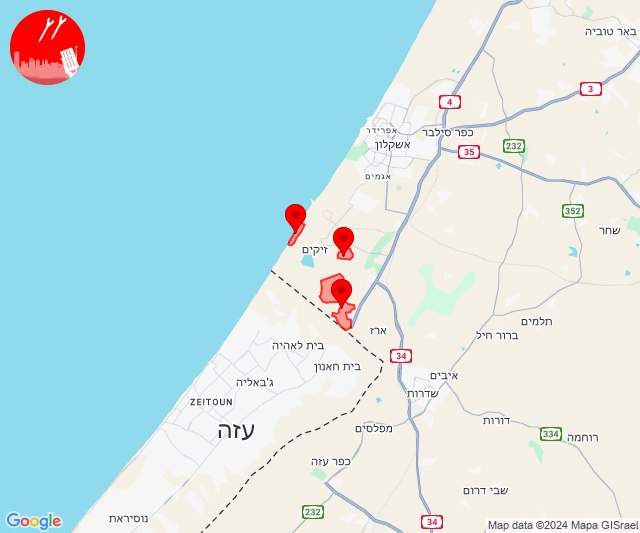
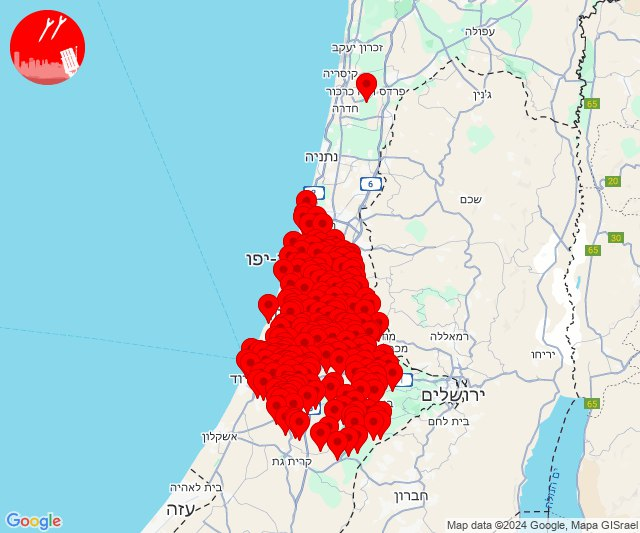

# Alerts for 2024-12-30

## 08:06

🔴 צבע אדום (30/12/2024):

10:06:
• עוטף עזה: ארז (15 שניות)

צופר - צבע אדום

## 08:06

## 08:20

🔴 צבע אדום (30/12/2024):

10:20:
• עוטף עזה: ניר עם (15 שניות)

צופר - צבע אדום

## 08:20

## 16:02

🔴 צבע אדום (30/12/2024):

18:02:
• עוטף עזה: כיסופים (15 שניות)

צופר - צבע אדום

## 16:02

## 18:37

🔴 צבע אדום (30/12/2024):

20:37:
• עוטף עזה: חוף זיקים, נתיב העשרה, כרמיה (15 שניות)

צופר - צבע אדום

## 18:38

## 21:11

🔴 צבע אדום (30/12/2024):

23:09:
• מנשה: תלמי אלעזר (דקה וחצי)

23:10:
• השפלה: פארק תעשיות פלמחים, ראשון לציון - מזרח, ראשון לציון - מערב, רחובות, אירוס, בית חנן, בית עובד, גן שורק, נטעים, נס ציונה, עיינות, גיבתון, גן שלמה, נצר סרני, אזור תעשייה נשר - רמלה, אזור תעשייה רגמ, אחיסמך, באר יעקב, בן שמן, גינתון, ישרש, כפר נוער בן שמן, לוד, מצליח, ניר צבי, רמלה, תעשיון צריפין, אחיעזר, בית דגן, בית חשמונאי, בית עוזיאל, גזר, גני הדר, גני יוחנן, זיתן, חולדה, חמד, חניון הנתיב מהיר, יגל, יד רמב''ם, יסודות, יציץ, כפר ביל''ו, כפר בן נון, כפר חב''ד, כפר שמואל, כרמי יוסף, מזכרת בתיה, משמר איילון, משמר דוד, משמר השבעה, נען, נצר חזני, סתריה, עזריה, פדיה, פתחיה, צפריה, קריית עקרון, רמות מאיר, גנות, גאליה (דקה וחצי, דקה)
• דן: תל אביב - דרום העיר ויפו, תל אביב - מזרח, תל אביב - מרכז העיר, תל אביב - עבר הירקון, אור יהודה, אזור, בני ברק, בת ים, גבעת שמואל, גבעתיים, גת רימון, הרצליה - מערב, חולון, יהוד מונוסון, מעש, מקווה ישראל, סביון, פתח תקווה, קריית אונו, רמת גן - מזרח, רמת גן - מערב, רמת השרון, גני תקווה, מגשימים, בית עלמין מורשה, סינמה סיטי גלילות, מתחם פי גלילות (דקה וחצי)
• ירקון: גמזו, כפר דניאל, מבוא מודיעים, מודיעין - ליגד סנטר, נוף איילון, שעלבים, בארות יצחק, בני עטרות, גבעת כ''ח, מזור, נופך, נחלים, רינתיה, בית נחמיה, בית עריף, ברקת, חדיד, טירת יהודה, כפר טרומן, נאות קדומים, שוהם, איירפורט סיטי, מודיעין - ישפרו סנטר (דקה וחצי)
• לכיש: פלמחים, גבעת ברנר, אשדוד - א,ב,ד,ה, אשדוד - אזור תעשייה צפוני ונמל, אשדוד - ג,ו,ז, בני דרום, ניר גלים, אביגדור, אורות, אזור תעשייה באר טוביה, אחווה, אל עזי, באר טוביה, בית אלעזרי, בית חלקיה, בני ראם, גדרה, גני טל, חפץ חיים, יבנה, יד בנימין, ינון, כפר אחים, כפר הנגיד, כפר הרי''ף וצומת ראם, ערוגות, קדרון, קריית מלאכי, רבדים, תימורים, תלמי יחיאל, אזור תעשייה כנות, אזור תעשייה רבדים, ביצרון, בית גמליאל, בן זכאי, בני עי''ש, בניה, גבעת וושינגטון, גן הדרום, גן יבנה, חצב, חצור, כנות, כפר אביב, כפר מרדכי, כרם ביבנה, מישר, מפעל אגריגדה, משגב דב, מתחם בני דרום, נווה מבטח, עשרת, קבוצת יבנה, שדמה, תחנת רכבת קריית מלאכי - יואב, אזור תעשייה גדרה, מעון צופיה, עזריקם, קדמה, שתולים, אזור תעשייה תימורים, פארק תעשייה ראם (דקה וחצי, 45 שניות, דקה)
• שפלת יהודה: אזור תעשייה הר טוב - צרעה, אשתאול, בקוע, גיזו, הראל, זנוח, טל שחר, ישעי, כפר אוריה, לטרון, מחסיה, מיני ישראל - נחשון, מסילת ציון, נווה שלום, נחם, נחשון, נתיב הל''ה, צלפון, צרעה, רטורנו - גבעת שמש, שער הגיא, תעוז, תרום, אזור תעשייה ברוש, צומת האלה, תירוש, זכריה, גבעת ישעיהו, שריגים - לי-און, עגור, שדות מיכה, גפן, צפרירים, לוזית, כפר מנחם, בית ניר (דקה וחצי, דקה)

23:11:
• ירקון: מודיעין מכבים רעות (דקה וחצי)
• לכיש: כפר ורבורג, ורדון, נחלה, ניר בנים, סגולה, שדה עוזיהו, שפיר (45 שניות)
• שפלת יהודה: אביעזר, אדרת, בית שמש, גבעות עדן, נווה מיכאל - רוגלית, בית גוברין, גלאון, כפר זוהרים, נחושה, בית מאיר, כסלון (דקה וחצי, דקה, 45 שניות)

צופר - צבע אדום

## 21:11

