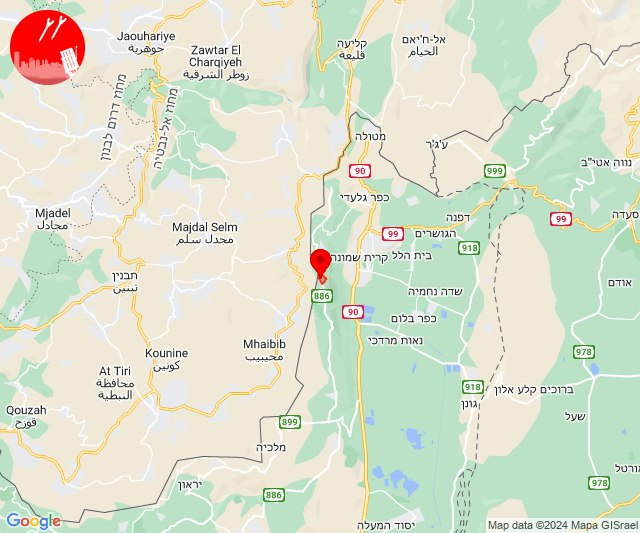
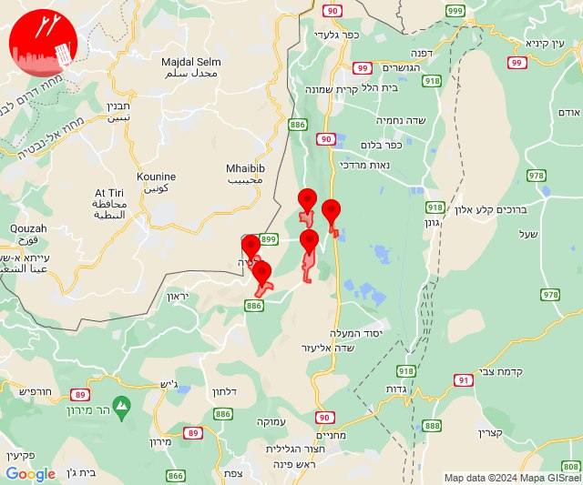
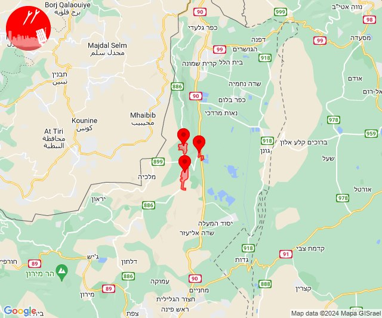
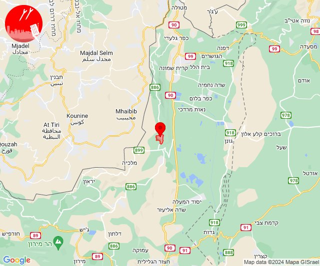
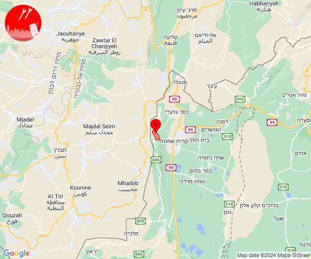
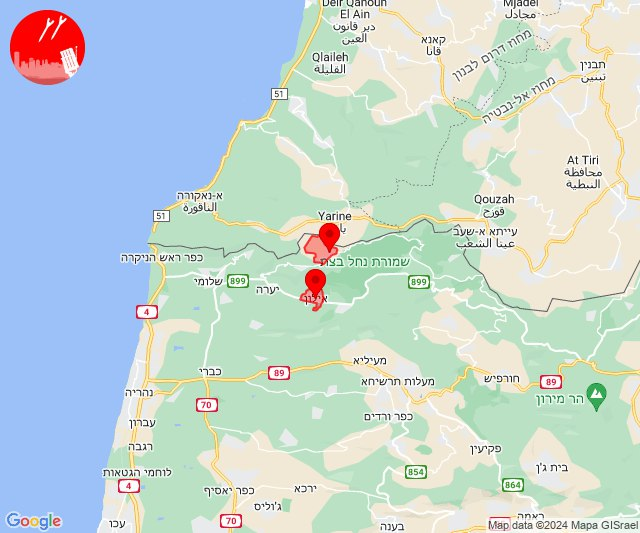
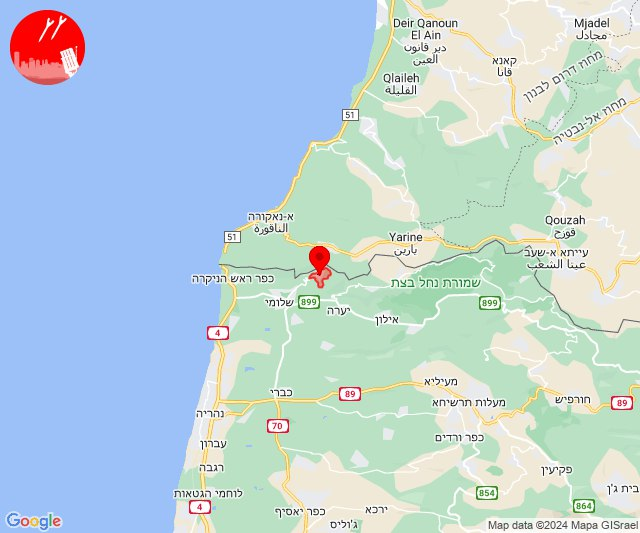
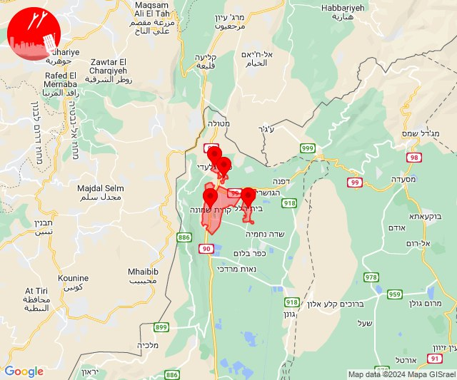
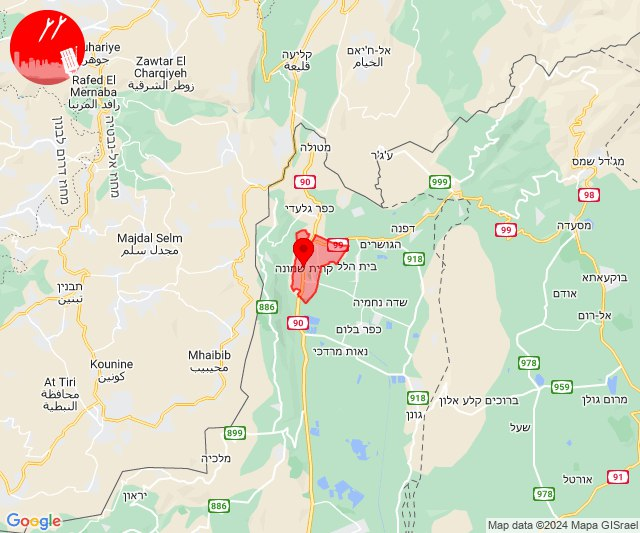
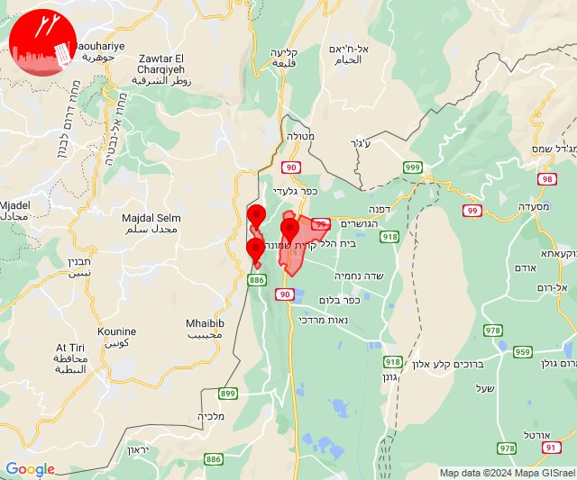

# Alerts for 2024-02-04

## 08:52

🔴 צבע אדום (04/02/2024):

10:52:
• קו העימות: מנרה (מיידי)

צופר - צבע אדום

## 08:52

## 09:29

🔴 צבע אדום (04/02/2024):

11:25:
• קו העימות: יפתח, יפתח, מרכז אזורי מבואות חרמון, רמות נפתלי (מיידי)

11:26:
• קו העימות: יפתח, מרכז אזורי מבואות חרמון, רמות נפתלי, דישון, מלכיה (מיידי)

11:27:
• קו העימות: יפתח, מרכז אזורי מבואות חרמון (מיידי)

11:28:
• קו העימות: רמות נפתלי (מיידי)

11:29:
• קו העימות: יפתח, מרכז אזורי מבואות חרמון (מיידי)

צופר - צבע אדום

## 09:29

## 09:32

🔴 צבע אדום (04/02/2024):

11:32:
• קו העימות: יפתח, מרכז אזורי מבואות חרמון, רמות נפתלי (מיידי)

צופר - צבע אדום

## 09:32

## 10:09

🔴 צבע אדום (04/02/2024):

12:09:
• קו העימות: יפתח (מיידי)

צופר - צבע אדום

## 10:09

## 11:59

🔴 צבע אדום (04/02/2024):

13:59:
• קו העימות: מרגליות (מיידי)

צופר - צבע אדום

## 11:59

## 12:04

🔴 צבע אדום (04/02/2024):

14:04:
• קו העימות: ערב אל עראמשה, אילון (מיידי)

צופר - צבע אדום

## 12:04

## 12:22

🔴 צבע אדום (04/02/2024):

14:22:
• קו העימות: חניתה (מיידי)

צופר - צבע אדום

## 12:22

## 12:59

🔴 צבע אדום (04/02/2024):

14:59:
• קו העימות: קריית שמונה, בית הלל, תל חי, כפר גלעדי (מיידי)

צופר - צבע אדום

## 12:59

## 13:23

🔴 צבע אדום (04/02/2024):

15:23:
• קו העימות: מטולה (מיידי)

צופר - צבע אדום

## 13:23

## 13:29

🔴 צבע אדום (04/02/2024):

15:29:
• קו העימות: קריית שמונה (מיידי)

צופר - צבע אדום

## 13:30

## 13:47

🔴 צבע אדום (04/02/2024):

15:47:
• קו העימות: מנרה, מרגליות, קריית שמונה (מיידי)

צופר - צבע אדום

## 13:47

