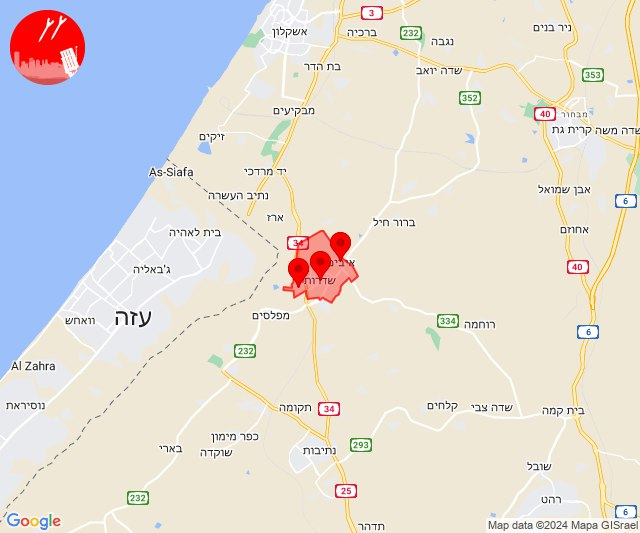
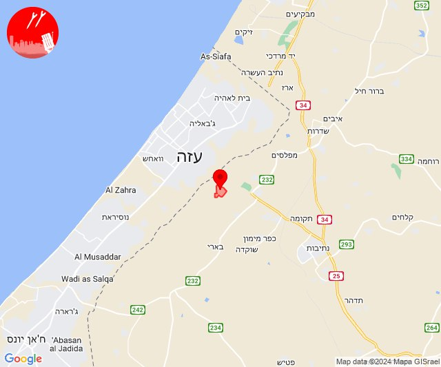
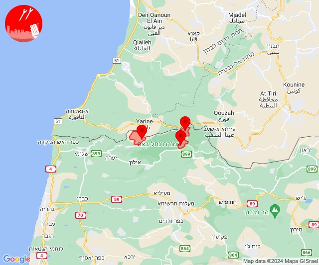
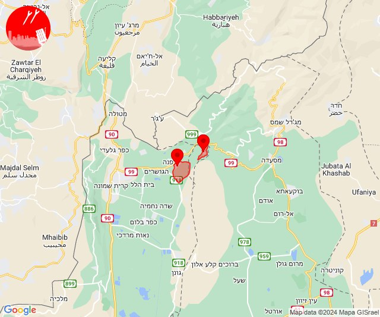
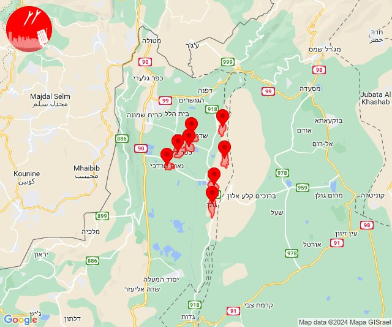
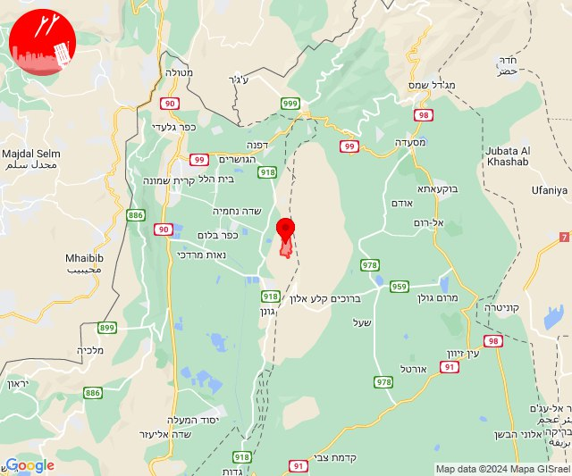
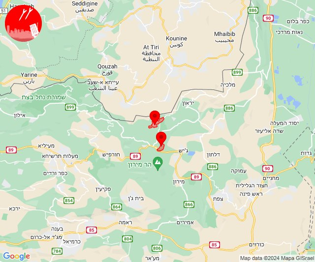
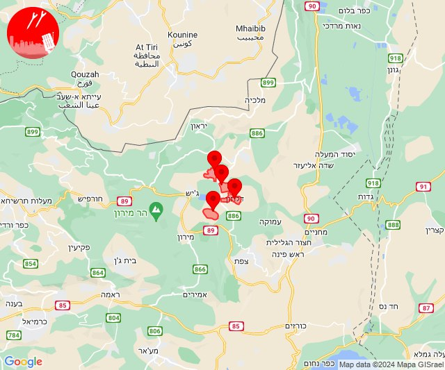

# Alerts for 2024-02-08

## 11:09

🔴 צבע אדום (08/02/2024):

13:09:
• עוטף עזה: שדרות, איבים, ניר עם (15 שניות)

צופר - צבע אדום

## 11:09

## 11:25

🔴 צבע אדום (08/02/2024):

13:25:
• עוטף עזה: נחל עוז (15 שניות)

צופר - צבע אדום

## 11:25

## 13:17

🔴 צבע אדום (08/02/2024):

15:17:
• קו העימות: זרעית, ערב אל עראמשה, שומרה (מיידי)

צופר - צבע אדום

## 13:17

## 14:06

🔴 צבע אדום (08/02/2024):

16:06:
• קו העימות: שאר ישוב, שניר (מיידי)

צופר - צבע אדום

## 14:06

## 14:50

✈️ חדירת כלי טיס עוין (08/02/2024):

16:50:
• קו העימות: גונן, כפר בלום, כפר סאלד, להבות הבשן, נאות מרדכי, עמיר, שדה נחמיה, שמיר 

צופר - צבע אדום

## 14:50

## 14:50

🔴 צבע אדום (08/02/2024):

16:50:
• קו העימות: שמיר (15 שניות)

צופר - צבע אדום

## 14:50

## 17:39

🔴 צבע אדום (08/02/2024):

19:39:
• קו העימות: דוב''ב, צבעון (מיידי)

צופר - צבע אדום

## 17:39

## 20:58

🔴 צבע אדום (08/02/2024):

22:57:
• קו העימות: אזור תעשייה רמת דלתון, דלתון, כרם בן זמרה (מיידי)
• גליל עליון: קדיתא (30 שניות)

22:58:
• קו העימות: דלתון (מיידי)

צופר - צבע אדום

## 20:58

