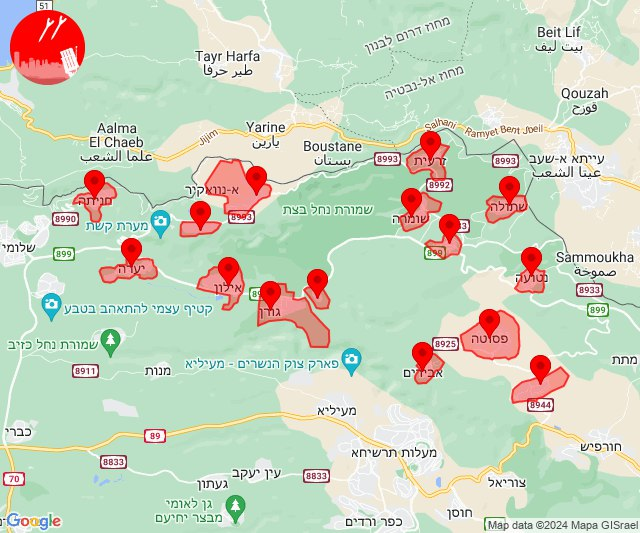
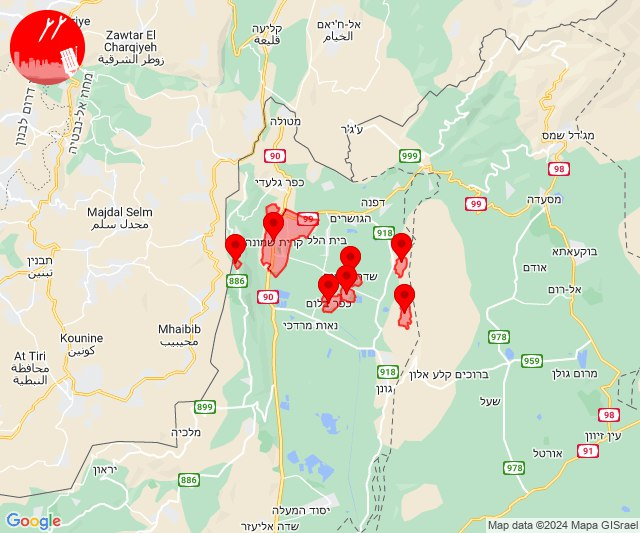

# Alerts for 2024-02-09

## 10:12

✈️ חדירת כלי טיס עוין (09/02/2024):

12:11:
• קו העימות: אבן מנחם, אדמית, אילון, גורן, גורנות הגליל, זרעית, חניתה, יערה, ערב אל עראמשה, שומרה, שתולה 

12:12:
• קו העימות: אבירים, אלקוש, נטועה, פסוטה 

צופר - צבע אדום

## 10:12

## 15:52

🔴 צבע אדום (09/02/2024):

17:51:
• קו העימות: כפר סאלד, שדה נחמיה, שמיר, קריית שמונה, עמיר (15 שניות, מיידי)

17:52:
• קו העימות: מנרה, כפר סאלד, שמיר, עמיר, שדה נחמיה, כפר בלום (מיידי, 15 שניות)

צופר - צבע אדום

## 15:52

