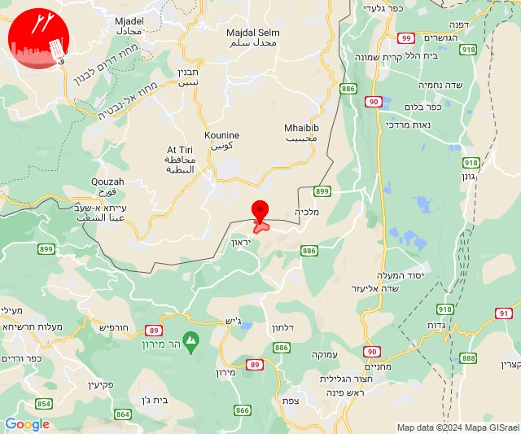
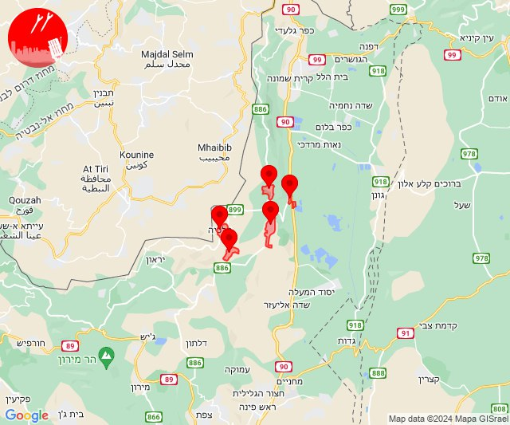
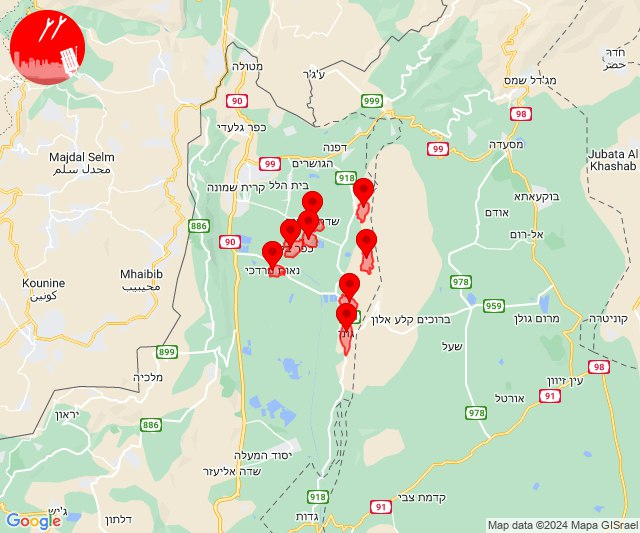
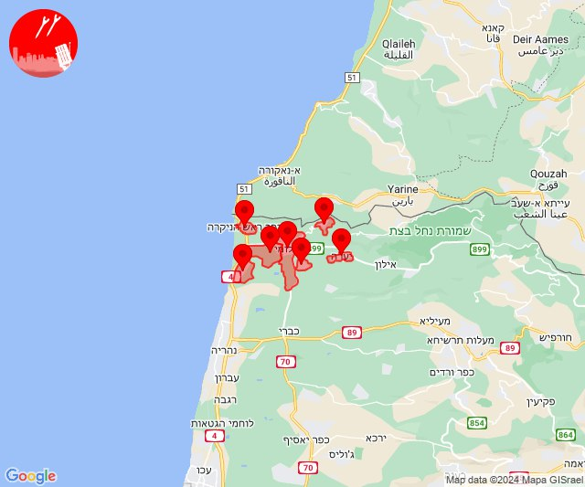
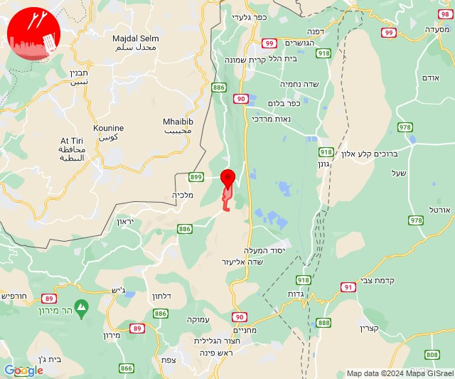
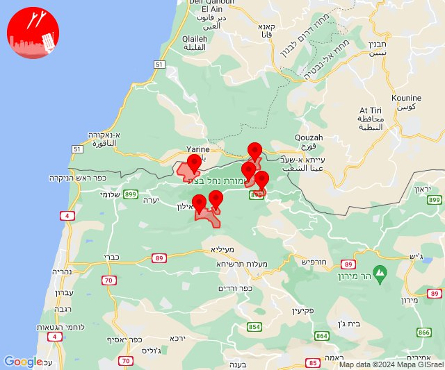
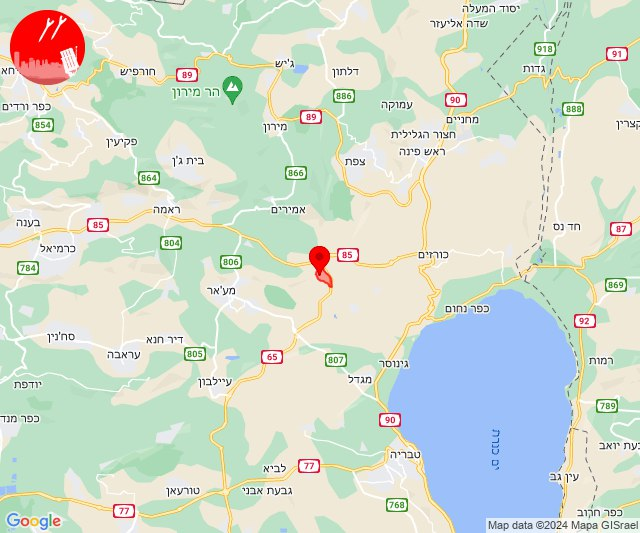

# Alerts for 2024-02-10

## 09:23

🔴 צבע אדום (10/02/2024):

11:23:
• קו העימות: אביבים (מיידי)

צופר - צבע אדום

## 09:23

## 09:32

✈️ חדירת כלי טיס עוין (10/02/2024):

11:32:
• קו העימות: דישון, יפתח, מלכיה, מרכז אזורי מבואות חרמון, רמות נפתלי 

צופר - צבע אדום

## 09:32

## 09:36

✈️ חדירת כלי טיס עוין (10/02/2024):

11:36:
• קו העימות: גונן, כפר בלום, כפר סאלד, להבות הבשן, נאות מרדכי, עמיר, שדה נחמיה, שמיר 

צופר - צבע אדום

## 09:36

## 12:54

🔴 צבע אדום (10/02/2024):

14:54:
• קו העימות: לימן, מצובה, בצת, חניתה, ראש הנקרה, יערה, שלומי (מיידי)

צופר - צבע אדום

## 12:54

## 16:15

🔴 צבע אדום (10/02/2024):

18:15:
• קו העימות: רמות נפתלי (מיידי)

צופר - צבע אדום

## 16:15

## 16:20

🔴 צבע אדום (10/02/2024):

18:20:
• קו העימות: אבן מנחם, גורן, גורנות הגליל, זרעית, ערב אל עראמשה, שומרה (מיידי)

צופר - צבע אדום

## 16:20

## 23:05

🔴 צבע אדום (11/02/2024):

01:05:
• גליל עליון: קדרים (דקה)

צופר - צבע אדום

## 23:06

