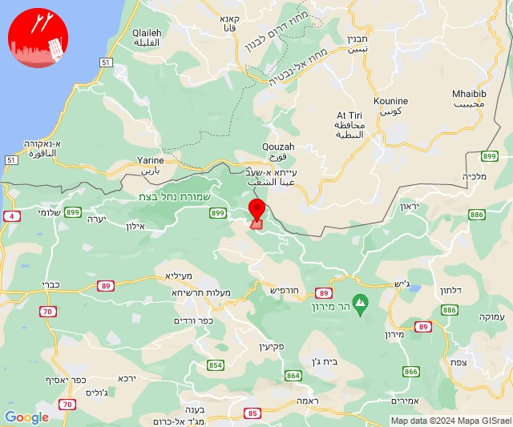
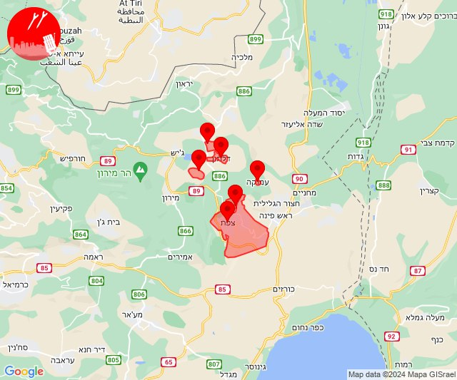
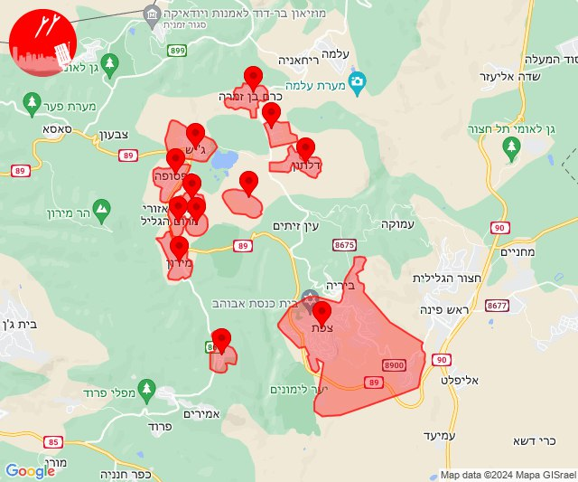
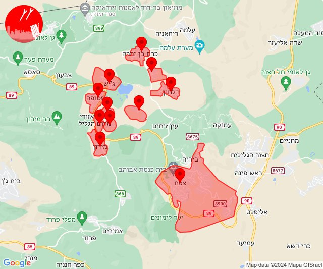
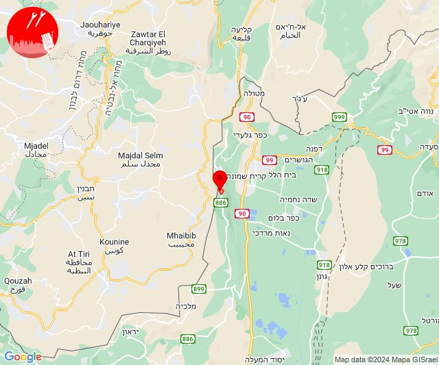
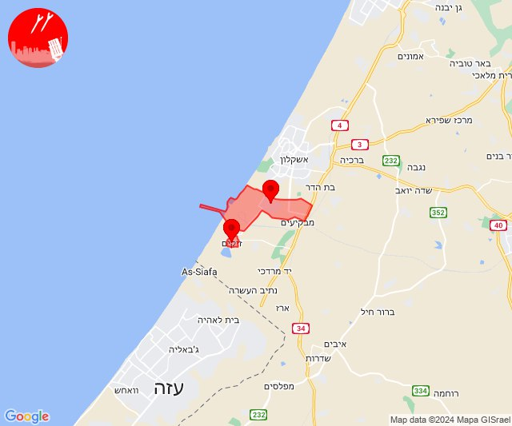

# Alerts for 2024-02-14

## 07:04

🔴 צבע אדום (14/02/2024):

09:04:
• קו העימות: נטועה (מיידי)

צופר - צבע אדום

## 07:04

## 07:06

🔴 צבע אדום (14/02/2024):

09:05:
• גליל עליון: צפת (30 שניות)

09:06:
• גליל עליון: ביריה, קדיתא, עמוקה (30 שניות)
• קו העימות: אזור תעשייה רמת דלתון, דלתון (מיידי)

צופר - צבע אדום

## 07:06

## 07:12

🔴 צבע אדום (14/02/2024):

09:12:
• גליל עליון: אור הגנוז, בר יוחאי, מירון, מרכז אזורי מרום גליל, ספסופה - כפר חושן, קדיתא, כפר שמאי, צפת (30 שניות)
• קו העימות: אזור תעשייה רמת דלתון, ג'ש - גוש חלב, דלתון, כרם בן זמרה (מיידי)

צופר - צבע אדום

## 07:12

## 07:17

🔴 צבע אדום (14/02/2024):

09:17:
• גליל עליון: מירון, מרכז אזורי מרום גליל, בר יוחאי, ספסופה - כפר חושן, קדיתא, אור הגנוז, צפת (30 שניות)
• קו העימות: דלתון, ג'ש - גוש חלב, אזור תעשייה רמת דלתון, כרם בן זמרה (מיידי)

צופר - צבע אדום

## 07:17

## 07:53

🔴 צבע אדום (14/02/2024):

09:53:
• קו העימות: מנרה (מיידי)

צופר - צבע אדום

## 07:53

## 18:59

🔴 צבע אדום (14/02/2024):

20:59:
• מערב לכיש: אזור תעשייה הדרומי אשקלון (30 שניות)
• עוטף עזה: זיקים (15 שניות)

צופר - צבע אדום

## 18:59

