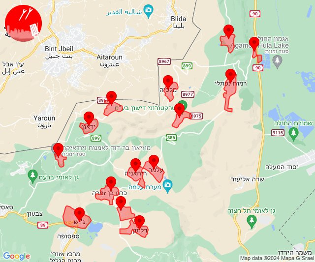
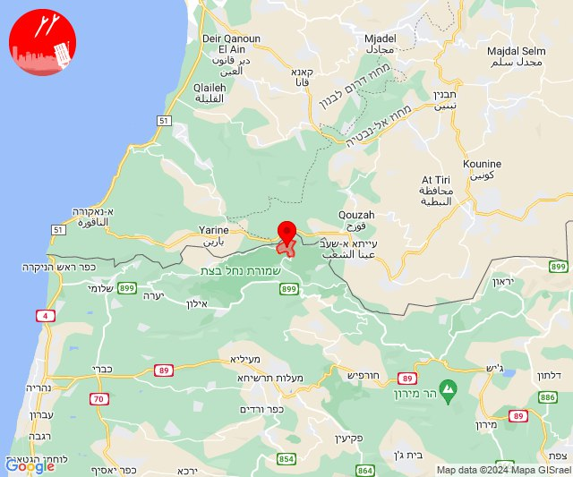
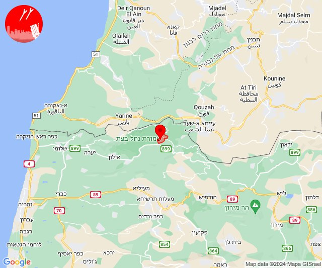
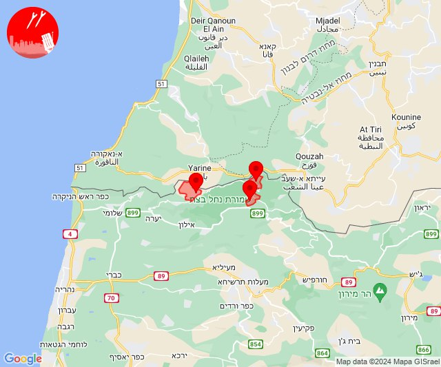
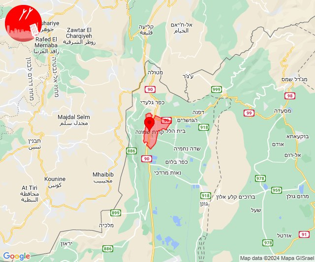
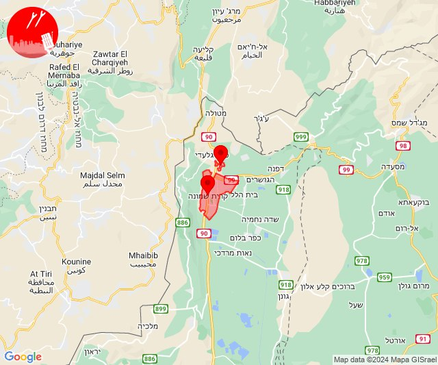
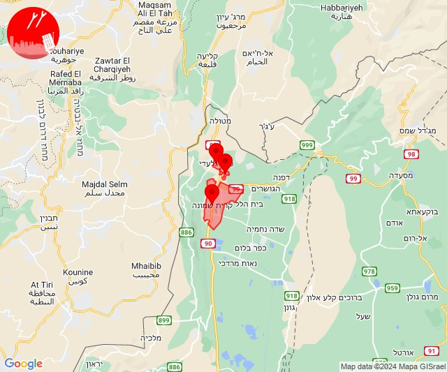

# Alerts for 2024-02-15

## 11:23

✈️ חדירת כלי טיס עוין (15/02/2024):

13:23:
• קו העימות: יראון, מלכיה, דישון, רמות נפתלי, ברעם, מרכז אזורי מבואות חרמון, יפתח, אביבים, אזור תעשייה רמת דלתון, ג'ש - גוש חלב, דלתון, כרם בן זמרה, עלמה, ריחאנייה 

צופר - צבע אדום

## 11:23

## 14:45

🔴 צבע אדום (15/02/2024):

16:45:
• קו העימות: זרעית (מיידי)

צופר - צבע אדום

## 14:45

## 14:54

🔴 צבע אדום (15/02/2024):

16:54:
• קו העימות: שומרה (מיידי)

צופר - צבע אדום

## 14:54

## 15:28

🔴 צבע אדום (15/02/2024):

17:28:
• קו העימות: זרעית, ערב אל עראמשה, שומרה (מיידי)

צופר - צבע אדום

## 15:28

## 15:51

🔴 צבע אדום (15/02/2024):

17:51:
• קו העימות: קריית שמונה (מיידי)

צופר - צבע אדום

## 15:51

## 16:00

🔴 צבע אדום (15/02/2024):

18:00:
• קו העימות: קריית שמונה (מיידי)

צופר - צבע אדום

## 16:00

## 19:09

🔴 צבע אדום (15/02/2024):

21:09:
• קו העימות: קריית שמונה, תל חי (מיידי)

צופר - צבע אדום

## 19:09

## 19:36

🔴 צבע אדום (15/02/2024):

21:36:
• קו העימות: קריית שמונה, תל חי, כפר גלעדי (מיידי)

צופר - צבע אדום

## 19:36

