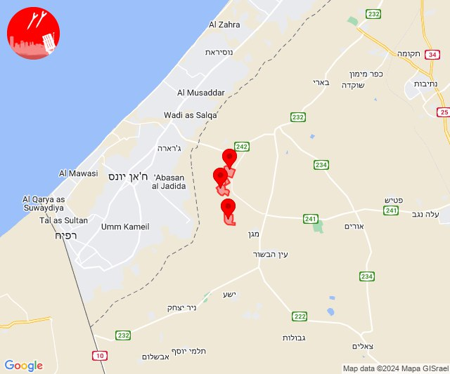
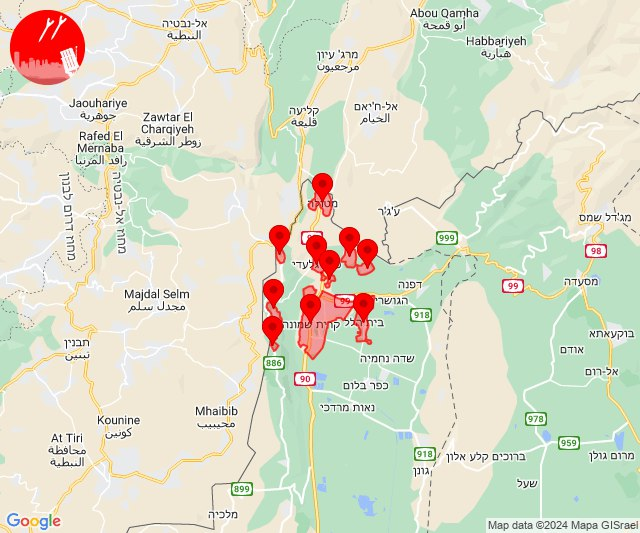
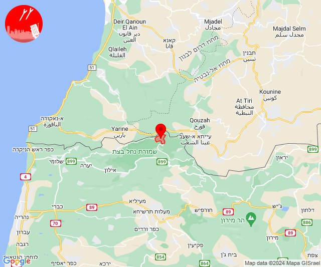
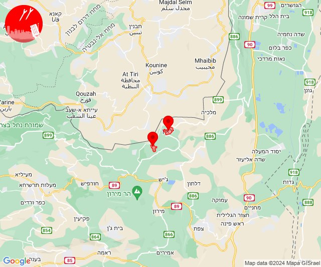
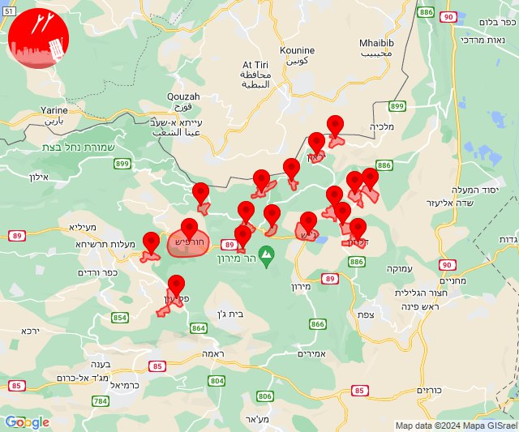

# Alerts for 2024-02-19

## 05:21

🔴 צבע אדום (19/02/2024):

07:21:
• עוטף עזה: ניר עוז, נירים, עין השלושה (15 שניות)

צופר - צבע אדום

## 05:21

## 08:25

✈️ חדירת כלי טיס עוין (19/02/2024):

10:25:
• קו העימות: בית הלל, כפר גלעדי, כפר יובל, מטולה, מנרה, מעיין ברוך, מרגליות, משגב עם, קריית שמונה, תל חי 

צופר - צבע אדום

## 08:25

## 13:03

🔴 צבע אדום (19/02/2024):

15:03:
• קו העימות: זרעית (מיידי)

צופר - צבע אדום

## 13:03

## 16:34

🔴 צבע אדום (19/02/2024):

18:34:
• קו העימות: ברעם, יראון (מיידי)

צופר - צבע אדום

## 16:34

## 16:36

✈️ חדירת כלי טיס עוין (19/02/2024):

18:34:
• קו העימות: אביבים, ברעם, יראון 

18:35:
• קו העימות: אזור תעשייה רמת דלתון, ג'ש - גוש חלב, דלתון, כרם בן זמרה, עלמה, ריחאנייה 

18:36:
• קו העימות: בית ספר שדה מירון, דוב''ב, חורפיש, מתת, סאסא, פקיעין, צבעון, צוריאל 

צופר - צבע אדום

## 16:36

