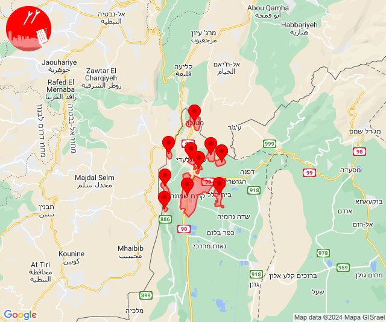
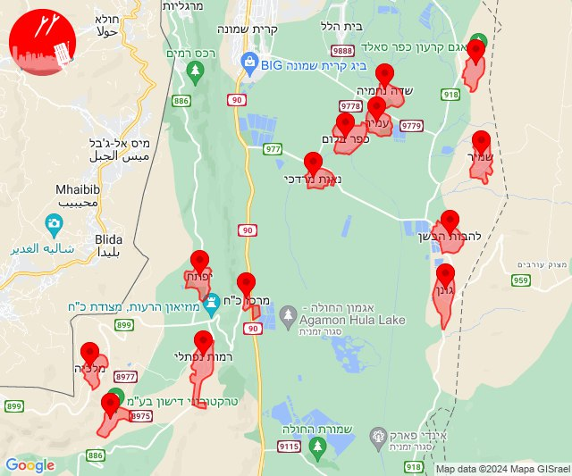

# Alerts for 2024-02-23

## 07:27

✈️ חדירת כלי טיס עוין (23/02/2024):

09:27:
• קו העימות: בית הלל, כפר גלעדי, כפר יובל, מטולה, מנרה, מעיין ברוך, מרגליות, משגב עם, קריית שמונה, תל חי 

צופר - צבע אדום

## 07:27

## 07:31

🔴 צבע אדום (23/02/2024):

09:31:
• קו העימות: קריית שמונה (מיידי)

צופר - צבע אדום

## 07:31

## 07:31

✈️ חדירת כלי טיס עוין (23/02/2024):

09:31:
• קו העימות: גונן, כפר בלום, כפר סאלד, להבות הבשן, נאות מרדכי, עמיר, שדה נחמיה, שמיר, דישון, יפתח, מלכיה, מרכז אזורי מבואות חרמון, רמות נפתלי 

צופר - צבע אדום

## 07:31

