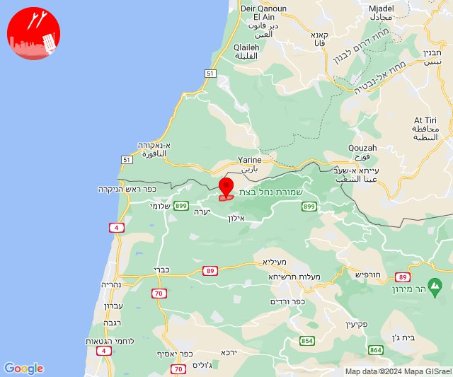
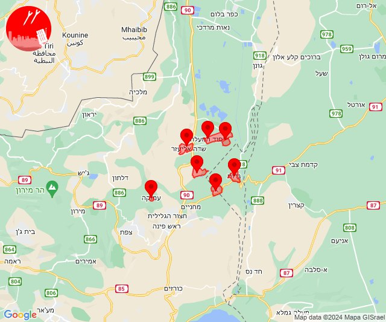
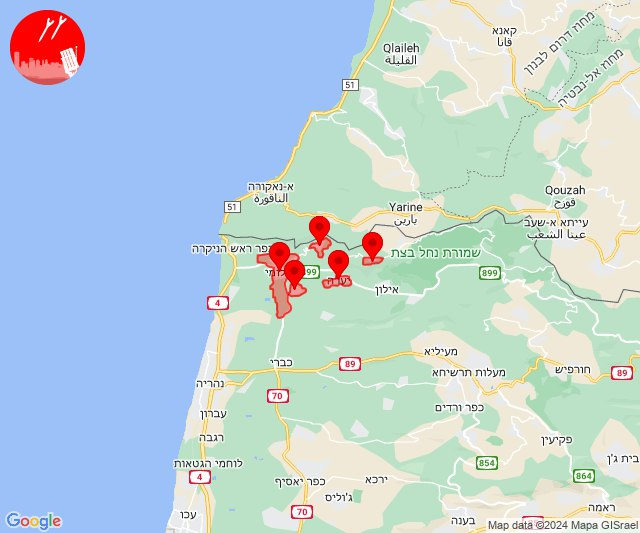
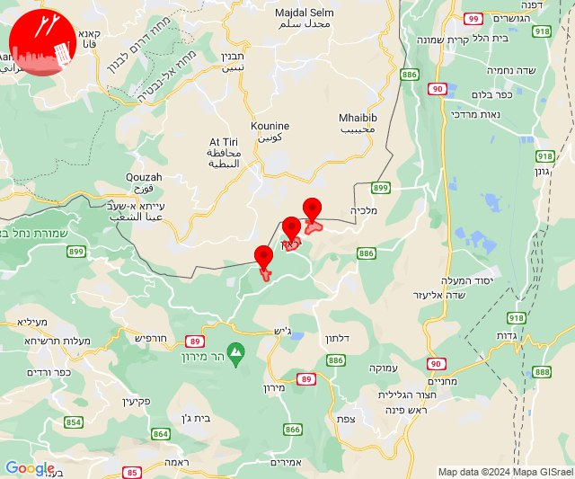
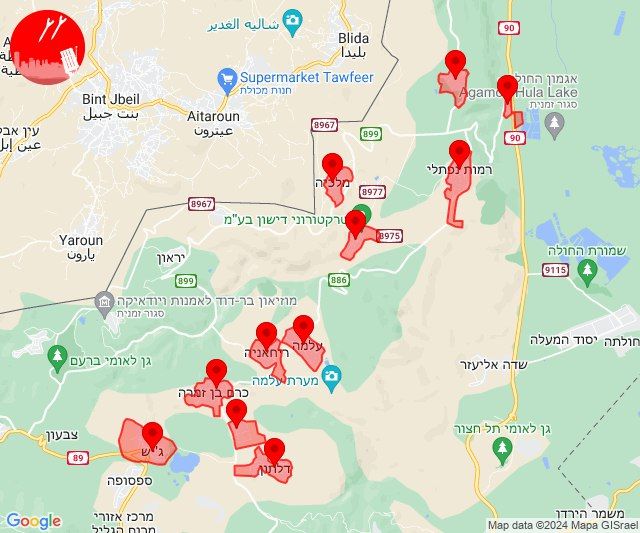
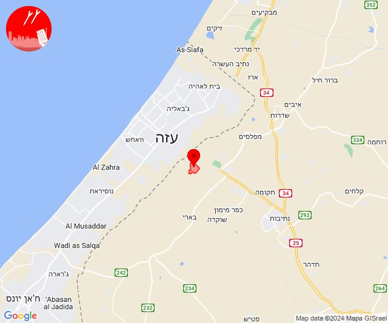
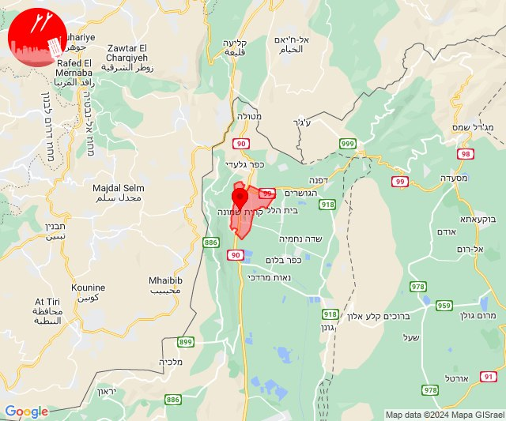
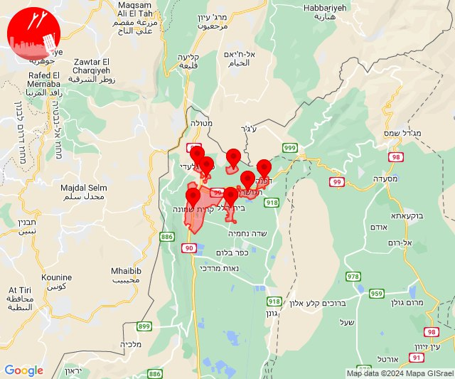
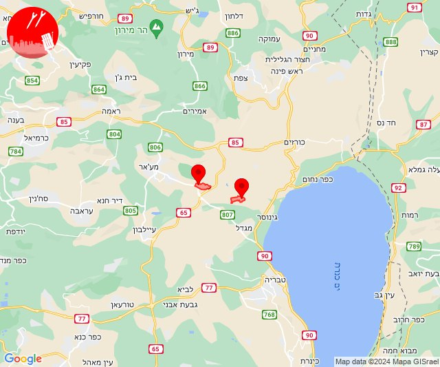
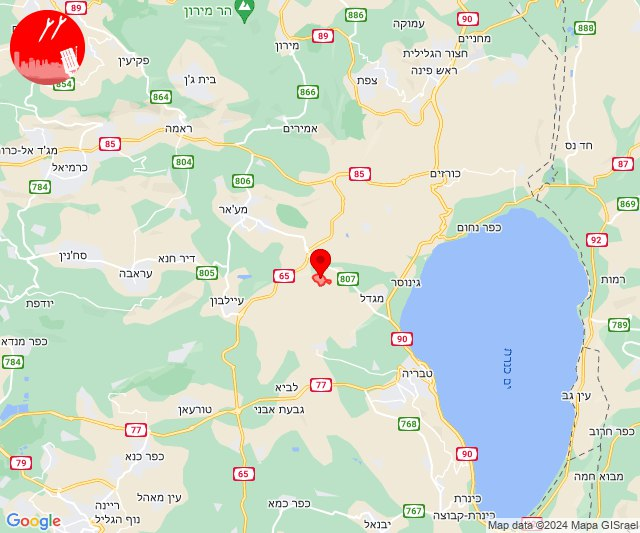

# Alerts for 2024-02-24

## 06:59

🔴 צבע אדום (24/02/2024):

08:59:
• קו העימות: אדמית (מיידי)

צופר - צבע אדום

## 06:59

## 08:23

✈️ חדירת כלי טיס עוין (24/02/2024):

10:23:
• גליל עליון: איילת השחר, גדות, חולתה, יסוד המעלה, משמר הירדן, עמוקה, שדה אליעזר 

צופר - צבע אדום

## 08:23

## 10:51

🔴 צבע אדום (24/02/2024):

12:50:
• קו העימות: אדמית, חניתה, יערה, מצובה, שלומי (מיידי)

12:51:
• קו העימות: אדמית, חניתה, יערה, מצובה, שלומי (מיידי)

צופר - צבע אדום

## 10:51

## 11:16

✈️ חדירת כלי טיס עוין (24/02/2024):

13:16:
• קו העימות: אביבים, ברעם, יראון 

צופר - צבע אדום

## 11:16

## 11:18

✈️ חדירת כלי טיס עוין (24/02/2024):

13:18:
• קו העימות: אזור תעשייה רמת דלתון, ג'ש - גוש חלב, דישון, דלתון, יפתח, כרם בן זמרה, מלכיה, מרכז אזורי מבואות חרמון, עלמה, ריחאנייה, רמות נפתלי 

צופר - צבע אדום

## 11:18

## 13:29

🔴 צבע אדום (24/02/2024):

15:29:
• עוטף עזה: נחל עוז (15 שניות)

צופר - צבע אדום

## 13:29

## 14:43

🔴 צבע אדום (24/02/2024):

16:43:
• קו העימות: קריית שמונה (מיידי)

צופר - צבע אדום

## 14:43

## 19:00

🔴 צבע אדום (24/02/2024):

20:59:
• קו העימות: הגושרים, בית הלל, דפנה, קריית שמונה (מיידי)

21:00:
• קו העימות: כפר גלעדי, תל חי, קריית שמונה, בית הלל, מעיין ברוך, תל חי (מיידי)

צופר - צבע אדום

## 19:00

## 21:30

🔴 צבע אדום (24/02/2024):

23:30:
• מרכז הגליל: כלנית (דקה)
• גליל תחתון: לבנים (דקה)

צופר - צבע אדום

## 21:30

## 21:33

🔴 צבע אדום (24/02/2024):

23:33:
• גליל תחתון: רביד (דקה)

צופר - צבע אדום

## 21:33

