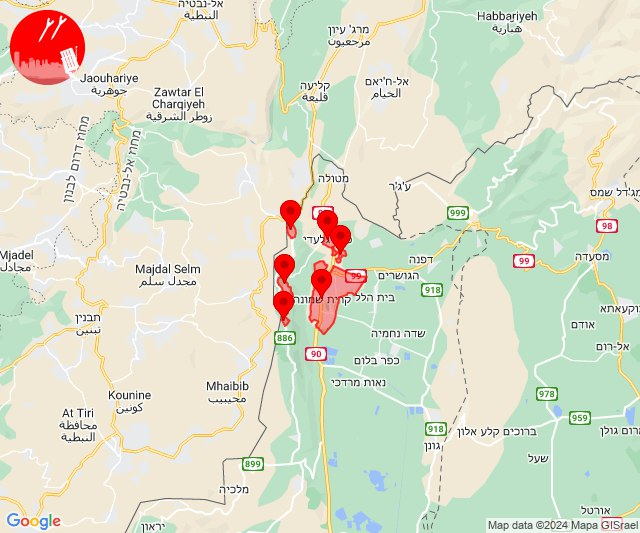
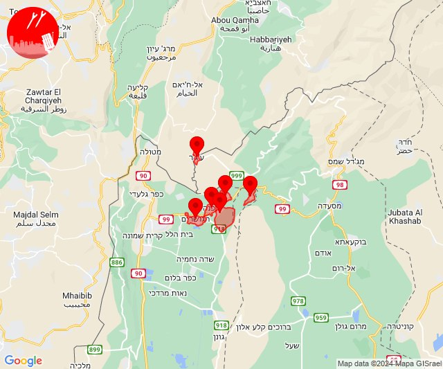
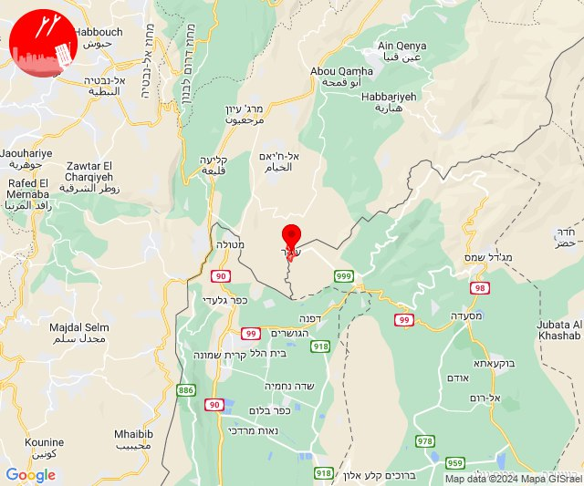
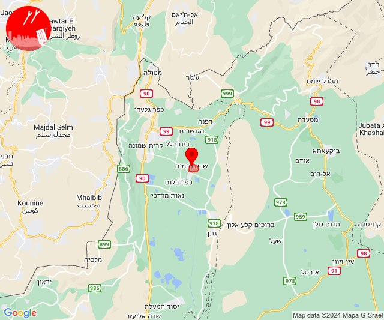
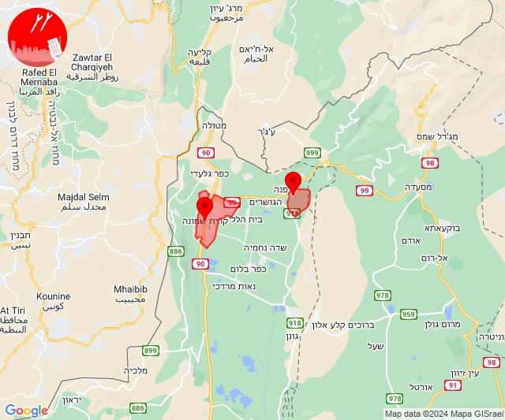
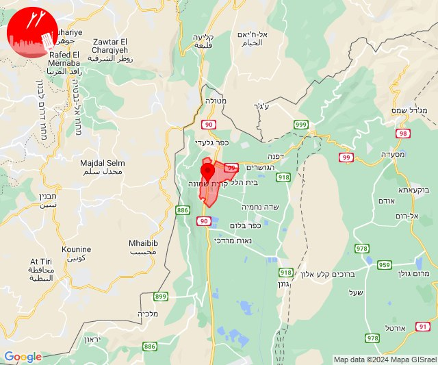
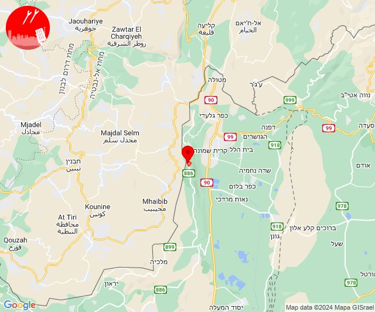
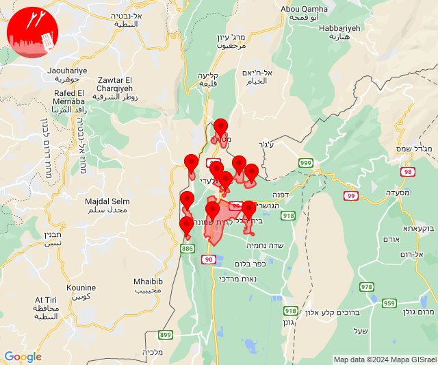
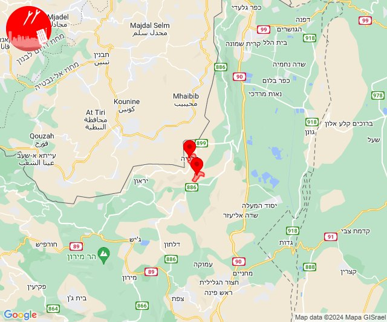

# Alerts for 2024-02-25

## 08:20

🔴 צבע אדום (25/02/2024):

10:20:
• קו העימות: כפר גלעדי, מנרה, מרגליות, משגב עם, קריית שמונה, תל חי (מיידי)

צופר - צבע אדום

## 08:20

## 10:24

✈️ חדירת כלי טיס עוין (25/02/2024):

12:24:
• קו העימות: דפנה, הגושרים, ע'ג'ר, קיבוץ דן, שאר ישוב, שניר 

צופר - צבע אדום

## 10:24

## 10:25

🔴 צבע אדום (25/02/2024):

12:24:
• קו העימות: ע'ג'ר (מיידי)

12:25:
• קו העימות: ע'ג'ר (מיידי)

צופר - צבע אדום

## 10:25

## 10:30

🔴 צבע אדום (25/02/2024):

12:30:
• קו העימות: שדה נחמיה (מיידי)

צופר - צבע אדום

## 10:30

## 11:30

🔴 צבע אדום (25/02/2024):

13:30:
• קו העימות: קריית שמונה, שאר ישוב (מיידי)

צופר - צבע אדום

## 11:30

## 11:58

🔴 צבע אדום (25/02/2024):

13:58:
• קו העימות: קריית שמונה (מיידי)

צופר - צבע אדום

## 11:58

## 13:35

🔴 צבע אדום (25/02/2024):

15:35:
• קו העימות: מנרה (מיידי)

צופר - צבע אדום

## 13:35

## 14:21

✈️ חדירת כלי טיס עוין (25/02/2024):

16:20:
• קו העימות: בית הלל, כפר גלעדי, כפר יובל, מטולה, מנרה, מעיין ברוך, מרגליות, משגב עם, קריית שמונה, תל חי 

16:21:
• קו העימות: כפר גלעדי, מטולה, מרגליות, משגב עם, קריית שמונה, תל חי 

צופר - צבע אדום

## 14:21

## 14:41

🔴 צבע אדום (25/02/2024):

16:41:
• קו העימות: דישון, מלכיה (מיידי)

צופר - צבע אדום

## 14:41

