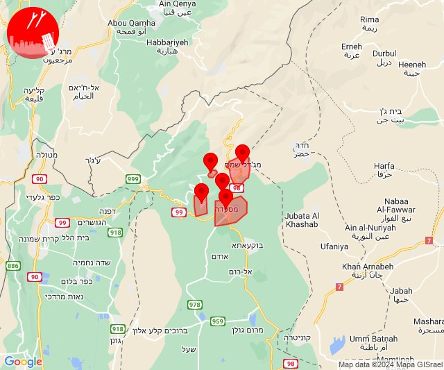
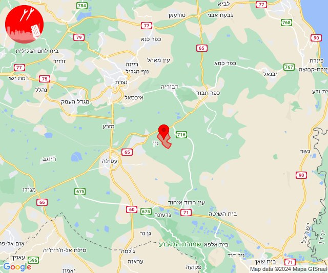
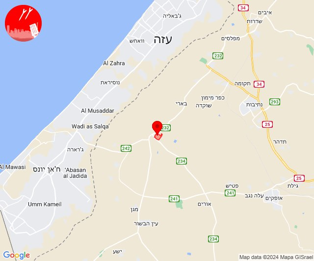
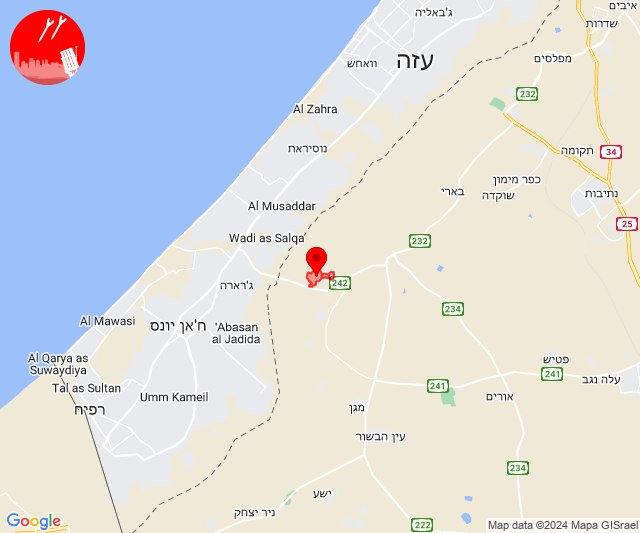
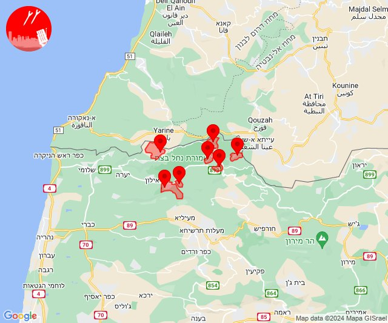
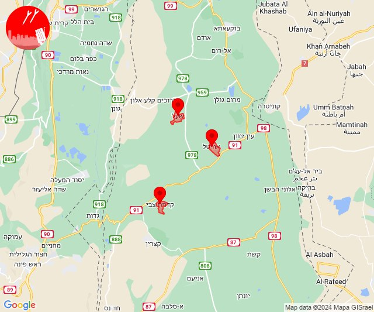
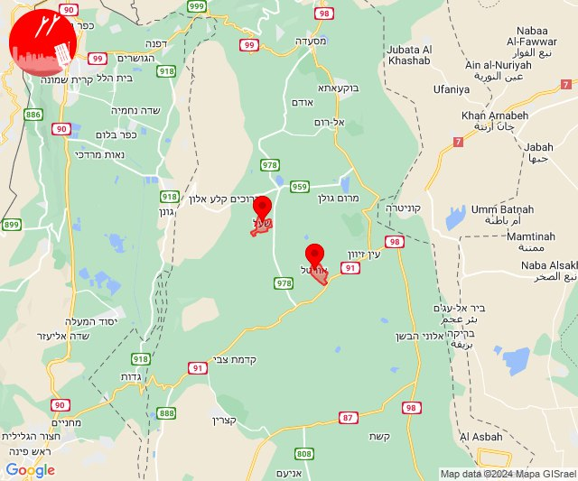
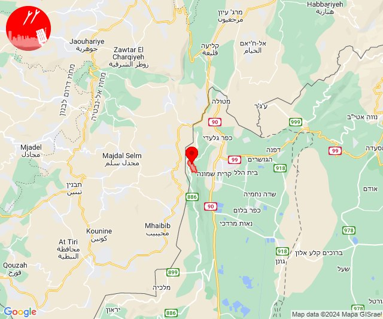

# Alerts for 2024-02-26

## 02:27

✈️ חדירת כלי טיס עוין (26/02/2024):

04:27:
• צפון הגולן: מג'דל שמס, מסעדה, נווה אטי''ב, נמרוד, עין קנייא 

צופר - צבע אדום

## 02:27

## 06:43

🔴 צבע אדום (26/02/2024):

08:43:
• העמקים: אזור תעשייה אלון התבור (דקה)

צופר - צבע אדום

## 06:43

## 07:03

🔴 צבע אדום (26/02/2024):

09:03:
• עוטף עזה: רעים (15 שניות)

צופר - צבע אדום

## 07:03

## 08:00

🔴 צבע אדום (26/02/2024):

10:00:
• עוטף עזה: כיסופים (15 שניות)

צופר - צבע אדום

## 08:00

## 10:01

🔴 צבע אדום (26/02/2024):

12:00:
• קו העימות: שתולה (מיידי)

12:01:
• קו העימות: אבן מנחם, גורן, גורנות הגליל, זרעית, ערב אל עראמשה, שומרה (מיידי)

צופר - צבע אדום

## 10:01

## 14:01

🔴 צבע אדום (26/02/2024):

16:00:
• צפון הגולן: שעל (15 שניות)
• דרום הגולן: קדמת צבי (15 שניות)

16:01:
• צפון הגולן: אורטל (מיידי)

צופר - צבע אדום

## 14:01

## 15:19

🔴 צבע אדום (26/02/2024):

17:19:
• צפון הגולן: אורטל, שעל (מיידי, 15 שניות)

צופר - צבע אדום

## 15:19

## 20:11

🔴 צבע אדום (26/02/2024):

22:11:
• קו העימות: מרגליות (מיידי)

צופר - צבע אדום

## 20:11

