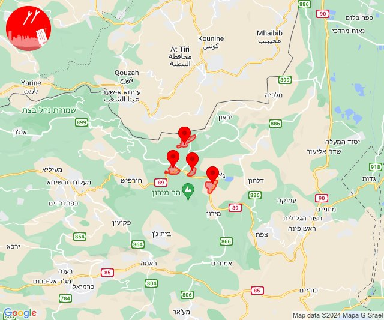
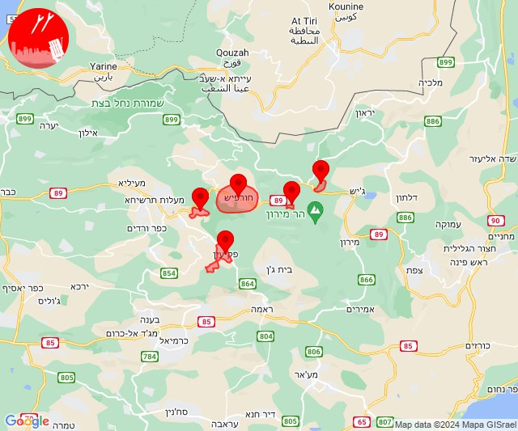
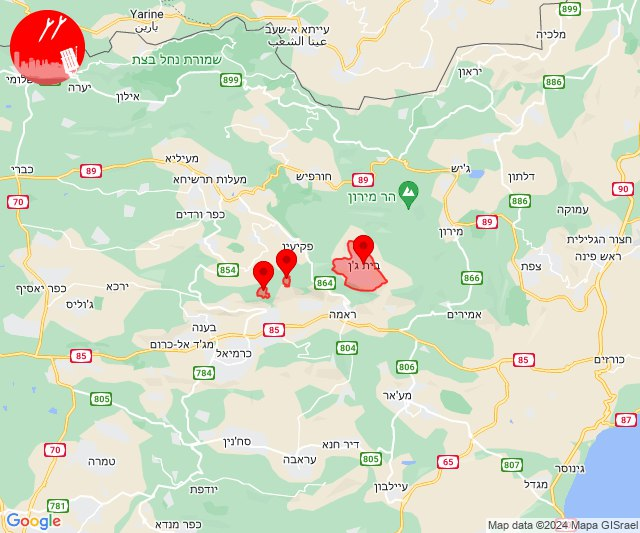
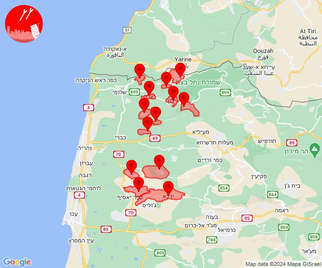
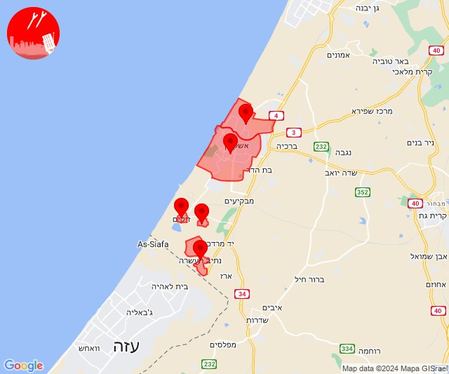

# Alerts for 2024-02-27

## 05:49

🔴 צבע אדום (27/02/2024):

07:48:
• קו העימות: צבעון, סאסא (מיידי)
• גליל עליון: ספסופה - כפר חושן (30 שניות)

07:49:
• קו העימות: דוב''ב, צבעון (מיידי)

צופר - צבע אדום

## 05:49

## 13:32

✈️ חדירת כלי טיס עוין (27/02/2024):

15:32:
• קו העימות: בית ספר שדה מירון, חורפיש, פקיעין, צבעון, צוריאל 

צופר - צבע אדום

## 13:32

## 13:34

✈️ חדירת כלי טיס עוין (27/02/2024):

15:34:
• גליל עליון: בית ג'אן, הר-חלוץ, חרשים 

צופר - צבע אדום

## 13:34

## 14:51

🔴 צבע אדום (27/02/2024):

16:50:
• קו העימות: מנות, אדמית, אילון, חניתה, יערה, עבדון, ערב אל עראמשה, גורן, נווה זיו, אילון (מיידי)

16:51:
• קו העימות: אדמית, יערה, מנות, עבדון, גורן, חניתה, ערב אל עראמשה (מיידי)
• גליל עליון: אבו סנאן, ירכא, כליל, עמקה (30 שניות)

צופר - צבע אדום

## 14:51

## 19:01

🔴 צבע אדום (27/02/2024):

21:01:
• מערב לכיש: אשקלון - דרום, אשקלון - צפון (30 שניות)
• עוטף עזה: נתיב העשרה, זיקים, כרמיה (15 שניות)

צופר - צבע אדום

## 19:01

