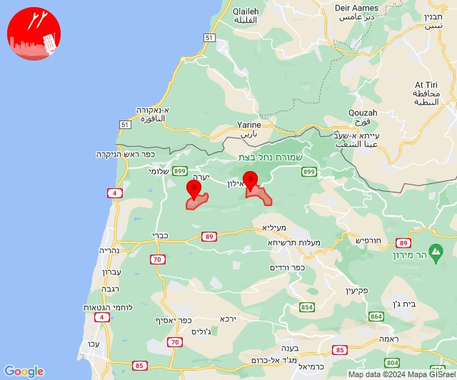
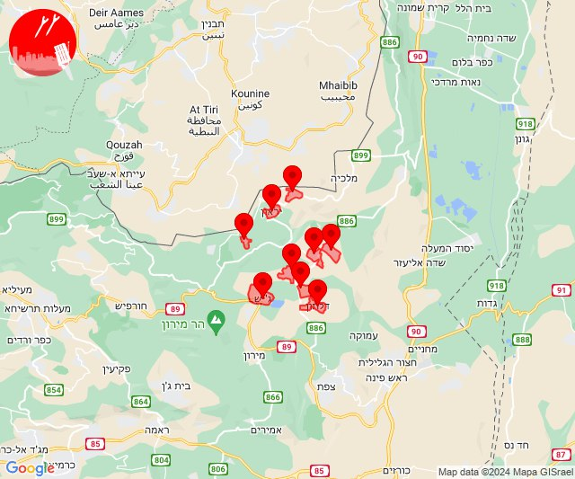
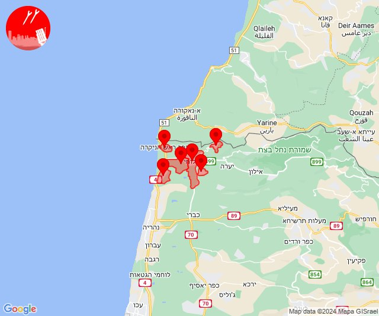
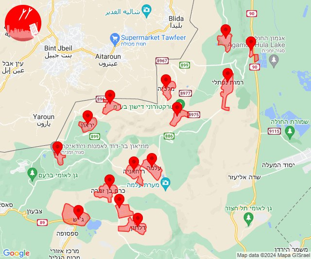
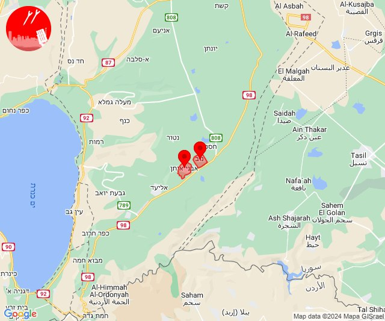

# Alerts for 2024-01-01

## 09:01

🔴 צבע אדום (01/01/2024):

11:01:
• קו העימות: גורן, עבדון (מיידי)

צופר - צבע אדום

## 09:01

## 09:56

✈️ חדירת כלי טיס עוין (01/01/2024):

11:56:
• קו העימות: אביבים, אזור תעשייה רמת דלתון, ברעם, ג'ש - גוש חלב, דלתון, יראון, כרם בן זמרה, עלמה, ריחאנייה 

צופר - צבע אדום

## 09:56

## 11:14

🔴 צבע אדום (01/01/2024):

13:14:
• קו העימות: מטולה (מיידי)

צופר - צבע אדום

## 11:14

## 12:10

🔴 צבע אדום (01/01/2024):

14:10:
• קו העימות: בצת, חניתה, לימן, מצובה, ראש הנקרה, שלומי (מיידי)

צופר - צבע אדום

## 12:10

## 13:34

✈️ חדירת כלי טיס עוין (01/01/2024):

15:34:
• קו העימות: אביבים, אזור תעשייה רמת דלתון, ברעם, ג'ש - גוש חלב, דישון, דלתון, יפתח, יראון, כרם בן זמרה, מלכיה, מרכז אזורי מבואות חרמון, עלמה, ריחאנייה, רמות נפתלי 

צופר - צבע אדום

## 13:34

## 16:12

🔴 צבע אדום (01/01/2024):

18:12:
• קו העימות: קריית שמונה (מיידי)

צופר - צבע אדום

## 16:12

## 19:01

🔴 צבע אדום (01/01/2024):

21:01:
• דרום הגולן: אבני איתן, נוב (מיידי)

צופר - צבע אדום

## 19:01

