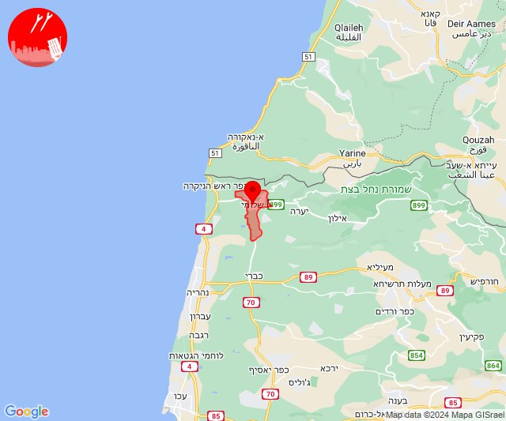

# Alerts for 2024-01-02

## 09:20

✈️ חדירת כלי טיס עוין (02/01/2024):

11:20:
• קו העימות: יפתח, מלכיה, מרכז אזורי מבואות חרמון, רמות נפתלי, דישון 

צופר - צבע אדום

## 09:20

## 13:25

🔴 צבע אדום (02/01/2024):

15:25:
• קו העימות: ערב אל עראמשה (מיידי)

צופר - צבע אדום

## 13:25

## 13:36

🔴 צבע אדום (02/01/2024):

15:36:
• קו העימות: משגב עם (מיידי)

צופר - צבע אדום

## 13:36

## 15:38

🔴 צבע אדום (02/01/2024):

17:38:
• קו העימות: שלומי (מיידי)

צופר - צבע אדום

## 15:38

## 15:48

🔴 צבע אדום (02/01/2024):

17:48:
• עוטף עזה: שדרות, איבים, ניר עם (15 שניות)

צופר - צבע אדום

## 15:48

## 15:57

🔴 צבע אדום (02/01/2024):

17:57:
• קו העימות: מתת (מיידי)

צופר - צבע אדום

## 15:57

## 19:32

🔴 צבע אדום (02/01/2024):

21:32:
• עוטף עזה: כיסופים (15 שניות)

צופר - צבע אדום

## 19:32

