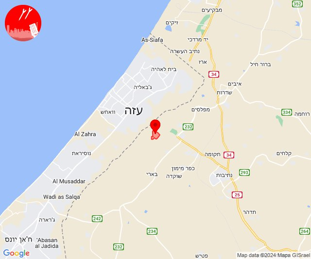
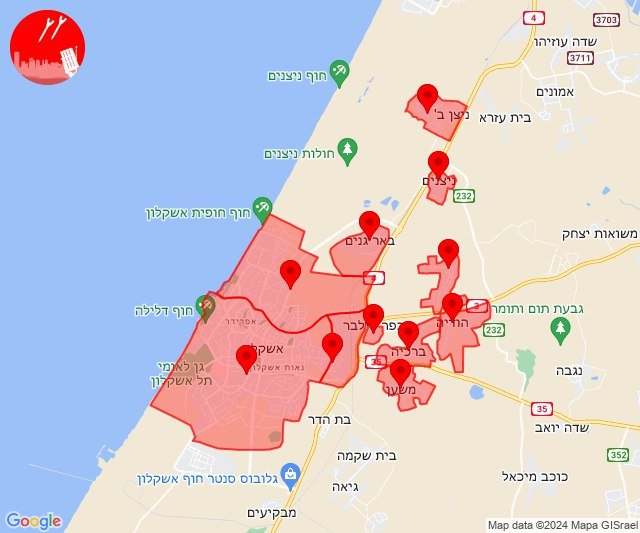
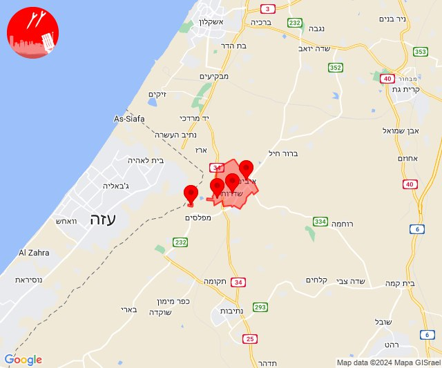
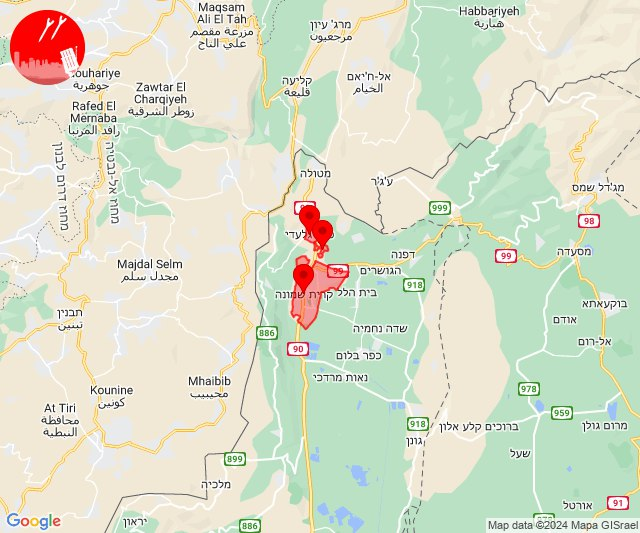
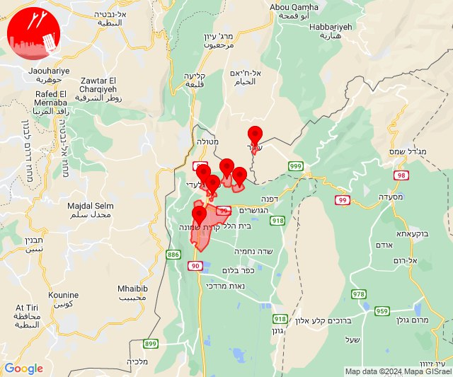

# Alerts for 2024-01-05

## 07:59

🔴 צבע אדום (05/01/2024):

09:59:
• עוטף עזה: נחל עוז (15 שניות)

צופר - צבע אדום

## 07:59

## 12:51

🔴 צבע אדום (05/01/2024):

14:50:
• מערב לכיש: ניצן (45 שניות)

14:51:
• מערב לכיש: ניצנים, ניר ישראל, אזור תעשייה צפוני אשקלון, אשקלון - צפון, באר גנים, כפר סילבר, אשקלון - דרום, ברכיה, הודיה, משען (30 שניות)

צופר - צבע אדום

## 12:51

## 12:54

🔴 צבע אדום (05/01/2024):

14:53:
• עוטף עזה: שדרות, איבים, ניר עם (15 שניות)

14:54:
• עוטף עזה: מטווח ניר עם (15 שניות)

צופר - צבע אדום

## 12:54

## 15:37

🔴 צבע אדום (05/01/2024):

17:37:
• קו העימות: קריית שמונה, כפר גלעדי, תל חי (מיידי)

צופר - צבע אדום

## 15:37

## 16:33

🔴 צבע אדום (05/01/2024):

18:33:
• קו העימות: קריית שמונה, ע'ג'ר, כפר יובל, מעיין ברוך, כפר גלעדי, תל חי (מיידי)

צופר - צבע אדום

## 16:33

