# Alerts for 2024-01-06

## 06:04

✈️ חדירת כלי טיס עוין (06/01/2024):

08:04:
• קו העימות: אבירים, פסוטה, אלקוש, נטועה, אבן מנחם, זרעית, שומרה, שתולה 

צופר - צבע אדום

## 06:04

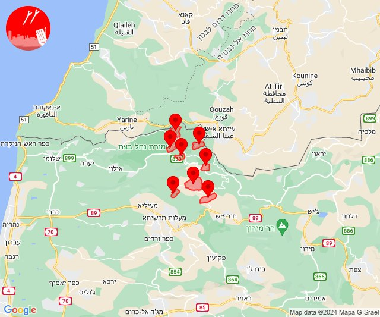

## 06:05

🔴 צבע אדום (06/01/2024):

08:05:
• קו העימות: סאסא, דוב''ב (מיידי)

צופר - צבע אדום

## 06:05

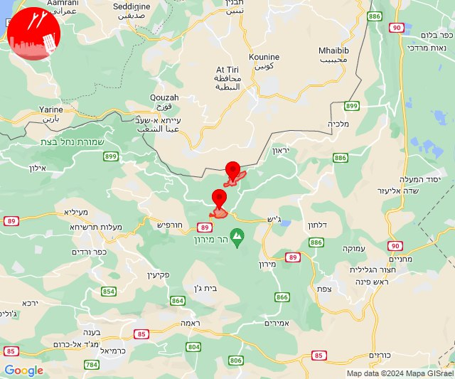

## 06:07

✈️ חדירת כלי טיס עוין (06/01/2024):

08:06:
• קו העימות: אביבים, אזור תעשייה רמת דלתון, בית ספר שדה מירון, ברעם, ג'ש - גוש חלב, דוב''ב, דלתון, חורפיש, יראון, כרם בן זמרה, מתת, סאסא, עלמה, פקיעין, צבעון, צוריאל, ריחאנייה 

08:07:
• גליל עליון: אזור תעשייה חצור הגלילית, אזור תעשייה כרמיאל, אזור תעשייה צ.ח.ר, אליפלט, אמנון, ביריה, בית ג'אן, בענה, דיר אל-אסד, הר-חלוץ, חצור הגלילית, חרשים, טובא זנגריה, כורזים ורד הגליל, כפר הנשיא, כרכום, כרמיאל, לבון, מג'דל כרום, מחניים, נחף, סאג'ור, עין אל אסד, עמיעד, צורית גילון, צפת, ראמה, ראש פינה, שזור, אור הגנוז, איילת השחר, אמירים, בר יוחאי, גדות, חולתה, יסוד המעלה, כפר שמאי, מירון, מרכז אזורי מרום גליל, משמר הירדן, ספסופה - כפר חושן, עין כמונים, עמוקה, פרוד, קדיתא, שדה אליעזר, שפר, מנחת מחניים 
• דרום הגולן: אלמגור 
• קו העימות: הילה, חוסן, כפר ורדים, מעונה, מעיליא, מעלות תרשיחא, אבירים, אבן מנחם, אדמית, אילון, אלקוש, גורן, גורנות הגליל, געתון, זרעית, חניתה, יחיעם, יערה, כברי, מנות, נווה זיו, נטועה, עבדון, עין יעקב, ערב אל עראמשה, פסוטה, שומרה, שתולה 

צופר - צבע אדום

## 06:07

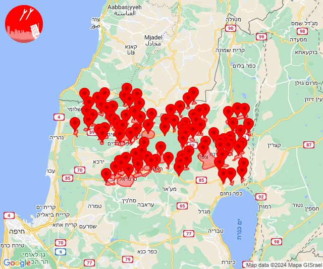

## 07:10

🔴 צבע אדום (06/01/2024):

09:09:
• קו העימות: כפר גלעדי, מרגליות (מיידי)

09:10:
• קו העימות: מנרה, משגב עם, קריית שמונה (מיידי)

צופר - צבע אדום

## 07:10

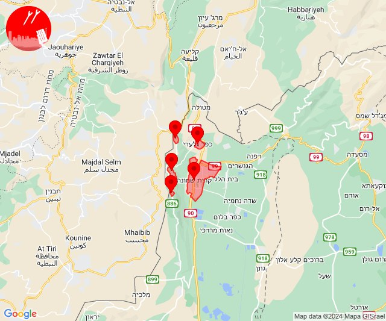

## 07:10

✈️ חדירת כלי טיס עוין (06/01/2024):

09:10:
• קו העימות: בית הלל, כפר גלעדי, כפר יובל, מטולה, מנרה, מעיין ברוך, מרגליות, משגב עם, קריית שמונה, תל חי, גונן, דישון, דפנה, הגושרים, יפתח, כפר בלום, כפר סאלד, להבות הבשן, מלכיה, מרכז אזורי מבואות חרמון, נאות מרדכי, ע'ג'ר, עמיר, קיבוץ דן, רמות נפתלי, שאר ישוב, שדה נחמיה, שמיר, שניר 

צופר - צבע אדום

## 07:10

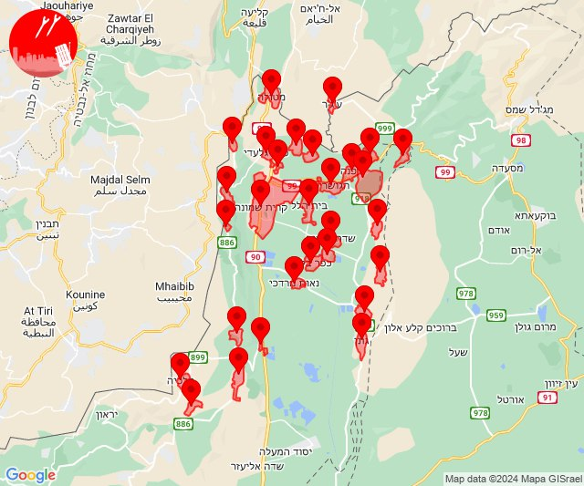

## 07:13

✈️ חדירת כלי טיס עוין (06/01/2024):

09:13:
• צפון הגולן: אודם, אל רום, בוקעתא, מג'דל שמס, מסעדה, נווה אטי''ב, נמרוד, עין קנייא 

צופר - צבע אדום

## 07:14

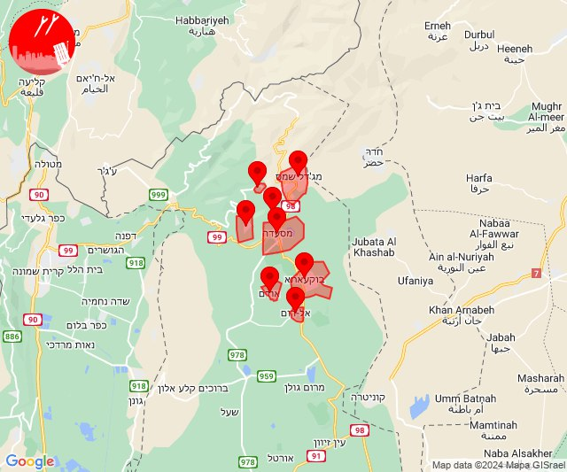

## 10:21

🔴 צבע אדום (06/01/2024):

12:21:
• עוטף עזה: מפלסים (15 שניות)

צופר - צבע אדום

## 10:22

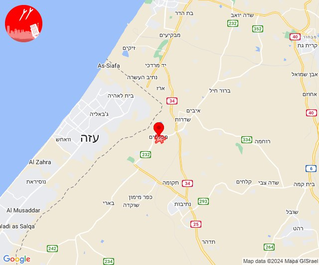

## 11:39

✈️ חדירת כלי טיס עוין (06/01/2024):

13:39:
• קו העימות: אדמית, אזור תעשייה אכזיב מילואות, אילון, בצת, גורן, גורנות הגליל, חניתה, יערה, לימן, מצובה, ערב אל עראמשה, ראש הנקרה, שלומי 

צופר - צבע אדום

## 11:39

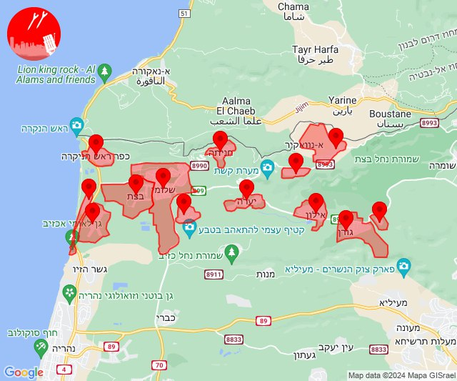

## 11:39

🔴 צבע אדום (06/01/2024):

13:39:
• קו העימות: חניתה, שלומי (מיידי)

צופר - צבע אדום

## 11:39

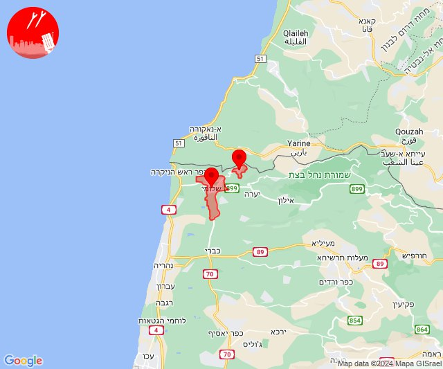

## 12:04

✈️ חדירת כלי טיס עוין (06/01/2024):

14:04:
• דרום הגולן: חמת גדר, האון, מסדה, מעגן, עין גב, שער הגולן, תל קציר 
• גליל תחתון: אזור תעשייה צמח, המכללה האקדמית כנרת 

צופר - צבע אדום

## 12:04

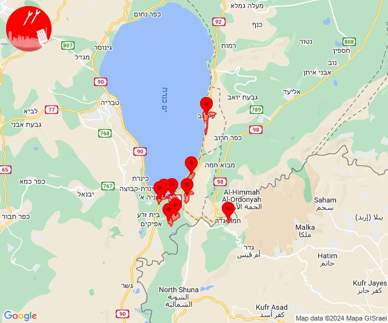

## 12:55

✈️ חדירת כלי טיס עוין (06/01/2024):

14:55:
• קו העימות: אבירים, אלקוש, נטועה, פסוטה 

צופר - צבע אדום

## 12:55

🔴 צבע אדום (06/01/2024):

14:55:
• קו העימות: אבן מנחם, פסוטה, נטועה (מיידי)

צופר - צבע אדום

## 12:57

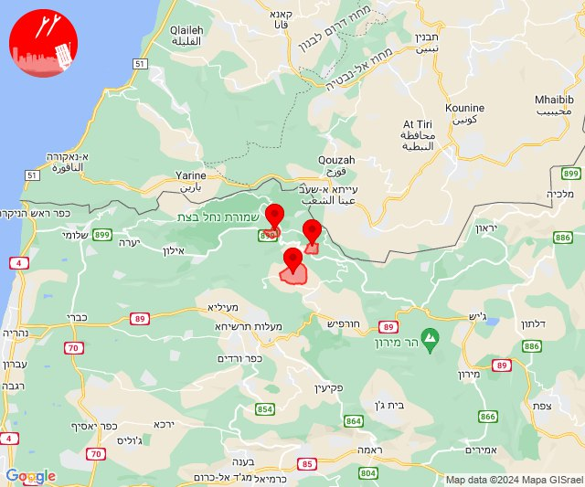

## 14:55

🔴 צבע אדום (06/01/2024):

16:55:
• קו העימות: שתולה (מיידי)

צופר - צבע אדום

## 14:55

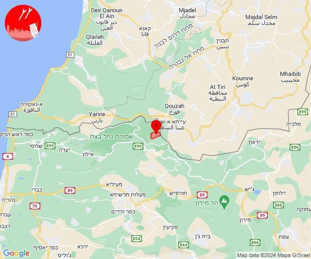

## 15:49

🔴 צבע אדום (06/01/2024):

17:49:
• עוטף עזה: שדרות, איבים, ניר עם (15 שניות)

צופר - צבע אדום

## 15:49

## 18:22

🔴 צבע אדום (06/01/2024):

20:22:
• קו העימות: אבן מנחם (מיידי)

צופר - צבע אדום

## 18:23

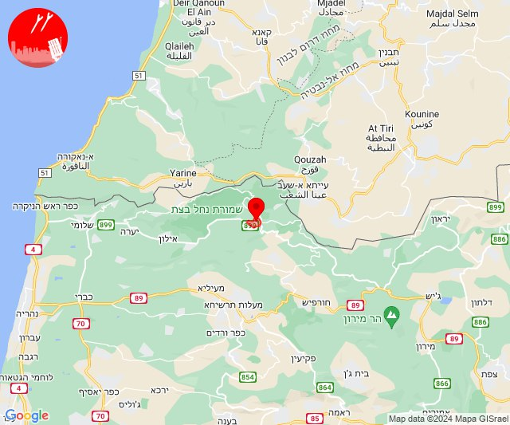

