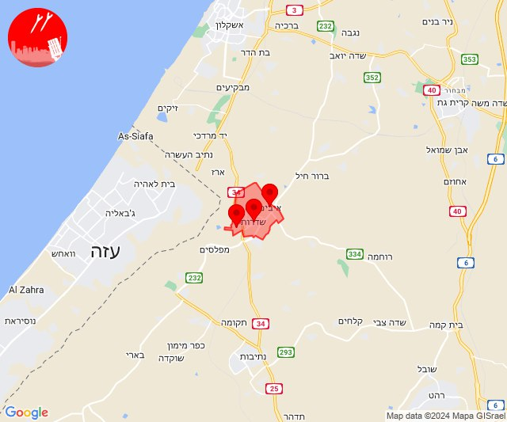

# Alerts for 2024-01-08

## 11:44

✈️ חדירת כלי טיס עוין (08/01/2024):

13:44:
• קו העימות: בית הלל, כפר גלעדי, כפר יובל, מטולה, מנרה, מעיין ברוך, מרגליות, משגב עם, קריית שמונה, תל חי 

צופר - צבע אדום

## 11:44

## 11:50

🔴 צבע אדום (08/01/2024):

13:50:
• קו העימות: כפר בלום (מיידי)

צופר - צבע אדום

## 11:50

## 12:35

✈️ חדירת כלי טיס עוין (08/01/2024):

14:35:
• קו העימות: אביבים, אזור תעשייה רמת דלתון, ברעם, ג'ש - גוש חלב, דישון, דלתון, יפתח, יראון, כרם בן זמרה, מלכיה, מרכז אזורי מבואות חרמון, עלמה, ריחאנייה, רמות נפתלי 

צופר - צבע אדום

## 12:35

## 13:18

✈️ חדירת כלי טיס עוין (08/01/2024):

15:18:
• קו העימות: יפתח, רמות נפתלי, מרכז אזורי מבואות חרמון, מלכיה, דישון 

צופר - צבע אדום

## 13:18

## 13:58

🔴 צבע אדום (08/01/2024):

15:58:
• קו העימות: ראש הנקרה (מיידי)

צופר - צבע אדום

## 13:58

## 14:02

🔴 צבע אדום (08/01/2024):

16:02:
• קו העימות: שלומי (מיידי)

צופר - צבע אדום

## 14:02

## 15:48

🔴 צבע אדום (08/01/2024):

17:46:
• השפלה: נצר סרני, רחובות, באר יעקב, ישרש, רמלה, סתריה, גיבתון, גן שלמה, נס ציונה, לוד, ניר צבי, ראשון לציון - מזרח, תעשיון צריפין, ראשון לציון - מערב (דקה וחצי)
• לכיש: גבעת ברנר (דקה וחצי)
• דן: חולון (דקה וחצי)

17:47:
• לכיש: בית גמליאל, בניה, כפר מרדכי, שדמה, משגב דב, עשרת, גבעת וושינגטון, קבוצת יבנה (דקה)

17:48:
• לכיש: בני דרום, ביצרון, גן הדרום, גן יבנה, חצור, כנות, כפר אביב, כרם ביבנה, מישר, מתחם בני דרום, נווה מבטח (45 שניות, דקה)
• השפלה: כפר ביל''ו, נען (דקה וחצי)

צופר - צבע אדום

## 15:48

## 18:59

🔴 צבע אדום (08/01/2024):

20:59:
• עוטף עזה: שדרות, איבים, ניר עם (15 שניות)

צופר - צבע אדום

## 18:59

