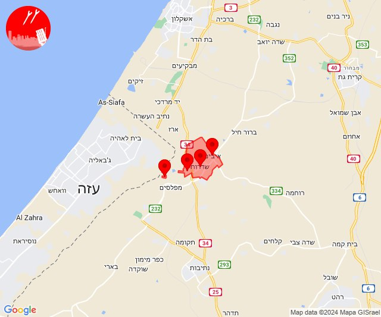

# Alerts for 2024-01-09

## 07:30

✈️ חדירת כלי טיס עוין (09/01/2024):

09:30:
• קו העימות: דישון, יפתח, מלכיה, מרכז אזורי מבואות חרמון, רמות נפתלי, אביבים, ברעם, יראון 

צופר - צבע אדום

## 07:30

## 07:43

🔴 צבע אדום (09/01/2024):

09:41:
• קו העימות: יפתח (מיידי)

09:42:
• קו העימות: דישון, מלכיה (מיידי)

09:43:
• קו העימות: רמות נפתלי (מיידי)

צופר - צבע אדום

## 07:43

## 07:47

✈️ חדירת כלי טיס עוין (09/01/2024):

09:47:
• גליל עליון: ביריה, צפת 

צופר - צבע אדום

## 07:47

## 08:06

🔴 צבע אדום (09/01/2024):

10:06:
• קו העימות: דישון, מלכיה (מיידי)

צופר - צבע אדום

## 08:06

## 08:06

✈️ חדירת כלי טיס עוין (09/01/2024):

10:04:
• קו העימות: יפתח, מלכיה, מרכז אזורי מבואות חרמון, ברעם, רמות נפתלי, אביבים, דישון, יראון, אזור תעשייה רמת דלתון, ג'ש - גוש חלב, דלתון, כרם בן זמרה, עלמה, ריחאנייה 

10:06:
• גליל עליון: איילת השחר, גדות, חולתה, יסוד המעלה, משמר הירדן, עמוקה, שדה אליעזר, איילת השחר, גדות, חולתה, יסוד המעלה, משמר הירדן, עמוקה, שדה אליעזר 
• קו העימות: אביבים, אזור תעשייה רמת דלתון, ברעם, ג'ש - גוש חלב, דישון, דלתון, יפתח, יראון, כרם בן זמרה, מלכיה, מרכז אזורי מבואות חרמון, עלמה, ריחאנייה, רמות נפתלי 

צופר - צבע אדום

## 08:06

## 08:10

✈️ חדירת כלי טיס עוין (09/01/2024):

10:10:
• קו העימות: אזור תעשייה רמת דלתון, ג'ש - גוש חלב, דלתון, כרם בן זמרה, עלמה, ריחאנייה 

צופר - צבע אדום

## 08:10

## 08:13

✈️ חדירת כלי טיס עוין (09/01/2024):

10:13:
• גליל עליון: ביריה, צפת 

צופר - צבע אדום

## 08:13

## 11:24

✈️ חדירת כלי טיס עוין (09/01/2024):

13:24:
• קו העימות: אביבים, ברעם, יראון 

צופר - צבע אדום

## 11:24

## 11:26

✈️ חדירת כלי טיס עוין (09/01/2024):

13:26:
• קו העימות: דלתון, ריחאנייה, אזור תעשייה רמת דלתון, עלמה, ג'ש - גוש חלב, כרם בן זמרה 

צופר - צבע אדום

## 11:26

## 12:47

✈️ חדירת כלי טיס עוין (09/01/2024):

14:46:
• קו העימות: רמות נפתלי, יפתח, מלכיה, מרכז אזורי מבואות חרמון, דישון 

14:47:
• קו העימות: גונן, כפר בלום, כפר סאלד, להבות הבשן, נאות מרדכי, עמיר, שדה נחמיה, שמיר 

צופר - צבע אדום

## 12:47

## 12:55

✈️ חדירת כלי טיס עוין (09/01/2024):

14:55:
• קו העימות: יפתח, מלכיה, מרכז אזורי מבואות חרמון, רמות נפתלי, דישון 

צופר - צבע אדום

## 12:55

## 13:09

✈️ חדירת כלי טיס עוין (09/01/2024):

15:09:
• קו העימות: דישון, יפתח, מלכיה, מרכז אזורי מבואות חרמון, רמות נפתלי 

צופר - צבע אדום

## 13:09

## 13:25

✈️ חדירת כלי טיס עוין (09/01/2024):

15:25:
• קו העימות: בית הלל, כפר גלעדי, כפר יובל, מטולה, מנרה, מעיין ברוך, מרגליות, משגב עם, קריית שמונה, תל חי, דפנה, הגושרים, ע'ג'ר, קיבוץ דן, שאר ישוב, שניר 

צופר - צבע אדום

## 13:25

## 13:51

✈️ חדירת כלי טיס עוין (09/01/2024):

15:51:
• קו העימות: ברעם, אביבים, יראון 

צופר - צבע אדום

## 13:51

## 13:53

✈️ חדירת כלי טיס עוין (09/01/2024):

15:53:
• קו העימות: עלמה, ג'ש - גוש חלב, אזור תעשייה רמת דלתון, דלתון, כרם בן זמרה, ריחאנייה 

צופר - צבע אדום

## 13:53

## 13:56

🔴 צבע אדום (09/01/2024):

15:56:
• קו העימות: דישון (מיידי)

צופר - צבע אדום

## 13:56

## 15:18

🔴 צבע אדום (09/01/2024):

17:18:
• עוטף עזה: עלומים, נחל עוז (15 שניות)

צופר - צבע אדום

## 15:18

## 16:16

🔴 צבע אדום (09/01/2024):

18:16:
• עוטף עזה: שדרות, איבים, ניר עם, מטווח ניר עם (15 שניות)

צופר - צבע אדום

## 16:16

## 18:19

✈️ חדירת כלי טיס עוין (09/01/2024):

20:19:
• קו העימות: רמות נפתלי, יפתח, מלכיה, מרכז אזורי מבואות חרמון, דישון 

צופר - צבע אדום

## 18:19

