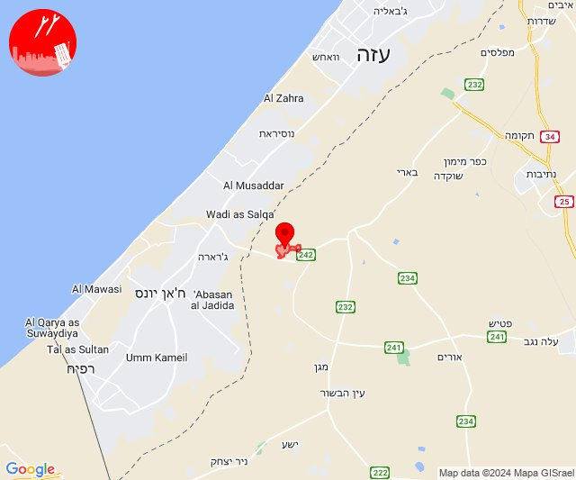
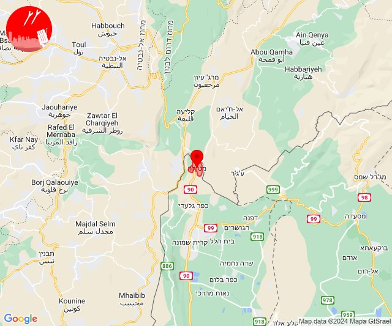
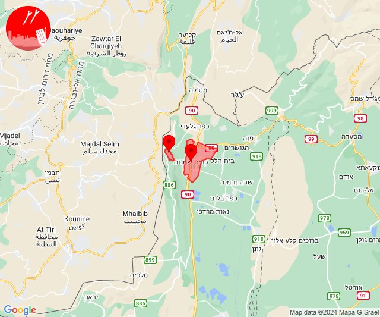
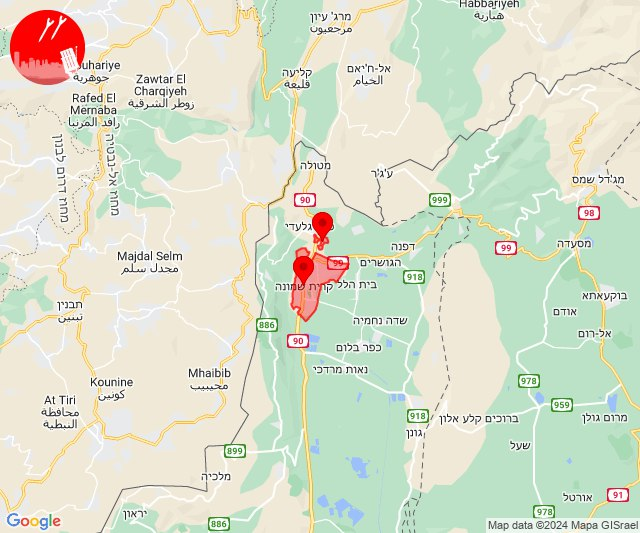

# Alerts for 2024-01-11

## 08:28

🔴 צבע אדום (11/01/2024):

10:28:
• עוטף עזה: כיסופים (15 שניות)

צופר - צבע אדום

## 08:28

## 11:54

✈️ חדירת כלי טיס עוין (11/01/2024):

13:54:
• קו העימות: דישון, יפתח, מלכיה, מרכז אזורי מבואות חרמון, רמות נפתלי 

צופר - צבע אדום

## 11:54

## 12:59

🔴 צבע אדום (11/01/2024):

14:59:
• קו העימות: מטולה (מיידי)

צופר - צבע אדום

## 12:59

## 13:51

🔴 צבע אדום (11/01/2024):

15:50:
• קו העימות: קריית שמונה (מיידי)

15:51:
• קו העימות: מרגליות (מיידי)

צופר - צבע אדום

## 13:51

## 14:00

🔴 צבע אדום (11/01/2024):

16:00:
• קו העימות: קריית שמונה, תל חי (מיידי)

צופר - צבע אדום

## 14:00

