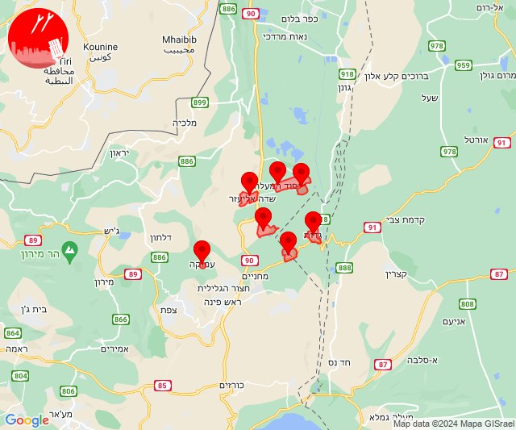
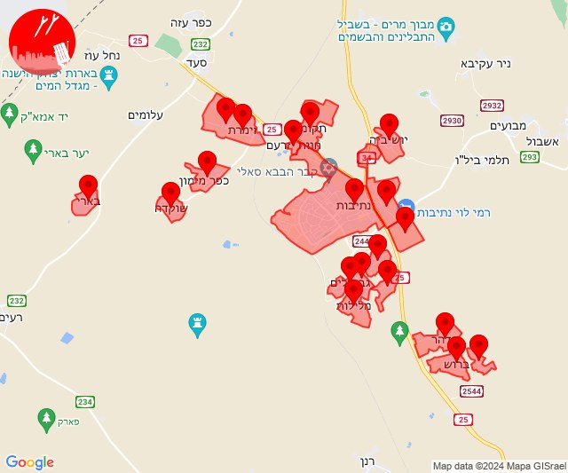
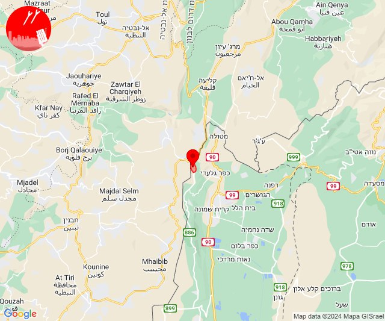
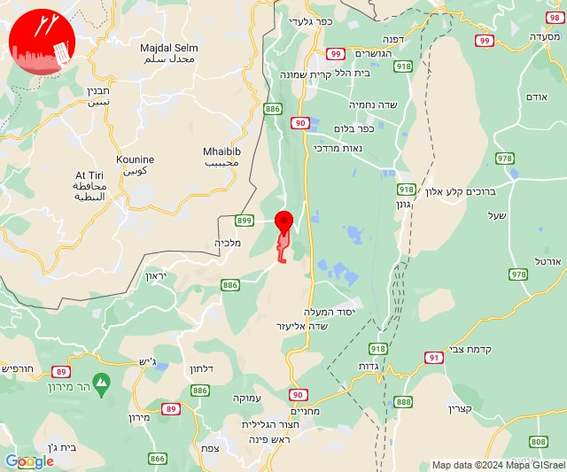

# Alerts for 2024-01-16

## 05:19

✈️ חדירת כלי טיס עוין (16/01/2024):

07:19:
• גליל עליון: איילת השחר, גדות, חולתה, יסוד המעלה, משמר הירדן, עמוקה, שדה אליעזר 

צופר - צבע אדום

## 05:19

## 07:44

🔴 צבע אדום (16/01/2024):

09:43:
• מערב הנגב: נתיבות, שרשרת, בית הגדי, מעגלים, גבעולים, מלילות, אזור תעשייה נ.ע.מ, שיבולים, תדהר, ברוש, תאשור, יושיביה (30 שניות, 15 שניות)
• עוטף עזה: כפר מימון ותושיה, שוקדה, תקומה, זמרת, שובה, בארי, חוות יזרעם (15 שניות)

צופר - צבע אדום

## 07:44

## 10:10

🔴 צבע אדום (16/01/2024):

12:10:
• קו העימות: משגב עם (מיידי)

צופר - צבע אדום

## 10:10

## 13:25

🔴 צבע אדום (16/01/2024):

15:25:
• קו העימות: רמות נפתלי (מיידי)

צופר - צבע אדום

## 13:25

