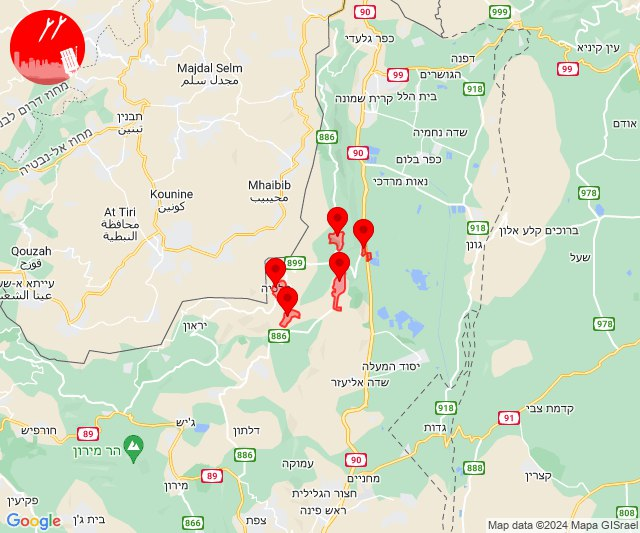
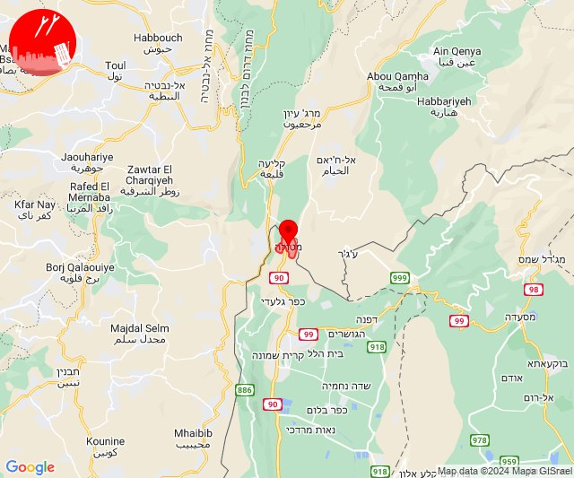
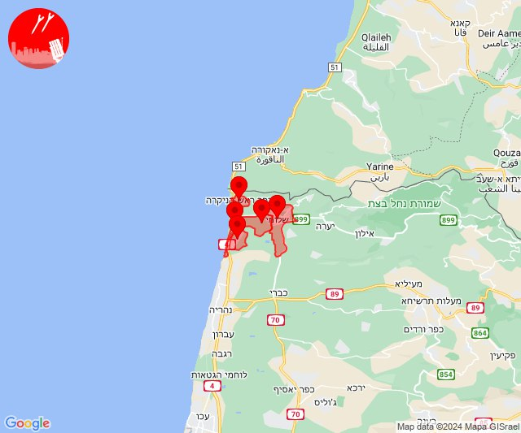
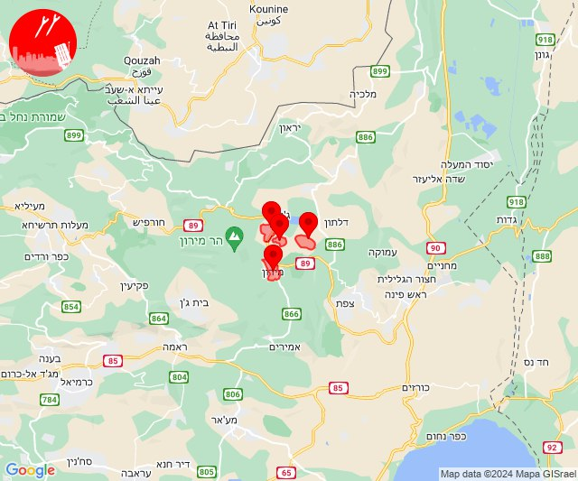
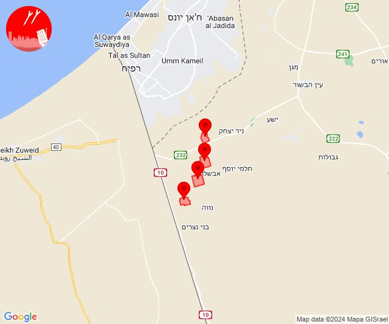

# Alerts for 2024-01-17

## 13:58

✈️ חדירת כלי טיס עוין (17/01/2024):

15:58:
• קו העימות: דישון, יפתח, מלכיה, מרכז אזורי מבואות חרמון, רמות נפתלי 

צופר - צבע אדום

## 13:58

## 14:13

🔴 צבע אדום (17/01/2024):

16:13:
• קו העימות: מטולה (מיידי)

צופר - צבע אדום

## 14:13

## 14:24

🔴 צבע אדום (17/01/2024):

16:24:
• קו העימות: בצת, לימן, אזור תעשייה אכזיב מילואות, ראש הנקרה, שלומי (מיידי)

צופר - צבע אדום

## 14:25

## 16:41

✈️ חדירת כלי טיס עוין (17/01/2024):

18:41:
• קו העימות: אזור תעשייה רמת דלתון, ג'ש - גוש חלב, דלתון, כרם בן זמרה, עלמה, ריחאנייה 

צופר - צבע אדום

## 16:41

## 16:44

✈️ חדירת כלי טיס עוין (17/01/2024):

18:44:
• גליל עליון: ספסופה - כפר חושן, אור הגנוז, קדיתא, מירון 

צופר - צבע אדום

## 16:44

## 22:19

🔴 צבע אדום (18/01/2024):

00:19:
• עוטף עזה: יתד, שלומית, יבול, חולית (15 שניות, 30 שניות)

צופר - צבע אדום

## 22:19

