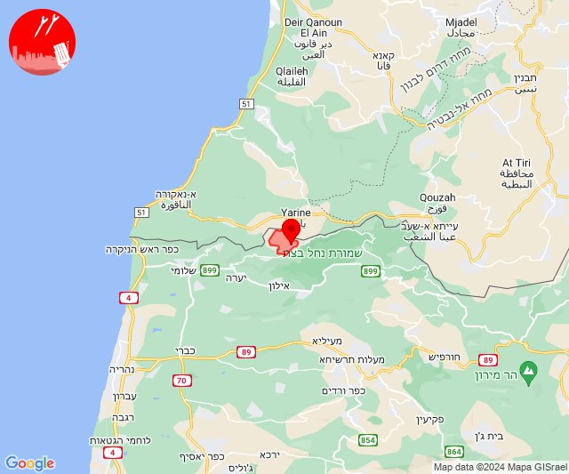
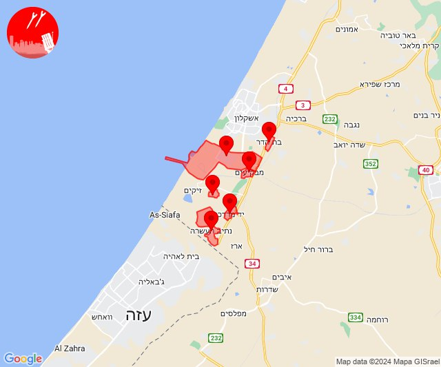

# Alerts for 2024-01-28

## 05:33

🔴 צבע אדום (28/01/2024):

07:33:
• עוטף עזה: כיסופים (15 שניות)

צופר - צבע אדום

## 05:33

## 12:00

🔴 צבע אדום (28/01/2024):

14:00:
• קו העימות: קריית שמונה (מיידי)

צופר - צבע אדום

## 12:00

## 12:36

🔴 צבע אדום (28/01/2024):

14:36:
• עוטף עזה: שדרות, איבים, ניר עם (15 שניות)

צופר - צבע אדום

## 12:36

## 14:08

🔴 צבע אדום (28/01/2024):

16:08:
• קו העימות: ערב אל עראמשה (מיידי)

צופר - צבע אדום

## 14:08

## 14:15

🔴 צבע אדום (28/01/2024):

16:15:
• קו העימות: זרעית, ערב אל עראמשה, שומרה (מיידי)

צופר - צבע אדום

## 14:15

## 14:29

✈️ חדירת כלי טיס עוין (28/01/2024):

16:29:
• דרום הגולן: קדמת צבי, קצרין - אזור תעשייה, קצרין 

צופר - צבע אדום

## 14:29

## 14:34

🔴 צבע אדום (28/01/2024):

16:34:
• דרום הגולן: קצרין - אזור תעשייה (30 שניות)

צופר - צבע אדום

## 14:34

## 14:34

✈️ חדירת כלי טיס עוין (28/01/2024):

16:34:
• דרום הגולן: קדמת צבי, קצרין - אזור תעשייה, קצרין 

צופר - צבע אדום

## 14:34

## 19:03

🔴 צבע אדום (28/01/2024):

21:03:
• מערב לכיש: אזור תעשייה הדרומי אשקלון, מבקיעים, בת הדר (30 שניות)
• עוטף עזה: יד מרדכי, כרמיה, נתיב העשרה (15 שניות)

צופר - צבע אדום

## 19:03

