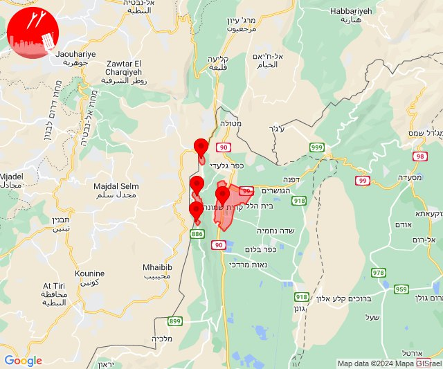

# Alerts for 2024-01-29

## 08:01

🔴 צבע אדום (29/01/2024):

10:01:
• קו העימות: ראש הנקרה (מיידי)

צופר - צבע אדום

## 08:01

## 11:33

🔴 צבע אדום (29/01/2024):

13:33:
• קו העימות: מנרה, מרגליות, משגב עם, קריית שמונה (מיידי)

צופר - צבע אדום

## 11:33

## 14:52

🔴 צבע אדום (29/01/2024):

16:50:
• דן: חולון, תל אביב - דרום העיר ויפו, תל אביב - מזרח, אזור, בת-ים, מקווה ישראל, אור יהודה (דקה וחצי)
• השפלה: ראשון לציון - מערב, ראשון לציון - מזרח, אזור תעשייה נשר - רמלה, אחיסמך, בן שמן, לוד, בית דגן, חמד, כפר חב''ד, משמר השבעה, צפריה, גנות, מצליח, יד רמב''ם (דקה וחצי)
• ירקון: גמזו, כפר דניאל (דקה וחצי)

16:51:
• דן: יהוד-מונוסון (דקה וחצי)
• ירקון: בני עטרות (דקה וחצי)
• השפלה: יגל, אחיעזר, באר יעקב, ניר צבי, תעשיון צריפין, זיתן, פארק תעשיות פלמחים, בית חנן, בית עובד, גן שורק, נטעים (דקה וחצי)
• לכיש: פלמחים (דקה וחצי)

16:52:
• השפלה: נס ציונה, ישרש, רמלה, גני הדר, נען, סתריה, עזריה, פתחיה, אירוס, רמות מאיר, נצר סרני (דקה וחצי)

צופר - צבע אדום

## 14:52

## 15:10

🔴 צבע אדום (29/01/2024):

17:10:
• קו העימות: מתת (מיידי)

צופר - צבע אדום

## 15:10

## 18:22

🔴 צבע אדום (29/01/2024):

20:22:
• קו העימות: קריית שמונה (מיידי)

צופר - צבע אדום

## 18:22

