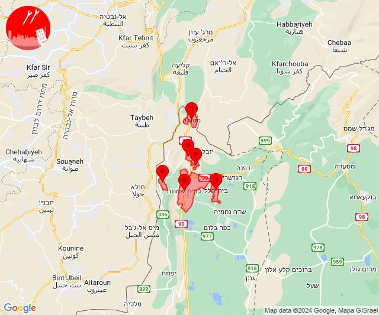
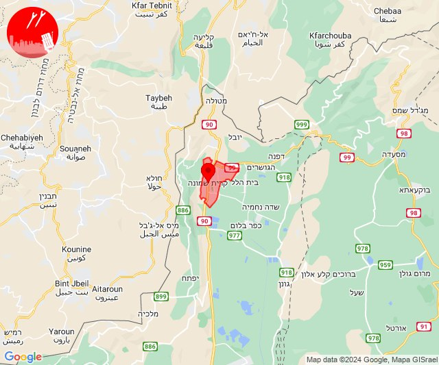
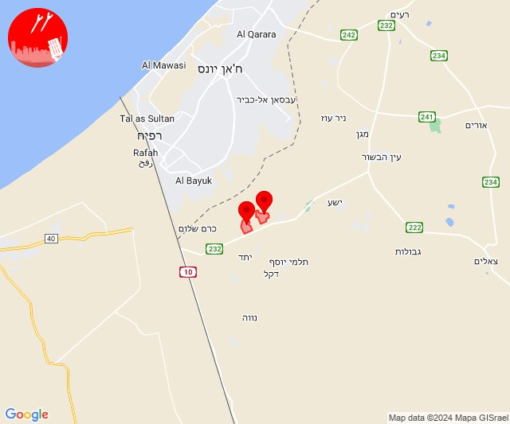

# Alerts for 2024-07-02

## 10:31

✈️ חדירת כלי טיס עוין (02/07/2024):

13:31:
• קו העימות: דישון, יפתח, מלכיה, מרכז אזורי מבואות חרמון, רמות נפתלי 

צופר - צבע אדום

## 10:31

## 14:00

🔴 צבע אדום (02/07/2024):

17:00:
• קו העימות: קריית שמונה, מרגליות, בית הלל, תל חי, כפר גלעדי, מטולה (מיידי)

צופר - צבע אדום

## 14:00

## 14:06

🔴 צבע אדום (02/07/2024):

17:06:
• קו העימות: קריית שמונה (מיידי)

צופר - צבע אדום

## 14:06

## 21:00

🔴 צבע אדום (02/07/2024-03/07/2024):

23:59:
• עוטף עזה: סופה (15 שניות)

00:00:
• עוטף עזה: חולית (15 שניות)

צופר - צבע אדום

## 21:00

