# Alerts for 2024-07-04

## 07:00

🔴 צבע אדום (04/07/2024):

10:00:
• קו העימות: כפר בלום, עמיר, קריית שמונה, שדה נחמיה, בית הלל, להבות הבשן, נאות מרדכי, כפר גלעדי, תל חי (מיידי, 15 שניות)

צופר - צבע אדום

## 07:00

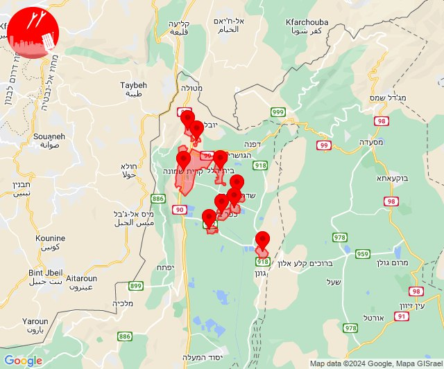

## 07:25

✈️ חדירת כלי טיס עוין (04/07/2024):

10:25:
• גליל עליון: איילת השחר 

צופר - צבע אדום

## 07:25

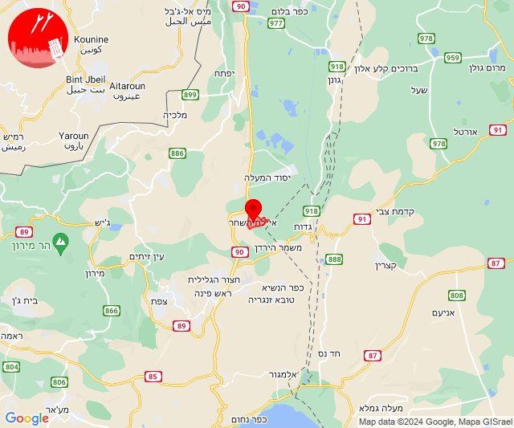

## 07:29

## 07:30

🔴 צבע אדום (04/07/2024):

10:29:
• קו העימות: דישון (מיידי)

10:30:
• קו העימות: יפתח (מיידי)

צופר - צבע אדום

## 07:30

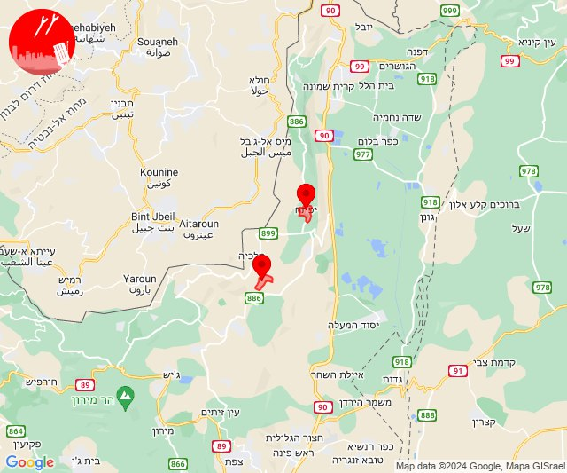

## 07:31

✈️ חדירת כלי טיס עוין (04/07/2024):

10:27:
• קו העימות: אביבים, ברעם, דישון, יפתח, יראון, מלכיה, מרכז אזורי מבואות חרמון, רמות נפתלי 

10:28:
• קו העימות: דישון, מלכיה 

10:29:
• קו העימות: יפתח, רמות נפתלי 

10:30:
• קו העימות: מצובה, שלומי, בצת, מרכז אזורי מבואות חרמון, כרם בן זמרה 
• גליל עליון: איילת השחר 

10:31:
• קו העימות: ריחאנייה 

צופר - צבע אדום

## 07:31

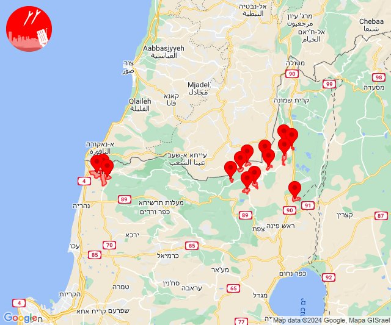

## 07:32

✈️ חדירת כלי טיס עוין (04/07/2024):

10:32:
• קו העימות: בית הלל, כפר גלעדי, כפר יובל, מטולה, מנרה, מעיין ברוך, מרגליות, משגב עם, קריית שמונה, תל חי, דפנה, הגושרים, ע'ג'ר, קיבוץ דן, שאר ישוב, שניר 

צופר - צבע אדום

## 07:32

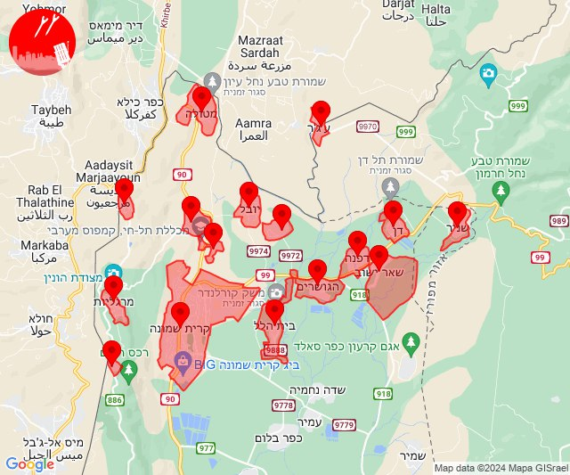

## 07:37

✈️ חדירת כלי טיס עוין (04/07/2024):

10:36:
• העמקים: אילניה 

10:37:
• צפון הגולן: נווה אטי''ב, עין קנייא, נמרוד, מג'דל שמס, מסעדה, נווה אטי''ב 

צופר - צבע אדום

## 07:37

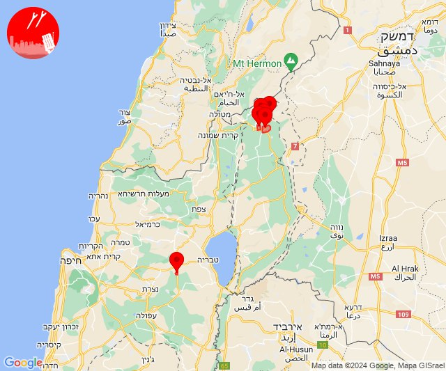

## 07:39

✈️ חדירת כלי טיס עוין (04/07/2024):

10:39:
• קו העימות: דפנה, הגושרים, ע'ג'ר, קיבוץ דן, שאר ישוב, שניר 
• צפון הגולן: מג'דל שמס, מסעדה, נווה אטי''ב, נמרוד, עין קנייא 

צופר - צבע אדום

## 07:39

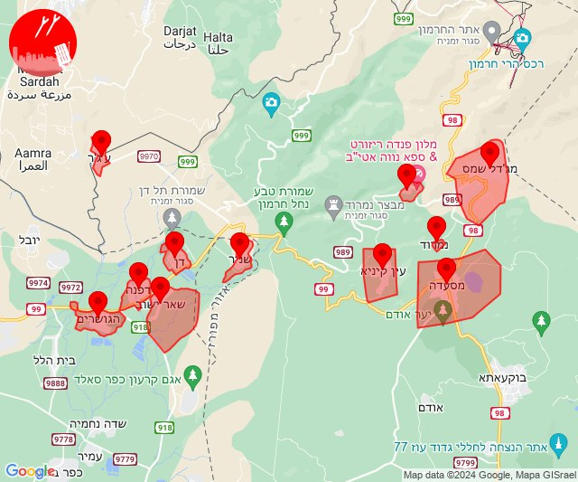

## 07:41

✈️ חדירת כלי טיס עוין (04/07/2024):

10:40:
• קו העימות: קיבוץ דן, שאר ישוב, שניר 

10:41:
• קו העימות: דפנה, הגושרים, ע'ג'ר, קיבוץ דן, שאר ישוב, שניר 
• צפון הגולן: קלע, שעל 

צופר - צבע אדום

## 07:41

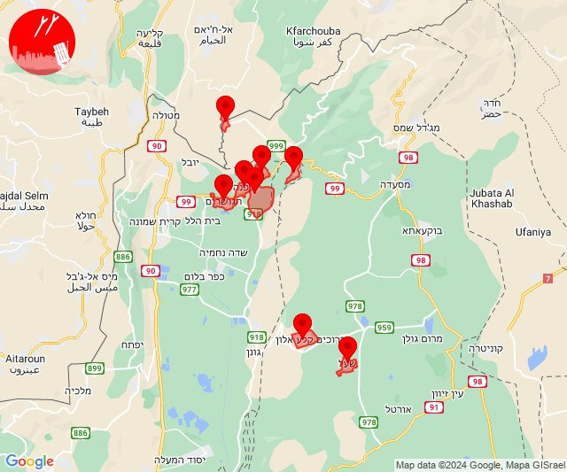

## 07:46

✈️ חדירת כלי טיס עוין (04/07/2024):

10:42:
• קו העימות: גונן, כפר בלום, כפר סאלד, להבות הבשן, נאות מרדכי, עמיר, שדה נחמיה, שמיר 

10:43:
• קו העימות: דפנה, קיבוץ דן, שאר ישוב, שניר, הגושרים 

10:44:
• קו העימות: שמיר 

10:45:
• קו העימות: כפר סאלד 
• צפון הגולן: קלע, שעל 

10:46:
• קו העימות: להבות הבשן, גונן 

צופר - צבע אדום

## 07:46

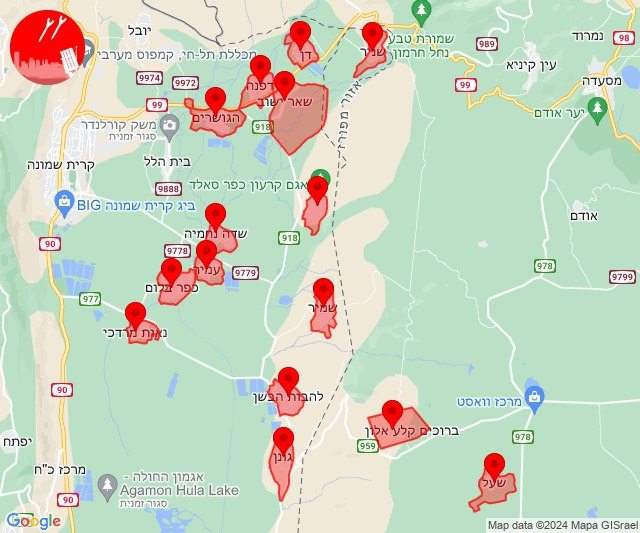

## 07:54

✈️ חדירת כלי טיס עוין (04/07/2024):

10:52:
• דרום הגולן: קדמת צבי 

10:53:
• דרום הגולן: קדמת צבי, קדמת צבי, קצרין - אזור תעשייה, קצרין 

10:54:
• דרום הגולן: קצרין - אזור תעשייה 

צופר - צבע אדום

## 07:54

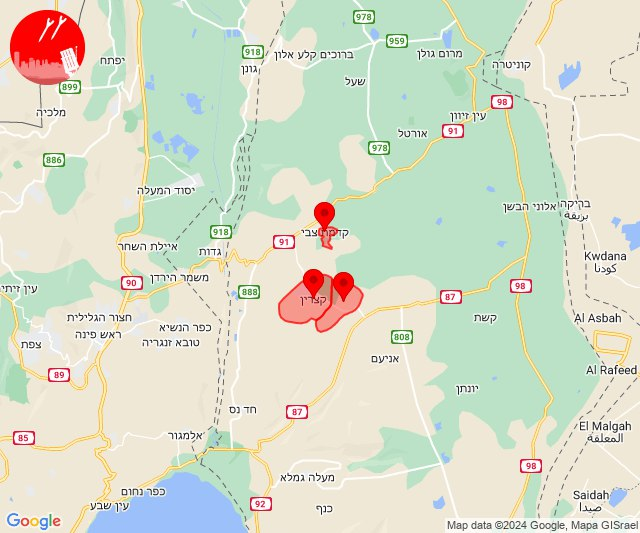

## 07:56

🔴 צבע אדום (04/07/2024):

10:56:
• דרום הגולן: קצרין, קצרין - אזור תעשייה (30 שניות)

צופר - צבע אדום

## 07:56

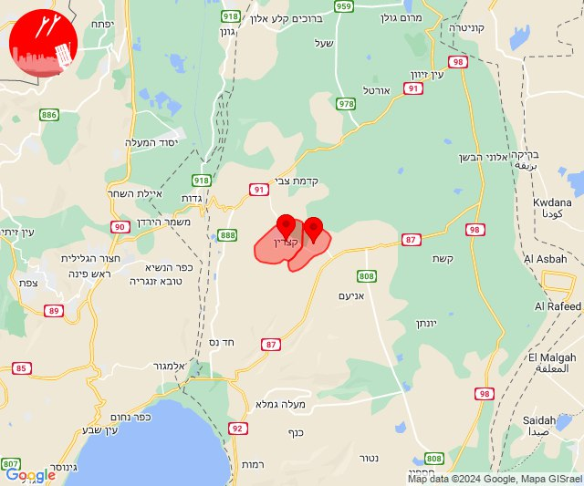

## 08:00

✈️ חדירת כלי טיס עוין (04/07/2024):

10:57:
• צפון הגולן: מג'דל שמס, מסעדה, נווה אטי''ב, נמרוד, עין קנייא 

10:58:
• גליל עליון: איילת השחר 

10:59:
• קו העימות: אביבים, יראון, דישון, מלכיה 

11:00:
• צפון הגולן: מג'דל שמס, מסעדה, נווה אטי''ב, נמרוד, עין קנייא 

צופר - צבע אדום

## 08:00

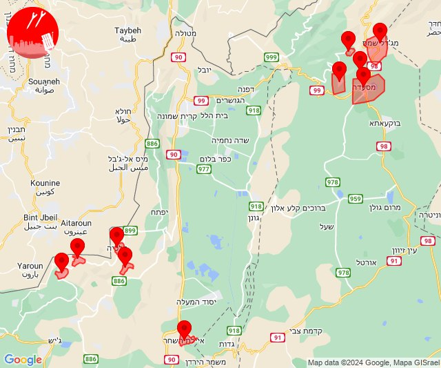

## 08:04

✈️ חדירת כלי טיס עוין (04/07/2024):

11:04:
• קו העימות: אביבים, ברעם, דישון, יפתח, יראון, מלכיה, מרכז אזורי מבואות חרמון, רמות נפתלי 

צופר - צבע אדום

## 08:04

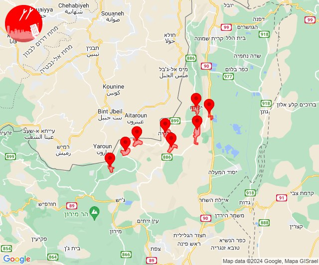

## 08:05

🔴 צבע אדום (04/07/2024):

11:00:
• קו העימות: עלמה, ריחאנייה (מיידי)
• דרום הגולן: כנף, רמות (15 שניות)

11:01:
• דרום הגולן: מעלה גמלא, כנף, קצרין - אזור תעשייה, נטור, אניעם, אלי עד, גשור, אזור תעשייה בני יהודה (15 שניות, 30 שניות, מיידי)
• גליל עליון: משמר הירדן, איילת השחר (30 שניות)

11:02:
• דרום הגולן: קצרין - אזור תעשייה, קצרין (30 שניות)
• גליל עליון: טובא זנגריה, מנחת מחניים (30 שניות)

11:03:
• קו העימות: מרגליות, מנרה, כפר בלום, להבות הבשן, נאות מרדכי, עמיר, שדה נחמיה, גונן (מיידי, 15 שניות)

11:04:
• קו העימות: מרגליות (מיידי)
• צפון הגולן: אורטל, שעל, אורטל (מיידי, 15 שניות)
• גליל עליון: גדות (30 שניות)
• דרום הגולן: קצרין (30 שניות)

11:05:
• עוטף עזה: נחל עוז (15 שניות)
• גליל עליון: גדות (30 שניות)

צופר - צבע אדום

## 08:05

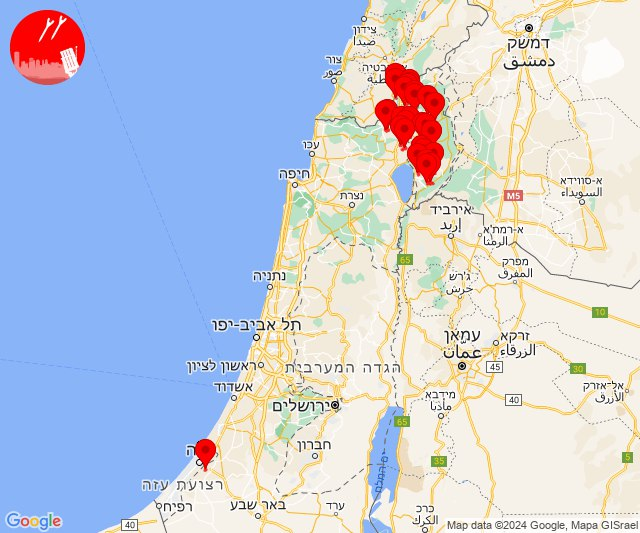

## 08:23

✈️ חדירת כלי טיס עוין (04/07/2024):

11:18:
• קו העימות: חניתה, שלומי 

11:19:
• קו העימות: אזור תעשייה אכזיב מילואות, בצת, לימן, מצובה, ראש הנקרה, שלומי, שלומי 

11:20:
• קו העימות: בצת, מצובה, לימן, אזור תעשייה אכזיב מילואות, שלומי 

11:21:
• קו העימות: געתון, יחיעם, כברי, עין יעקב, לימן, גשר הזיו, שלומי 

11:22:
• קו העימות: נהריה, אזור תעשייה אכזיב מילואות, סער, כברי 

11:23:
• קו העימות: נהריה, סער, כברי, בן עמי 

צופר - צבע אדום

## 08:23

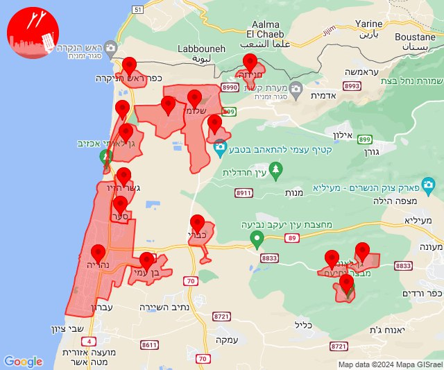

## 08:26

🔴 צבע אדום (04/07/2024):

11:26:
• גליל עליון: עין המפרץ, עכו - אזור תעשייה, עכו (30 שניות)

צופר - צבע אדום

## 08:26

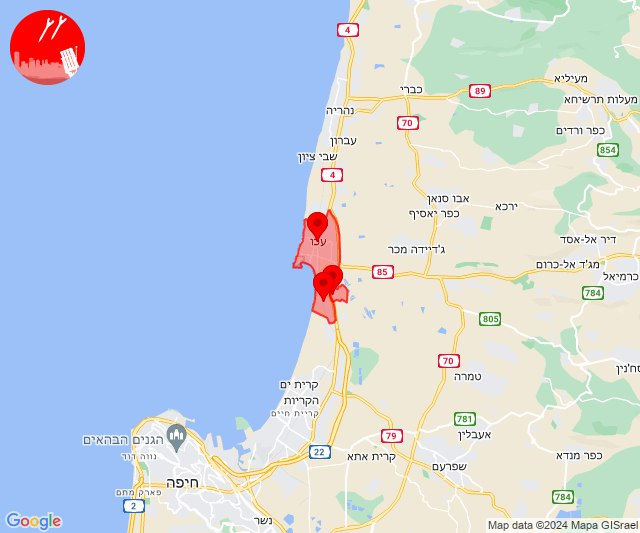

## 08:27

✈️ חדירת כלי טיס עוין (04/07/2024):

11:25:
• קו העימות: עברון 
• גליל עליון: מזרעה, שבי ציון 

11:26:
• גליל עליון: לוחמי הגטאות, רגבה, מזרעה, שבי ציון 

11:27:
• גליל עליון: רגבה, לוחמי הגטאות 

צופר - צבע אדום

## 08:27

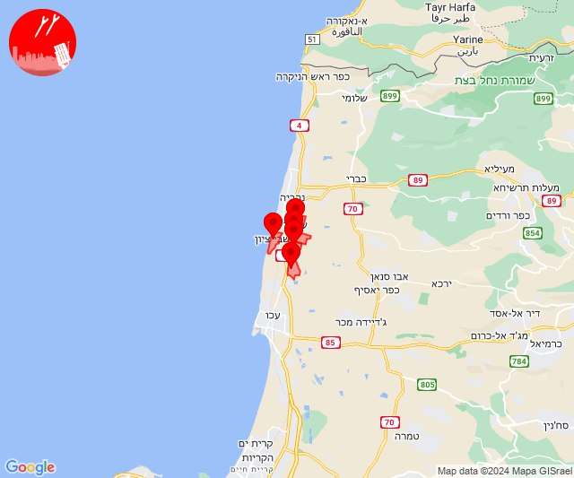

## 08:35

🔴 צבע אדום (04/07/2024):

11:35:
• גליל עליון: שבי ציון (30 שניות)

צופר - צבע אדום

## 08:35

## 08:35

✈️ חדירת כלי טיס עוין (04/07/2024):

11:35:
• גליל עליון: לוחמי הגטאות, רגבה 

צופר - צבע אדום

## 08:35

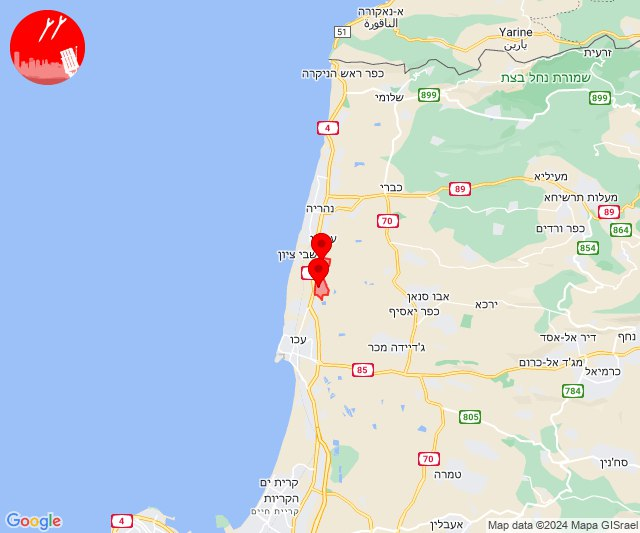

## 08:46

🔴 צבע אדום (04/07/2024):

11:46:
• קו העימות: ברעם (מיידי)

צופר - צבע אדום

## 08:46

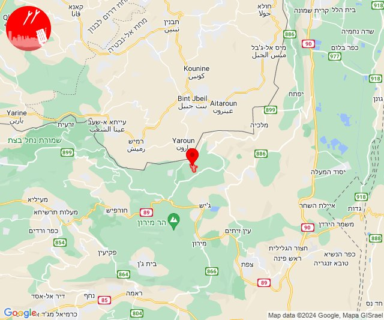

## 08:53

✈️ חדירת כלי טיס עוין (04/07/2024):

11:53:
• קו העימות: בית הלל, כפר גלעדי, כפר יובל, מטולה, מנרה, מעיין ברוך, מרגליות, משגב עם, קריית שמונה, תל חי 

צופר - צבע אדום

## 08:53

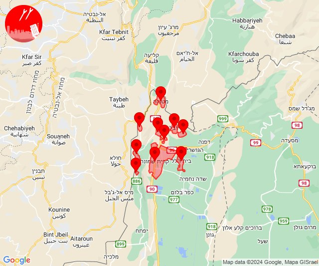

## 09:14

🔴 צבע אדום (04/07/2024):

12:14:
• קו העימות: דישון, יפתח, מלכיה, מרכז אזורי מבואות חרמון, רמות נפתלי, ברעם, דוב''ב, יראון (מיידי)

צופר - צבע אדום

## 09:14

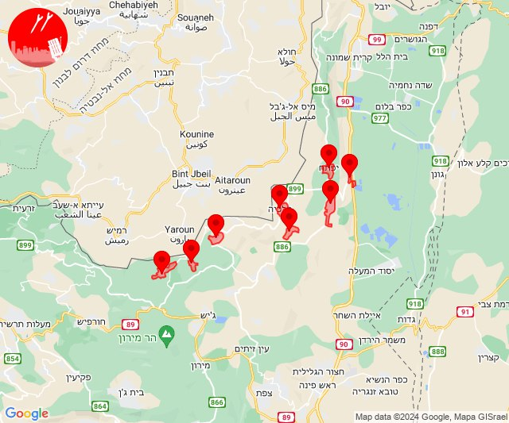

## 09:27

🔴 צבע אדום (04/07/2024):

12:27:
• קו העימות: דישון (מיידי)

צופר - צבע אדום

## 09:27

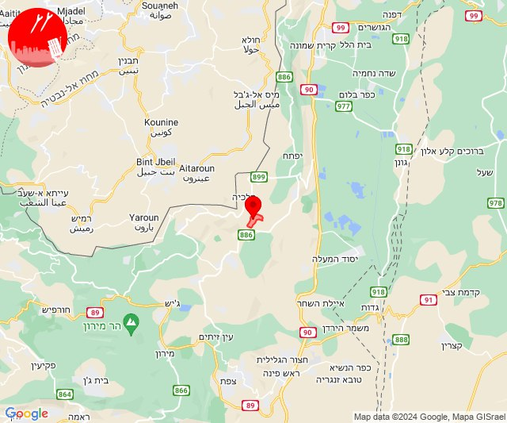

## 10:11

🔴 צבע אדום (04/07/2024):

13:11:
• עוטף עזה: נחל עוז (15 שניות)

צופר - צבע אדום

## 10:11

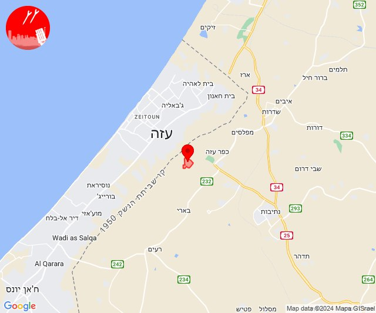

