# Alerts for 2024-07-06

## 02:38

✈️ חדירת כלי טיס עוין (06/07/2024):

05:38:
• קו העימות: כפר יובל 

צופר - צבע אדום

## 02:38

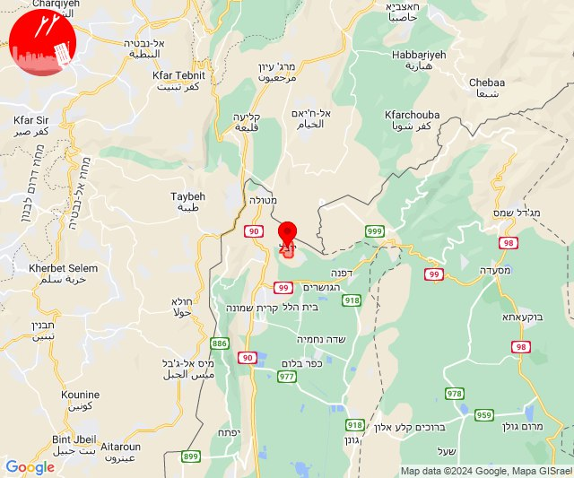

## 02:38

🔴 צבע אדום (06/07/2024):

05:38:
• קו העימות: מעיין ברוך (מיידי)

צופר - צבע אדום

## 02:38

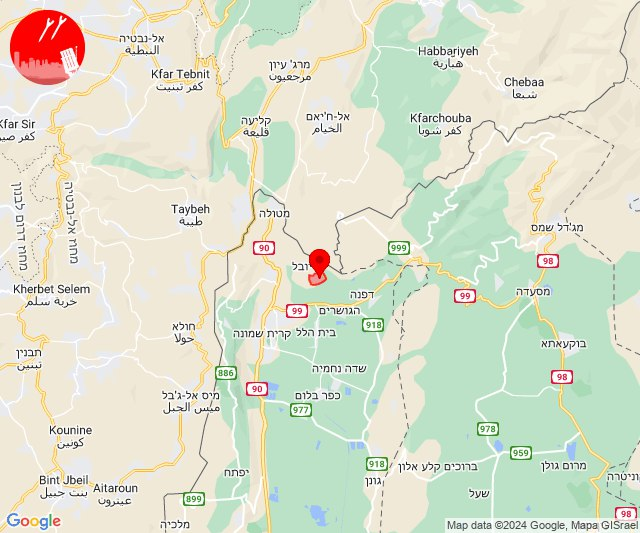

## 05:14

✈️ חדירת כלי טיס עוין (06/07/2024):

08:13:
• קו העימות: כפר יובל 

08:14:
• קו העימות: כפר גלעדי, מעיין ברוך, קריית שמונה, תל חי, כפר יובל 

צופר - צבע אדום

## 05:14

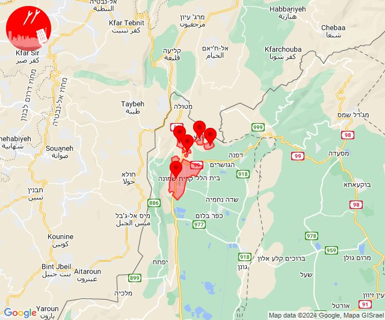

## 05:26

🔴 צבע אדום (06/07/2024):

08:26:
• קו העימות: שאר ישוב (מיידי)

צופר - צבע אדום

## 05:26

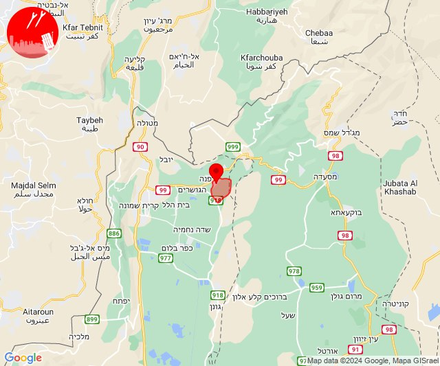

## 05:28

✈️ חדירת כלי טיס עוין (06/07/2024):

08:25:
• קו העימות: בית הלל 

08:26:
• קו העימות: קיבוץ דן 

08:28:
• קו העימות: שאר ישוב, שניר, הגושרים, דפנה, ע'ג'ר, קיבוץ דן 

צופר - צבע אדום

## 05:28

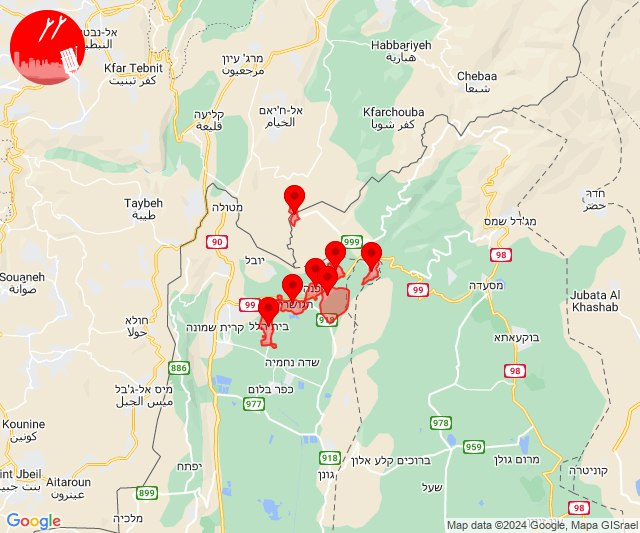

## 05:30

🔴 צבע אדום (06/07/2024):

08:30:
• קו העימות: קיבוץ דן (מיידי)

צופר - צבע אדום

## 05:30

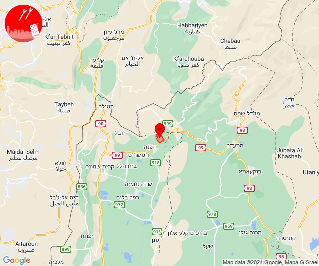

## 05:35

✈️ חדירת כלי טיס עוין (06/07/2024):

08:35:
• קו העימות: כפר בלום 

צופר - צבע אדום

## 05:35

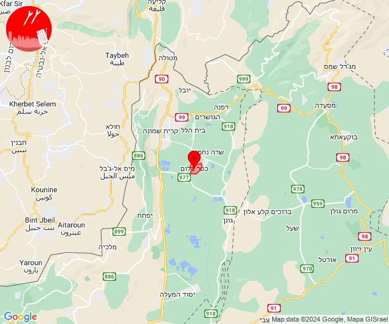

## 06:51

🔴 צבע אדום (06/07/2024):

09:51:
• קו העימות: קריית שמונה (מיידי)

צופר - צבע אדום

## 06:51

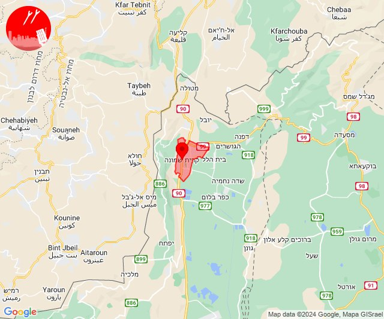

## 12:30

🔴 צבע אדום (06/07/2024):

15:30:
• עוטף עזה: נחל עוז (15 שניות)

צופר - צבע אדום

## 12:30

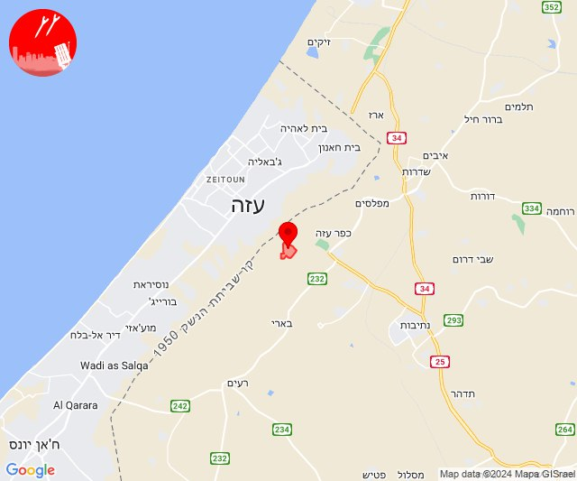

## 13:59

🔴 צבע אדום (06/07/2024):

16:59:
• עוטף עזה: שדרות, איבים, ניר עם, מטווח ניר עם (15 שניות)

צופר - צבע אדום

## 13:59

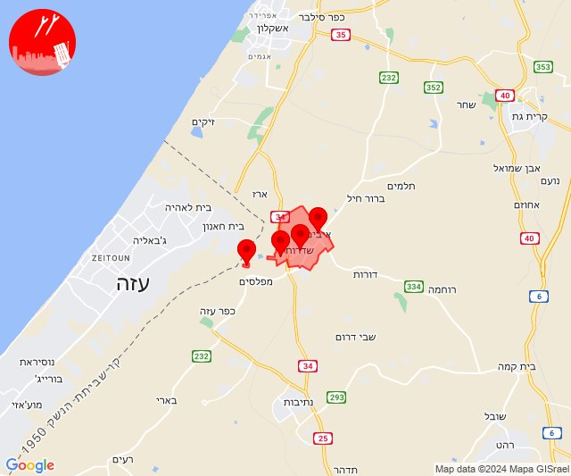

## 18:02

🔴 צבע אדום (06/07/2024):

21:02:
• עוטף עזה: כפר עזה (15 שניות)

צופר - צבע אדום

## 18:02

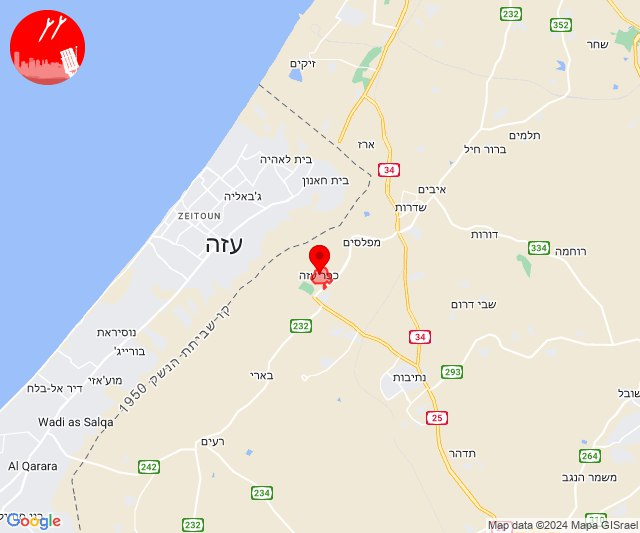

