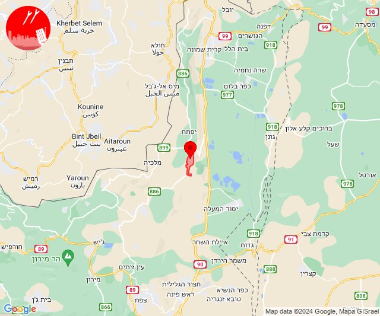
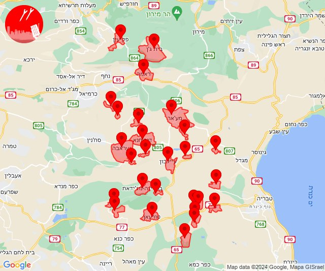
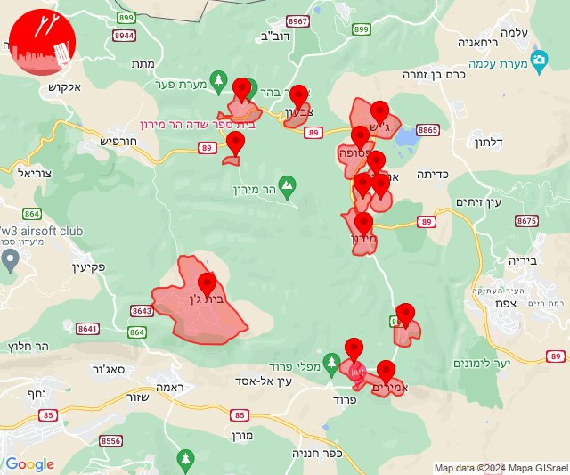
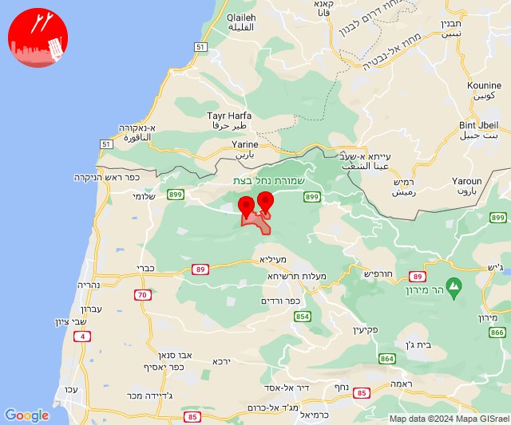
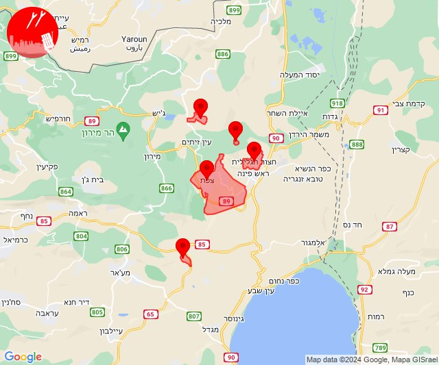
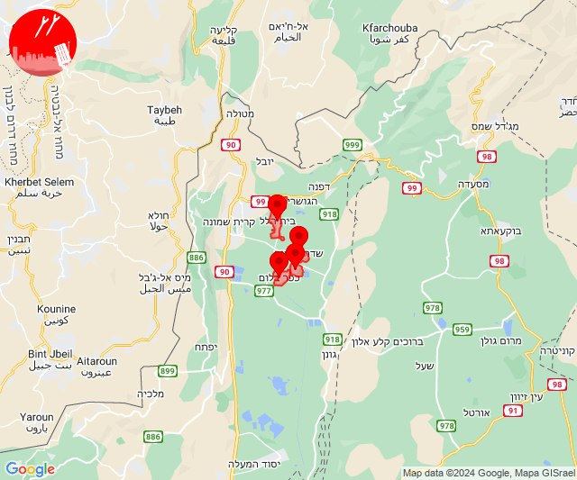
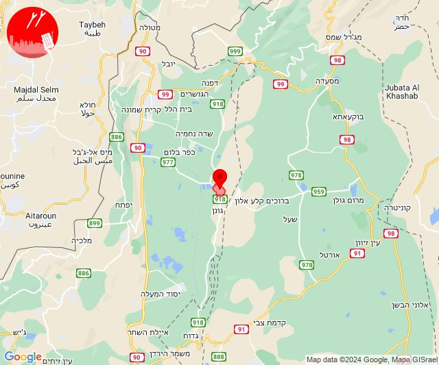
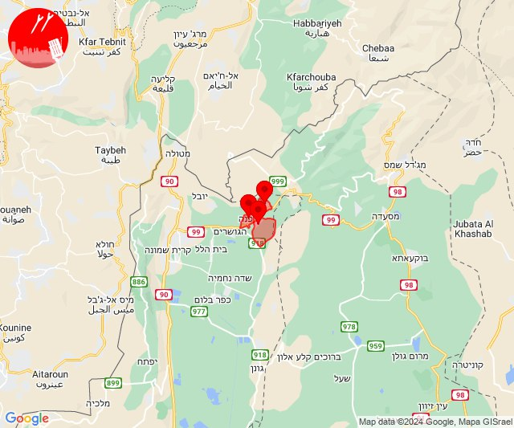
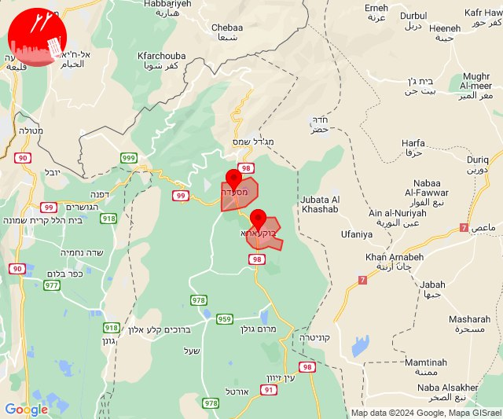
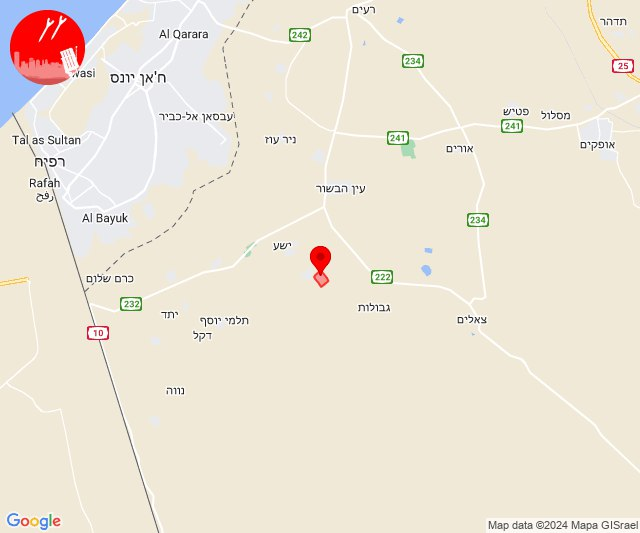

# Alerts for 2024-07-07

## 02:34

🔴 צבע אדום (07/07/2024):

05:34:
• קו העימות: רמות נפתלי (מיידי)

צופר - צבע אדום

## 02:34

## 07:02

🔴 צבע אדום (07/07/2024):

10:00:
• מרכז הגליל: עילבון, טפחות, מסד, הררית יחד, בועיינה-נוג'ידאת, מצפה נטופה, אבטליון, דיר חנא, עראבה, טורעאן, בית רימון, עוזייר (דקה)
• גליל תחתון: כפר נהר הירדן, גבעת אבני, הודיות, לביא, שדה אילן (דקה)

10:01:
• גליל תחתון: אזור תעשייה קדמת גליל, כפר זיתים (דקה)
• מרכז הגליל: מע'אר, חוסנייה, לוטם וחמדון, מעלה צביה (דקה)
• גליל עליון: בית ג'אן, ראמה (30 שניות)
• קו העימות: פקיעין (15 שניות)

10:02:
• גליל תחתון: רביד (דקה)

צופר - צבע אדום

## 07:02

## 10:03

🔴 צבע אדום (07/07/2024):

13:02:
• קו העימות: סאסא, סאסא, בית ספר שדה מירון (מיידי)
• גליל עליון: אמירים, שפר, ספסופה - כפר חושן, מירון (30 שניות)

13:03:
• גליל עליון: בית ג'אן, כפר שמאי, אור הגנוז, בר יוחאי, מרכז אזורי מרום גליל (30 שניות)
• קו העימות: צבעון, ג'ש - גוש חלב (מיידי)

צופר - צבע אדום

## 10:03

## 11:11

🔴 צבע אדום (07/07/2024):

14:11:
• קו העימות: גורנות הגליל, גורן (מיידי)

צופר - צבע אדום

## 11:11

## 14:50

🔴 צבע אדום (07/07/2024):

17:49:
• גליל עליון: חצור הגלילית, עמוקה, קדרים (30 שניות, דקה)
• קו העימות: דלתון (מיידי)

17:50:
• גליל עליון: צפת (30 שניות)

צופר - צבע אדום

## 14:50

## 16:02

✈️ חדירת כלי טיס עוין (07/07/2024):

19:01:
• קו העימות: שדה נחמיה, עמיר 

19:02:
• קו העימות: כפר בלום, בית הלל 

צופר - צבע אדום

## 16:02

## 16:04

✈️ חדירת כלי טיס עוין (07/07/2024):

19:04:
• קו העימות: להבות הבשן 

צופר - צבע אדום

## 16:04

## 16:07

🔴 צבע אדום (07/07/2024):

19:07:
• קו העימות: שאר ישוב, קיבוץ דן, דפנה (מיידי)

צופר - צבע אדום

## 16:07

## 17:42

🔴 צבע אדום (07/07/2024):

20:42:
• צפון הגולן: בוקעתא, מסעדה (מיידי)

צופר - צבע אדום

## 17:42

## 21:21

🔴 צבע אדום (08/07/2024):

00:21:
• עוטף עזה: תלמי אליהו (15 שניות)

צופר - צבע אדום

## 21:21

