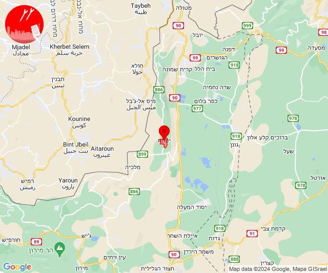
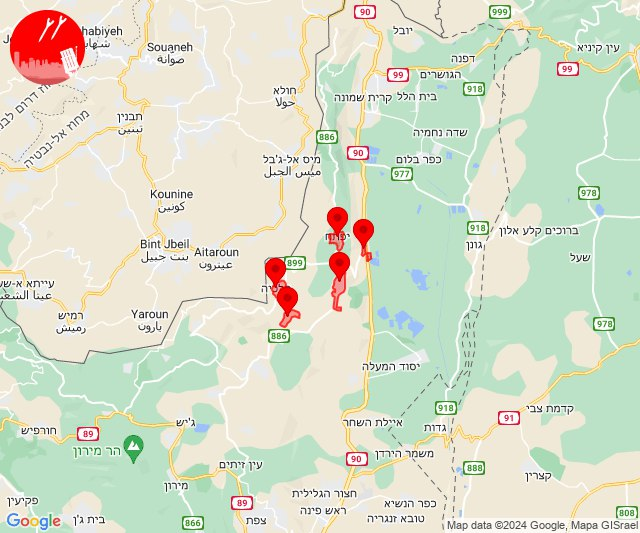
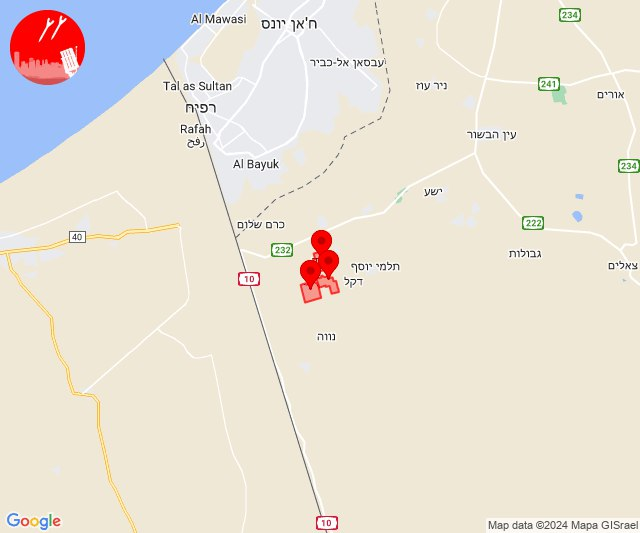
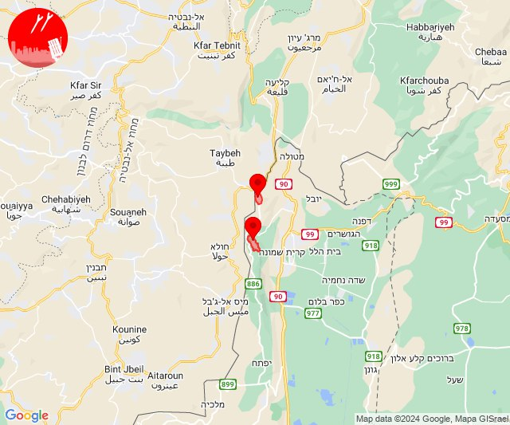
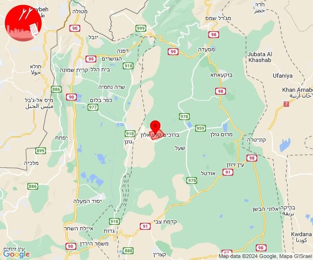
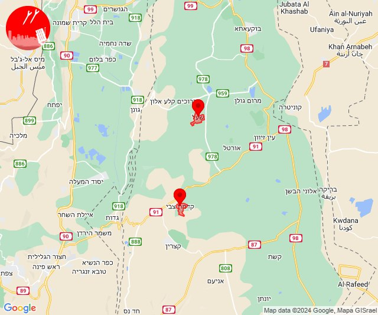
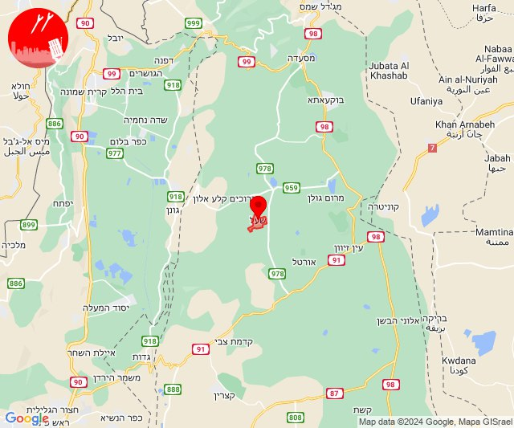
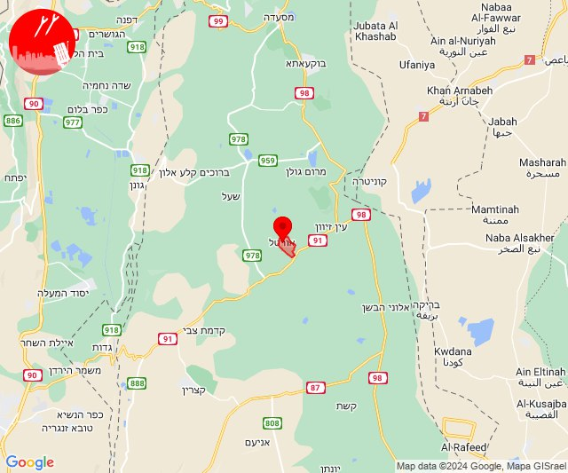

# Alerts for 2024-07-09

## 06:38

🔴 צבע אדום (09/07/2024):

09:38:
• קו העימות: יפתח (מיידי)

צופר - צבע אדום

## 06:38

## 06:43

🔴 צבע אדום (09/07/2024):

09:43:
• קו העימות: דישון, יפתח, מרכז אזורי מבואות חרמון, מלכיה, רמות נפתלי (מיידי)

צופר - צבע אדום

## 06:43

## 06:48

🔴 צבע אדום (09/07/2024):

09:48:
• קו העימות: יפתח (מיידי)

צופר - צבע אדום

## 06:48

## 09:22

🔴 צבע אדום (09/07/2024):

12:22:
• עוטף עזה: אבשלום, יבול, יתד (15 שניות)

צופר - צבע אדום

## 09:22

## 09:57

🔴 צבע אדום (09/07/2024):

12:57:
• קו העימות: משגב עם, מרגליות, משגב עם (מיידי)

צופר - צבע אדום

## 09:57

## 14:56

🔴 צבע אדום (09/07/2024):

17:56:
• צפון הגולן: קלע (15 שניות)

צופר - צבע אדום

## 14:56

## 15:59

🔴 צבע אדום (09/07/2024):

18:58:
• דרום הגולן: קדמת צבי (15 שניות)

18:59:
• צפון הגולן: שעל (15 שניות)

צופר - צבע אדום

## 15:59

## 16:00

🔴 צבע אדום (09/07/2024):

19:00:
• צפון הגולן: שעל (15 שניות)

צופר - צבע אדום

## 16:00

## 16:20

🔴 צבע אדום (09/07/2024):

19:20:
• צפון הגולן: אורטל (מיידי)

צופר - צבע אדום

## 16:21

