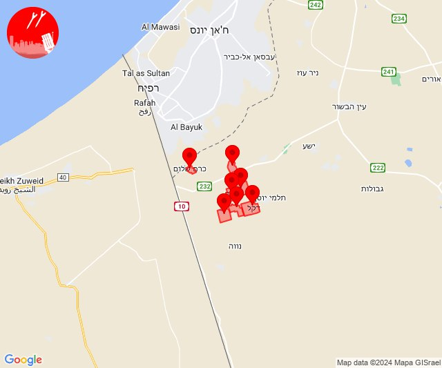
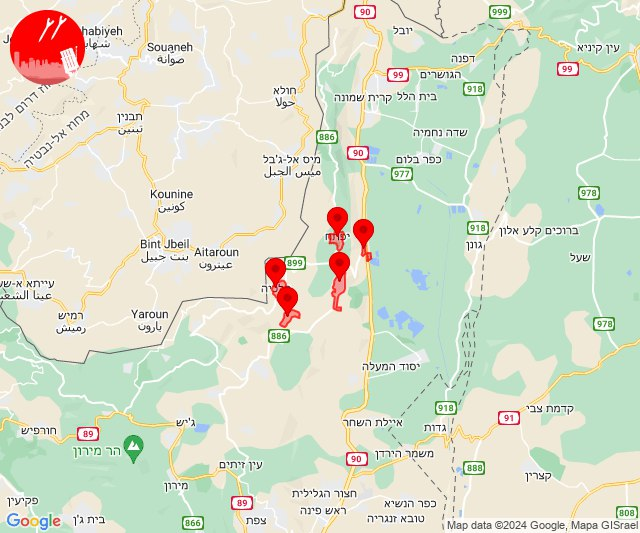
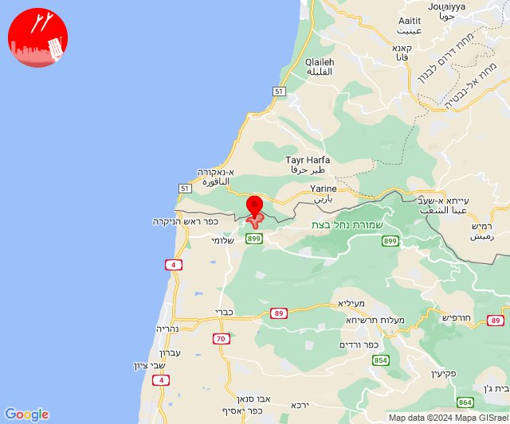
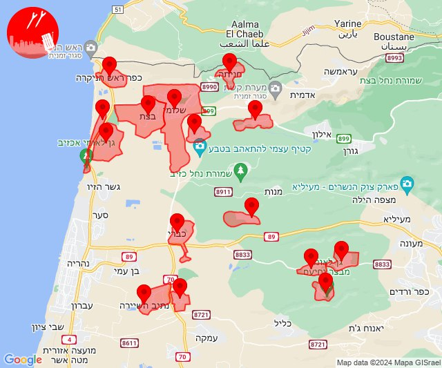
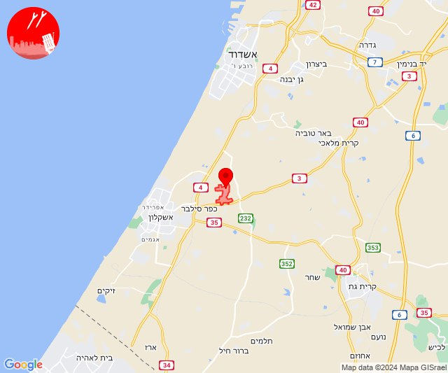
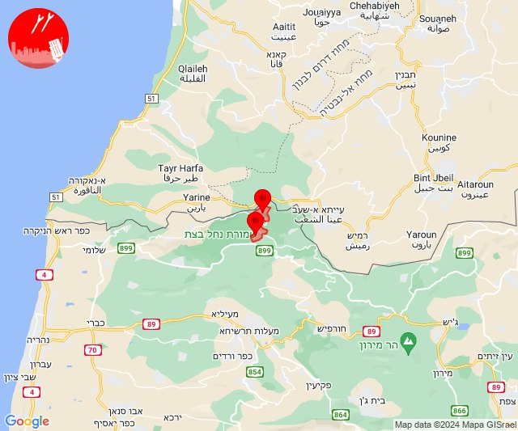

# Alerts for 2024-07-11

## 06:21

🔴 צבע אדום (11/07/2024):

09:21:
• עוטף עזה: יתד, חולית, שדה אברהם, דקל, אבשלום, יבול, כרם שלום (15 שניות)

צופר - צבע אדום

## 06:21

## 07:41

✈️ חדירת כלי טיס עוין (11/07/2024):

10:41:
• קו העימות: דישון, יפתח, מלכיה, מרכז אזורי מבואות חרמון, רמות נפתלי 

צופר - צבע אדום

## 07:41

## 07:59

✈️ חדירת כלי טיס עוין (11/07/2024):

10:59:
• קו העימות: חניתה 

צופר - צבע אדום

## 07:59

## 08:05

🔴 צבע אדום (11/07/2024):

11:05:
• קו העימות: בצת, שלומי (מיידי)

צופר - צבע אדום

## 08:05

## 08:09

✈️ חדירת כלי טיס עוין (11/07/2024):

11:01:
• קו העימות: אזור תעשייה אכזיב מילואות, בצת, לימן, מצובה, ראש הנקרה, שלומי 

11:02:
• קו העימות: שלומי 

11:03:
• קו העימות: כברי, שלומי, יערה, מצובה 

11:04:
• קו העימות: חניתה, כברי, שלומי, געתון, יחיעם, כברי, עין יעקב, מצובה 

11:05:
• קו העימות: כברי, מצובה, שלומי 
• גליל עליון: נתיב השיירה 

11:06:
• קו העימות: כברי, בצת, נווה זיו, שלומי 

11:07:
• קו העימות: כברי 

11:08:
• קו העימות: כברי 
• גליל עליון: נתיב השיירה, שייח' דנון 

11:09:
• גליל עליון: נתיב השיירה, שייח' דנון 
• קו העימות: כברי 

צופר - צבע אדום

## 08:09

## 11:01

🔴 צבע אדום (11/07/2024):

14:00:
• מערב לכיש: ניר ישראל (30 שניות)

צופר - צבע אדום

## 11:01

## 13:56

🔴 צבע אדום (11/07/2024):

16:56:
• קו העימות: זרעית, שומרה (מיידי)

צופר - צבע אדום

## 13:56

