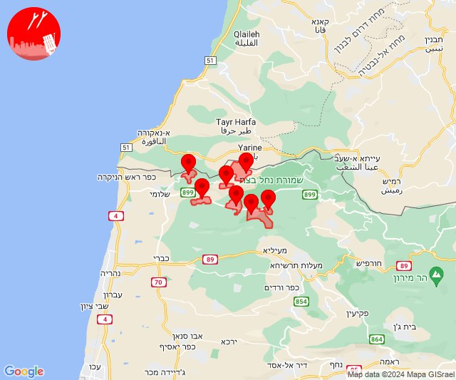
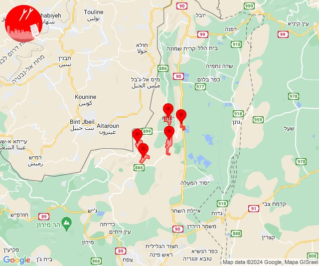
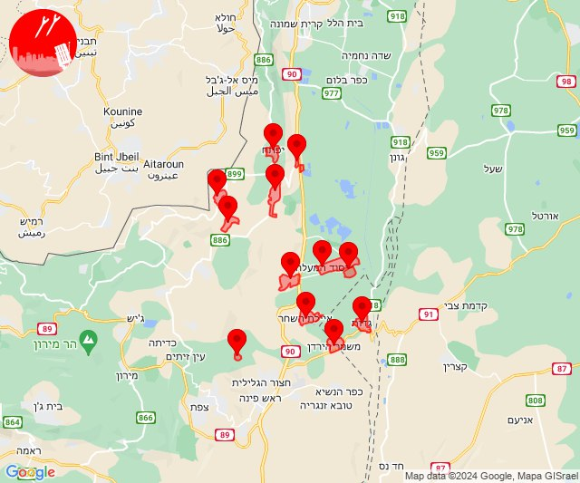
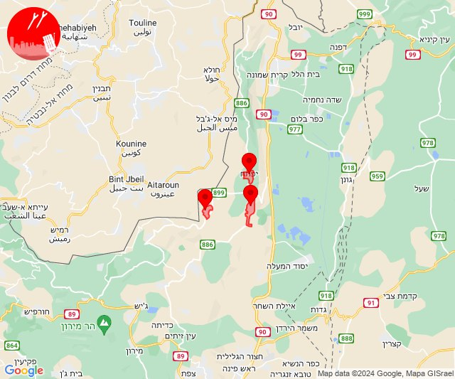
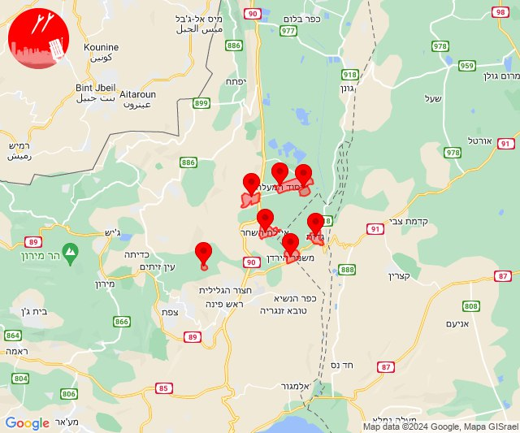

# Alerts for 2024-07-14

## 07:47

🔴 צבע אדום (14/07/2024):

10:47:
• קו העימות: אדמית, אילון, גורן, גורנות הגליל, חניתה, יערה, ערב אל עראמשה (מיידי)

צופר - צבע אדום

## 07:47

## 09:05

✈️ חדירת כלי טיס עוין (14/07/2024):

12:05:
• קו העימות: דישון, יפתח, מלכיה, מרכז אזורי מבואות חרמון, רמות נפתלי 

צופר - צבע אדום

## 09:05

## 09:09

✈️ חדירת כלי טיס עוין (14/07/2024):

12:08:
• גליל עליון: איילת השחר, גדות, חולתה, יסוד המעלה, משמר הירדן, עמוקה, שדה אליעזר 

12:09:
• קו העימות: דישון, יפתח, מלכיה, מרכז אזורי מבואות חרמון, רמות נפתלי 

צופר - צבע אדום

## 09:09

## 09:12

✈️ חדירת כלי טיס עוין (14/07/2024):

12:11:
• קו העימות: מלכיה 

12:12:
• קו העימות: יפתח, רמות נפתלי 

צופר - צבע אדום

## 09:12

## 09:14

✈️ חדירת כלי טיס עוין (14/07/2024):

12:14:
• גליל עליון: איילת השחר, גדות, חולתה, יסוד המעלה, משמר הירדן, עמוקה, שדה אליעזר 

צופר - צבע אדום

## 09:14

## 14:28

🔴 צבע אדום (14/07/2024):

17:28:
• עוטף עזה: כרם שלום (15 שניות)

צופר - צבע אדום

## 14:28

