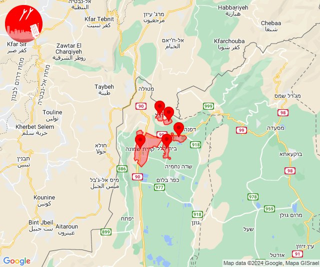
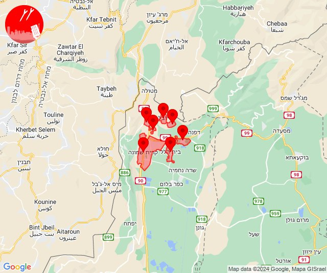
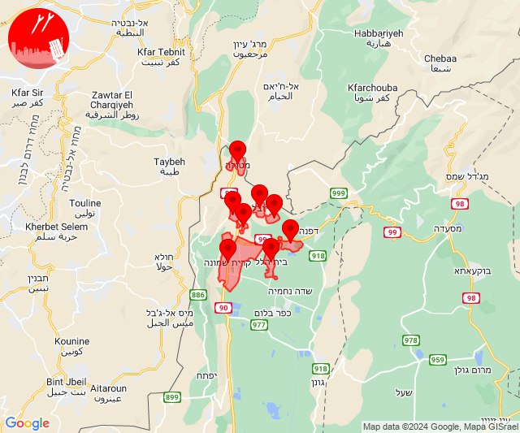

# Alerts for 2024-07-15

## 03:28

🔓 חשש לחדירת מחבלים (15/07/2024):

06:28:
• יהודה: עלמון 

צופר - חדירת מחבלים

## 03:28

## 12:19

✈️ חדירת כלי טיס עוין (15/07/2024):

15:19:
• קו העימות: דישון, יפתח, מלכיה, מרכז אזורי מבואות חרמון, רמות נפתלי 

צופר - צבע אדום

## 12:19

## 13:15

🔴 צבע אדום (15/07/2024):

16:15:
• קו העימות: בית הלל, כפר יובל, מעיין ברוך, הגושרים, קריית שמונה (מיידי)

צופר - צבע אדום

## 13:15

## 13:45

🔴 צבע אדום (15/07/2024):

16:44:
• קו העימות: קריית שמונה, תל חי, בית הלל (מיידי)

16:45:
• קו העימות: כפר גלעדי, מעיין ברוך, כפר יובל, הגושרים (מיידי)

צופר - צבע אדום

## 13:45

## 15:07

🔴 צבע אדום (15/07/2024):

18:07:
• עוטף עזה: כרם שלום (15 שניות)

צופר - צבע אדום

## 15:08

## 20:30

🔴 צבע אדום (15/07/2024):

23:30:
• קו העימות: קריית שמונה, מרגליות, מנרה (מיידי)

צופר - צבע אדום

## 20:30

## 20:39

🔴 צבע אדום (15/07/2024):

23:39:
• קו העימות: קריית שמונה, מטולה, כפר גלעדי, כפר יובל, מעיין ברוך, תל חי, בית הלל, הגושרים, קריית שמונה (מיידי)

צופר - צבע אדום

## 20:39

