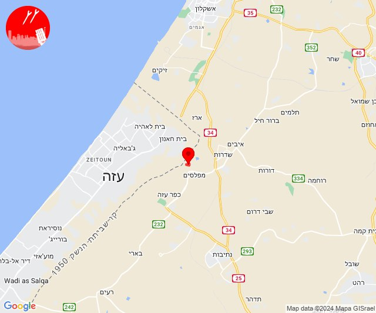
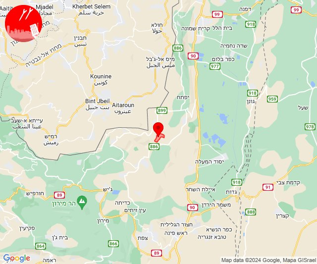
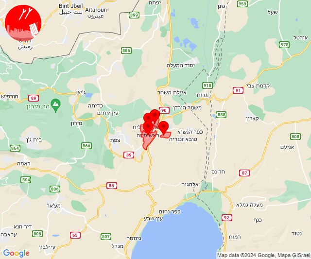
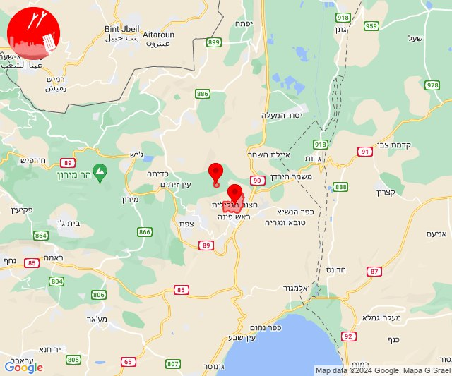
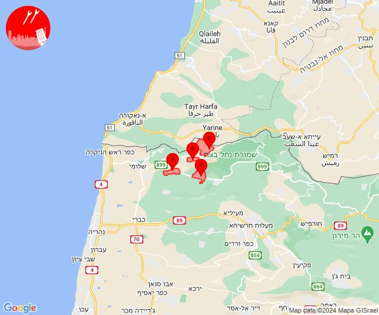
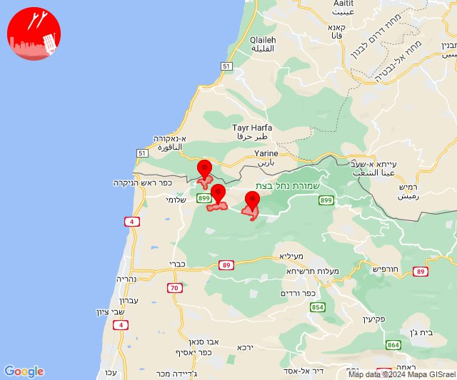

# Alerts for 2024-07-18

## 03:20

🔴 צבע אדום (18/07/2024):

06:20:
• עוטף עזה: מטווח ניר עם (15 שניות)

צופר - צבע אדום

## 03:20

## 06:42

🔴 צבע אדום (18/07/2024):

09:42:
• עוטף עזה: מטווח ניר עם (15 שניות)

צופר - צבע אדום

## 06:42

## 06:56

🔴 צבע אדום (18/07/2024):

09:56:
• עוטף עזה: מטווח ניר עם (15 שניות)

צופר - צבע אדום

## 06:56

## 14:34

✈️ חדירת כלי טיס עוין (18/07/2024):

17:34:
• קו העימות: דישון 

צופר - צבע אדום

## 14:34

## 14:39

🔴 צבע אדום (18/07/2024):

17:39:
• גליל עליון: אזור תעשייה חצור הגלילית, אזור תעשייה צ.ח.ר, חצור הגלילית, ראש פינה (30 שניות)

צופר - צבע אדום

## 14:39

## 14:40

✈️ חדירת כלי טיס עוין (18/07/2024):

17:40:
• גליל עליון: חצור הגלילית, עמוקה 

צופר - צבע אדום

## 14:40

## 16:33

🔴 צבע אדום (18/07/2024):

19:33:
• קו העימות: אילון, אדמית, ערב אל עראמשה, יערה (מיידי)

צופר - צבע אדום

## 16:33

## 16:34

✈️ חדירת כלי טיס עוין (18/07/2024):

19:33:
• קו העימות: חניתה 

19:34:
• קו העימות: אילון, יערה 

צופר - צבע אדום

## 16:34

