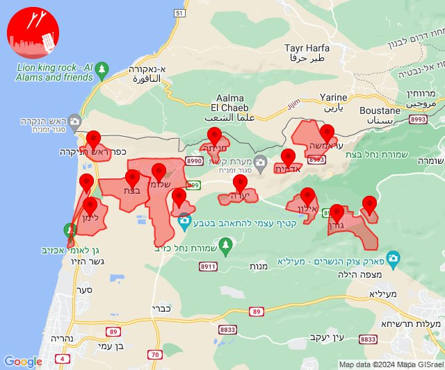

# Alerts for 2024-07-21

## 03:16

🔴 צבע אדום (21/07/2024):

06:16:
• אילת: אילות, אילת, אזור תעשייה שחורת (30 שניות)

צופר - צבע אדום

## 03:16

## 04:54

🔴 צבע אדום (21/07/2024):

07:54:
• קו העימות: אביבים, ברעם, דוב''ב, יראון (מיידי)

צופר - צבע אדום

## 04:54

## 06:19

✈️ חדירת כלי טיס עוין (21/07/2024):

09:18:
• קו העימות: בצת, שלומי 

09:19:
• קו העימות: בצת, שלומי 

צופר - צבע אדום

## 06:19

## 09:06

🔴 צבע אדום (21/07/2024):

12:06:
• קו העימות: כפר גלעדי, דפנה, שאר ישוב, הגושרים, בית הלל (מיידי)

צופר - צבע אדום

## 09:06

## 13:17

🔴 צבע אדום (21/07/2024):

16:16:
• קו העימות: דלתון (מיידי)
• גליל עליון: קדיתא (30 שניות)

16:17:
• קו העימות: אזור תעשייה רמת דלתון, כרם בן זמרה (מיידי)

צופר - צבע אדום

## 13:17

## 14:10

🔴 צבע אדום (21/07/2024):

17:10:
• קו העימות: יערה (מיידי)

צופר - צבע אדום

## 14:10

## 14:10

✈️ חדירת כלי טיס עוין (21/07/2024):

17:08:
• קו העימות: חניתה, שלומי, יערה 

17:09:
• קו העימות: אזור תעשייה אכזיב מילואות, בצת, לימן, מצובה, ראש הנקרה, שלומי, חניתה 

17:10:
• קו העימות: שלומי, מצובה, אדמית, אילון, גורן, גורנות הגליל, חניתה, יערה, ערב אל עראמשה 

צופר - צבע אדום

## 14:10

## 14:12

✈️ חדירת כלי טיס עוין (21/07/2024):

17:12:
• קו העימות: חניתה, שלומי, יערה, מצובה, עבדון 

צופר - צבע אדום

## 14:12

## 14:59

🔴 צבע אדום (21/07/2024):

17:59:
• קו העימות: אזור תעשייה רמת דלתון, דלתון (מיידי)

צופר - צבע אדום

## 14:59

## 16:05

🔴 צבע אדום (21/07/2024):

19:05:
• קו העימות: זרעית (מיידי)

צופר - צבע אדום

## 16:05

