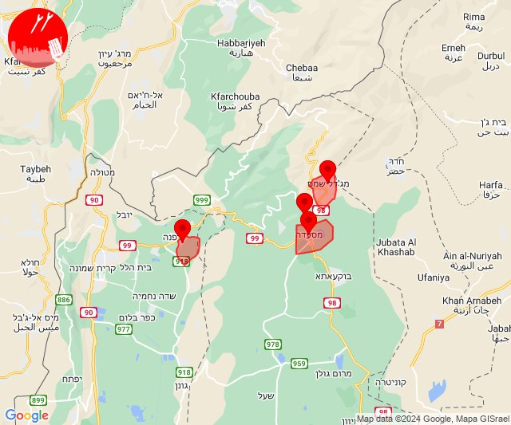
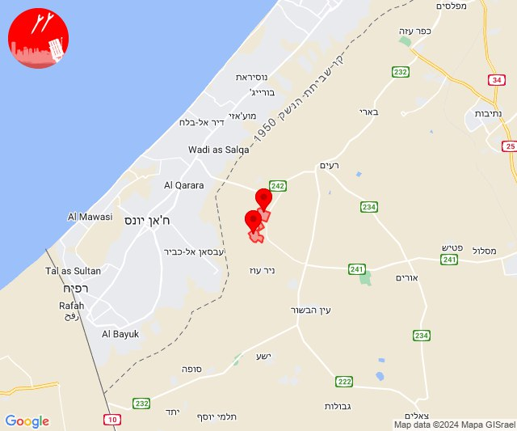
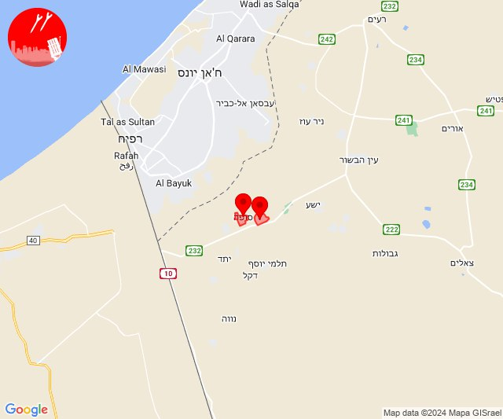
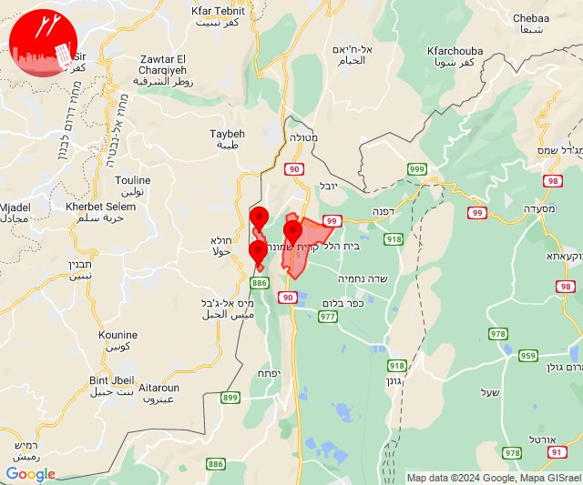
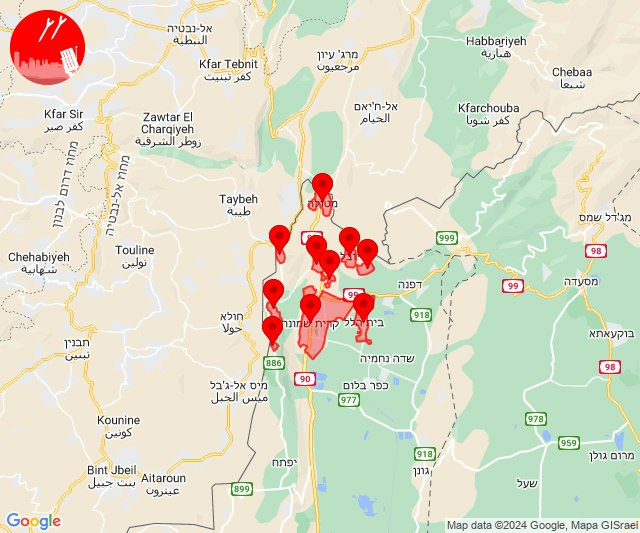
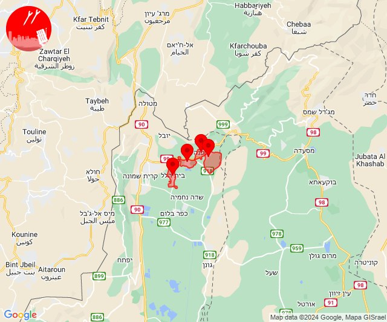
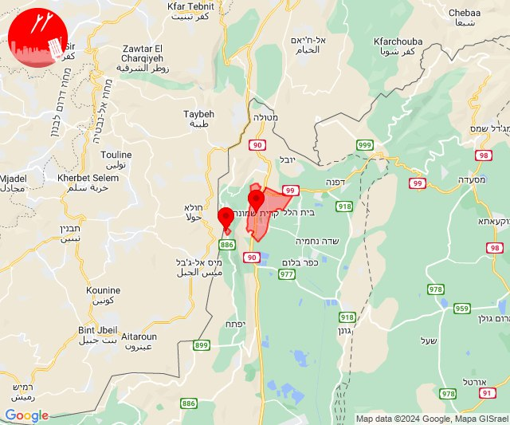
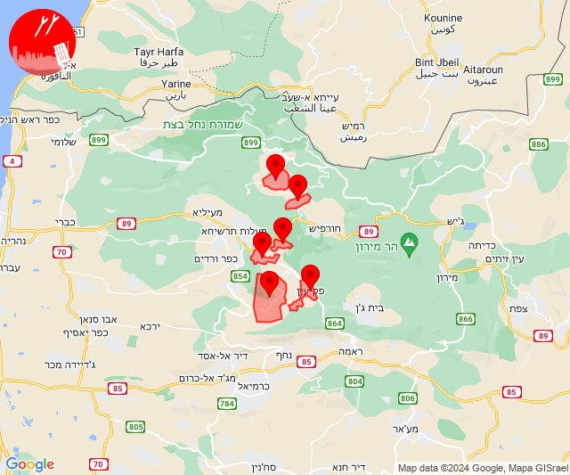

# Alerts for 2024-07-22

## 04:42

🔴 צבע אדום (22/07/2024):

07:40:
• צפון הגולן: מג'דל שמס (מיידי)

07:41:
• קו העימות: שאר ישוב (מיידי)

07:42:
• צפון הגולן: מג'דל שמס, מסעדה, נמרוד (מיידי)

צופר - צבע אדום

## 04:42

## 09:38

🔴 צבע אדום (22/07/2024):

12:38:
• עוטף עזה: נירים, עין השלושה (15 שניות)

צופר - צבע אדום

## 09:38

## 10:30

🔴 צבע אדום (22/07/2024):

13:30:
• עוטף עזה: ניר יצחק, סופה (15 שניות)

צופר - צבע אדום

## 10:30

## 14:57

🔴 צבע אדום (22/07/2024):

17:56:
• קו העימות: מנרה, מרגליות, קריית שמונה (מיידי)

17:57:
• קו העימות: מרגליות (מיידי)

צופר - צבע אדום

## 14:57

## 14:59

🔴 צבע אדום (22/07/2024):

17:59:
• קו העימות: מטולה, מעיין ברוך, משגב עם, כפר גלעדי, מרגליות, בית הלל, כפר יובל, תל חי, קריית שמונה, מנרה (מיידי)

צופר - צבע אדום

## 14:59

## 16:31

✈️ חדירת כלי טיס עוין (22/07/2024):

19:31:
• קו העימות: בית הלל, הגושרים, דפנה, שאר ישוב 

צופר - צבע אדום

## 16:31

## 17:10

🔴 צבע אדום (22/07/2024):

20:08:
• קו העימות: קריית שמונה (מיידי)

20:09:
• קו העימות: מנרה (מיידי)

20:10:
• קו העימות: קריית שמונה, מנרה (מיידי)

צופר - צבע אדום

## 17:10

## 19:44

🔴 צבע אדום (22/07/2024):

22:43:
• קו העימות: חוסן, פקיעין, צוריאל (15 שניות, מיידי)
• גליל עליון: כיסרא סמיע (30 שניות)

22:44:
• קו העימות: אלקוש, פסוטה, חוסן, פקיעין, צוריאל, אלקוש (מיידי, 15 שניות)

צופר - צבע אדום

## 19:44

