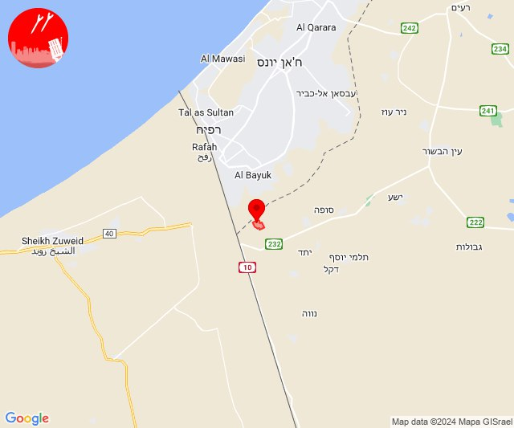

# Alerts for 2024-07-24

## 05:04

✈️ חדירת כלי טיס עוין (24/07/2024):

08:04:
• גליל עליון: איילת השחר 

צופר - צבע אדום

## 05:04

## 06:54

🔴 צבע אדום (24/07/2024):

09:54:
• גליל עליון: אבו סנאן, ג'וליס, ינוח-ג'ת, ירכא, כליל, עמקה (30 שניות)

צופר - צבע אדום

## 06:54

## 14:23

🔴 צבע אדום (24/07/2024):

17:23:
• עוטף עזה: כרם שלום (15 שניות)

צופר - צבע אדום

## 14:23

## 19:38

🔴 צבע אדום (24/07/2024):

22:38:
• קו העימות: מלכיה (מיידי)

צופר - צבע אדום

## 19:38

## 21:22

🔴 צבע אדום (25/07/2024):

00:22:
• קו העימות: חניתה (מיידי)

צופר - צבע אדום

## 21:22

