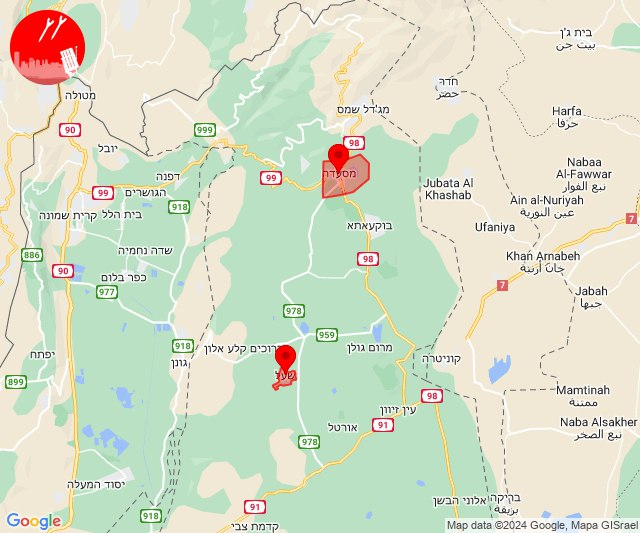
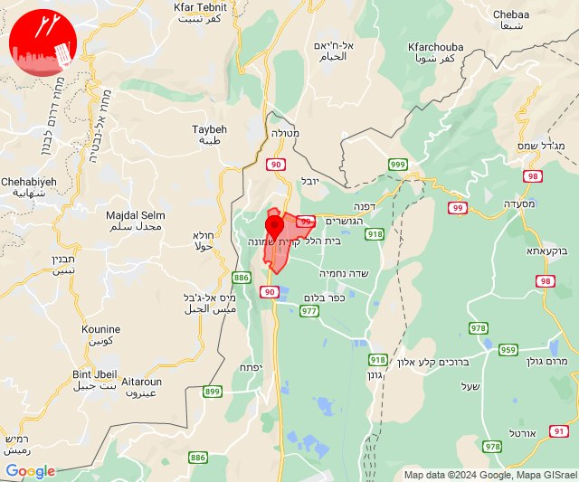

# Alerts for 2024-07-27

## 04:51

🔴 צבע אדום (27/07/2024):

07:48:
• קו העימות: קריית שמונה, תל חי, כפר גלעדי, כפר יובל (מיידי)

07:49:
• קו העימות: קריית שמונה, תל חי (מיידי)

07:50:
• קו העימות: קריית שמונה, תל חי (מיידי)

07:51:
• קו העימות: קריית שמונה (מיידי)

צופר - צבע אדום

## 04:51

## 05:26

🔴 צבע אדום (27/07/2024):

08:26:
• קו העימות: ערב אל עראמשה (מיידי)

צופר - צבע אדום

## 05:26

## 09:53

🔴 צבע אדום (27/07/2024):

12:53:
• קו העימות: מטולה (מיידי)

צופר - צבע אדום

## 09:53

## 10:46

🔴 צבע אדום (27/07/2024):

13:46:
• קו העימות: יפתח (מיידי)

צופר - צבע אדום

## 10:46

## 11:34

✈️ חדירת כלי טיס עוין (27/07/2024):

14:34:
• קו העימות: יפתח 

צופר - צבע אדום

## 11:34

## 12:22

🔴 צבע אדום (27/07/2024):

15:22:
• קו העימות: שתולה (מיידי)

צופר - צבע אדום

## 12:22

## 14:01

🔴 צבע אדום (27/07/2024):

17:00:
• קו העימות: מנרה, קריית שמונה (מיידי)

17:01:
• קו העימות: קריית שמונה, מנרה (מיידי)

צופר - צבע אדום

## 14:01

## 14:24

🔴 צבע אדום (27/07/2024):

17:23:
• קו העימות: קריית שמונה, בית הלל, הגושרים, שאר ישוב, מרגליות, תל חי, שניר, עמיר, שדה נחמיה, שמיר, כפר סאלד, מנרה (מיידי, 15 שניות)

17:24:
• קו העימות: קריית שמונה, מרגליות, בית הלל, הגושרים, שאר ישוב, כפר סאלד, מרגליות, קריית שמונה (מיידי, 15 שניות)

צופר - צבע אדום

## 14:24

## 14:55

🔴 צבע אדום (27/07/2024):

17:55:
• צפון הגולן: נווה אטי''ב (מיידי)

צופר - צבע אדום

## 14:55

## 15:18

🔴 צבע אדום (27/07/2024):

18:18:
• צפון הגולן: מג'דל שמס (מיידי)

צופר - צבע אדום

## 15:18

## 15:29

🔴 צבע אדום (27/07/2024):

18:29:
• קו העימות: בית הלל, קריית שמונה, תל חי, משגב עם, כפר גלעדי, קריית שמונה (מיידי)

צופר - צבע אדום

## 15:29

## 15:32

🔴 צבע אדום (27/07/2024):

18:31:
• קו העימות: כפר גלעדי, קריית שמונה, תל חי, בית הלל, הגושרים (מיידי)

18:32:
• קו העימות: משגב עם, כפר גלעדי, בית הלל, קריית שמונה, תל חי, הגושרים (מיידי)

צופר - צבע אדום

## 15:32

## 15:34

✈️ חדירת כלי טיס עוין (27/07/2024):

18:31:
• צפון הגולן: עין קנייא, מסעדה 
• קו העימות: כפר סאלד 

18:32:
• קו העימות: שמיר 

18:33:
• קו העימות: שמיר 

18:34:
• קו העימות: גונן 

צופר - צבע אדום

## 15:34

## 15:37

✈️ חדירת כלי טיס עוין (27/07/2024):

18:36:
• צפון הגולן: שעל 

18:37:
• צפון הגולן: מסעדה 

צופר - צבע אדום

## 15:37

## 15:45

✈️ חדירת כלי טיס עוין (27/07/2024):

18:45:
• קו העימות: קריית שמונה 

צופר - צבע אדום

## 15:45

## 15:53

✈️ חדירת כלי טיס עוין (27/07/2024):

18:53:
• קו העימות: כפר בלום 

צופר - צבע אדום

## 15:54

## 15:55

✈️ חדירת כלי טיס עוין (27/07/2024):

18:55:
• קו העימות: נאות מרדכי 

צופר - צבע אדום

## 15:55

## 15:57

✈️ חדירת כלי טיס עוין (27/07/2024):

18:57:
• קו העימות: להבות הבשן 

צופר - צבע אדום

## 15:58

