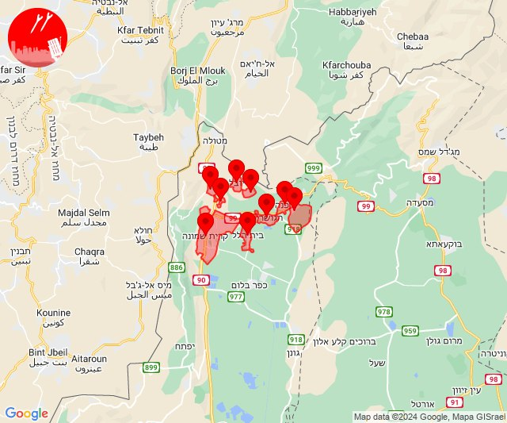
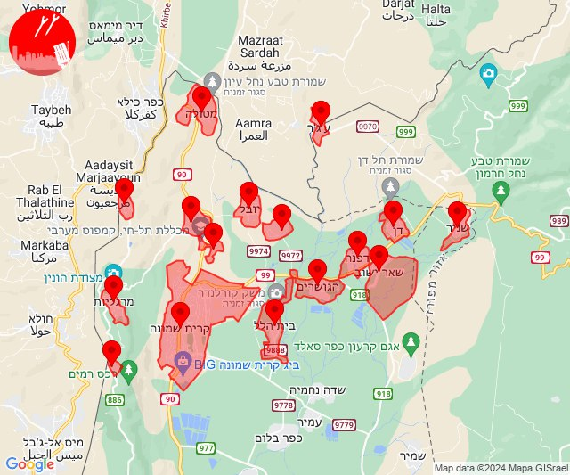
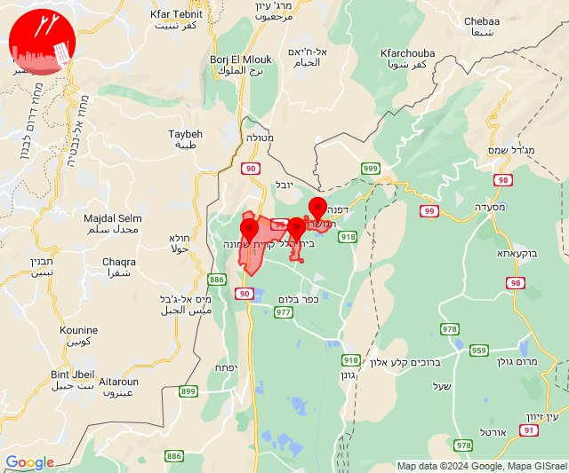
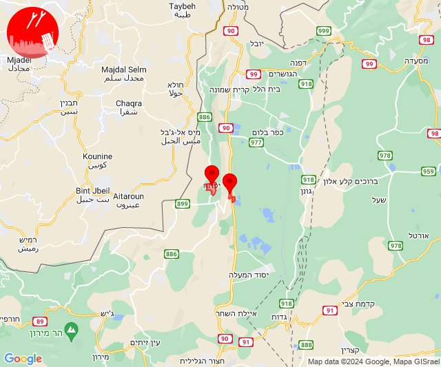
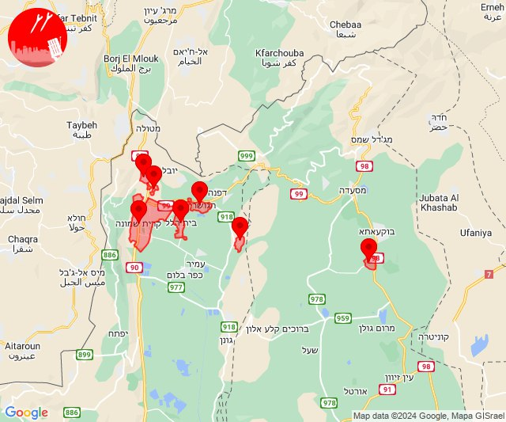

# Alerts for 2024-07-30

## 11:53

🔴 צבע אדום (30/07/2024):

14:53:
• קו העימות: דפנה, הגושרים, קריית שמונה, בית הלל, שאר ישוב, כפר גלעדי, תל חי, מעיין ברוך, כפר יובל (מיידי)

צופר - צבע אדום

## 11:53

## 12:53

✈️ חדירת כלי טיס עוין (30/07/2024):

15:48:
• קו העימות: כפר יובל 

15:49:
• קו העימות: דפנה, הגושרים, ע'ג'ר, קיבוץ דן, שאר ישוב, שניר 

15:50:
• קו העימות: דפנה 

15:51:
• קו העימות: הגושרים, בית הלל, כפר גלעדי, כפר יובל, מטולה, מנרה, מעיין ברוך, מרגליות, משגב עם, קריית שמונה, תל חי, קיבוץ דן 

15:52:
• קו העימות: דפנה, הגושרים, בית הלל, קריית שמונה, דפנה, הגושרים, ע'ג'ר, קיבוץ דן, שאר ישוב, שניר 

15:53:
• קו העימות: הגושרים, בית הלל, קריית שמונה 

צופר - צבע אדום

## 12:53

## 13:26

🔴 צבע אדום (30/07/2024):

16:26:
• קו העימות: בית הלל, קריית שמונה, הגושרים (מיידי)

צופר - צבע אדום

## 13:26

## 15:12

🔴 צבע אדום (30/07/2024):

18:12:
• קו העימות: יפתח, מרכז אזורי מבואות חרמון (מיידי)

צופר - צבע אדום

## 15:12

## 16:21

🔴 צבע אדום (30/07/2024):

19:20:
• קו העימות: כפר סאלד, כפר גלעדי, קריית שמונה, תל חי, בית הלל, הגושרים (15 שניות, מיידי)

19:21:
• צפון הגולן: אל רום (מיידי)

צופר - צבע אדום

## 16:21

