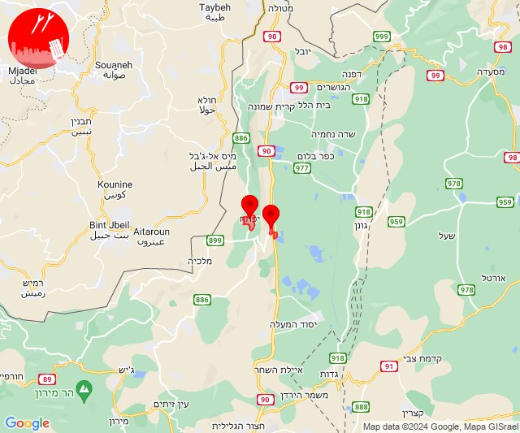
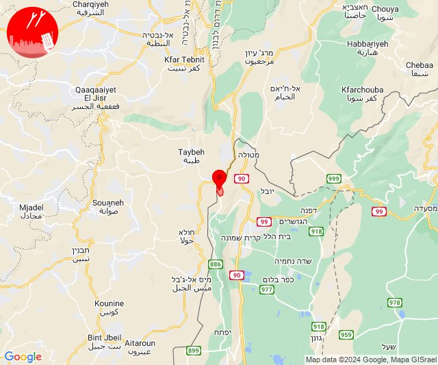
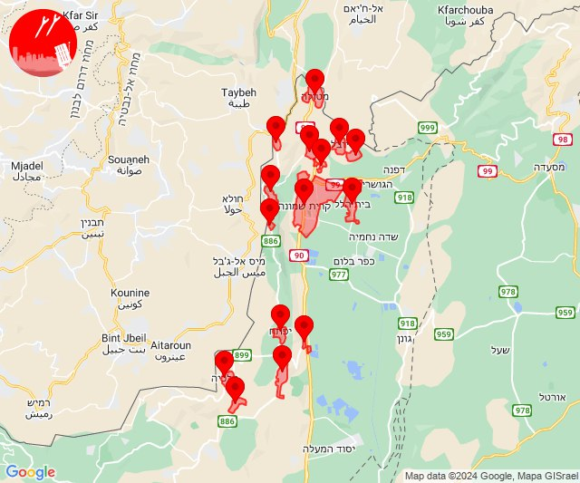
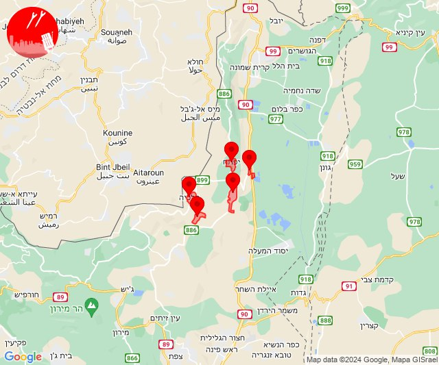
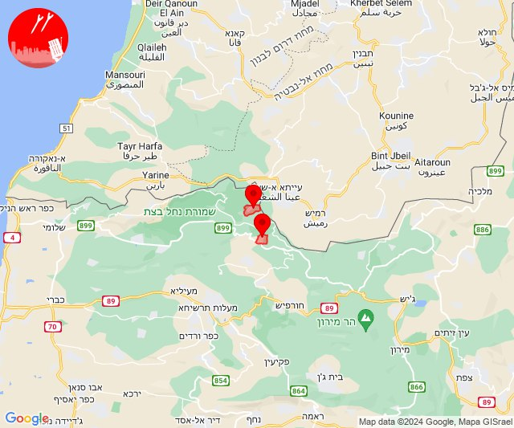
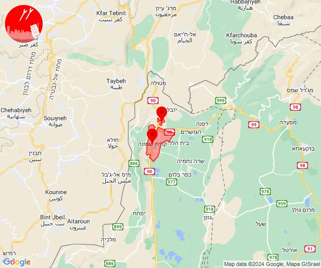
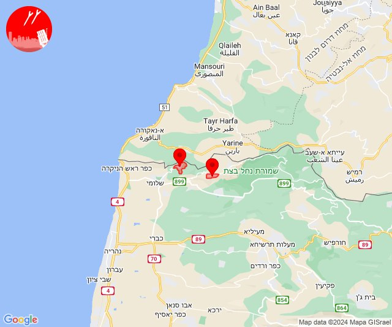
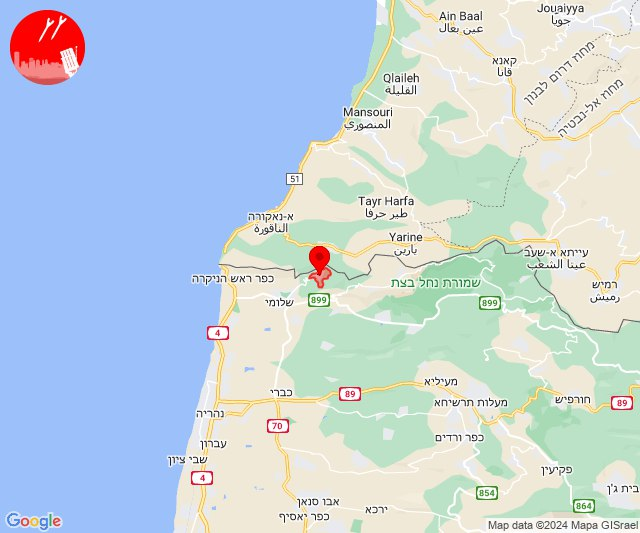
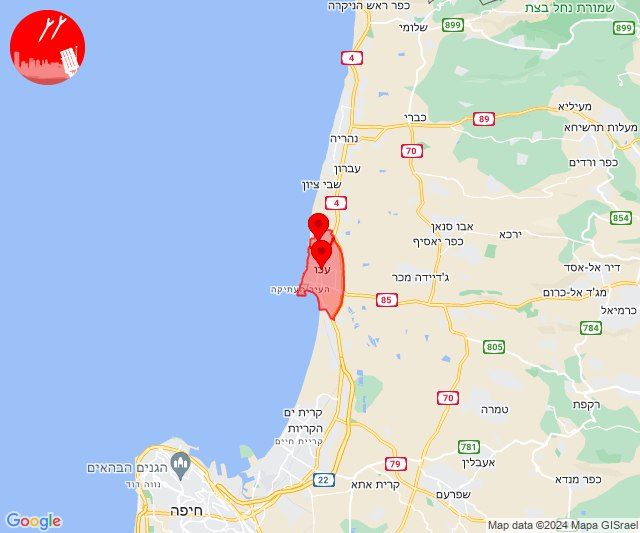
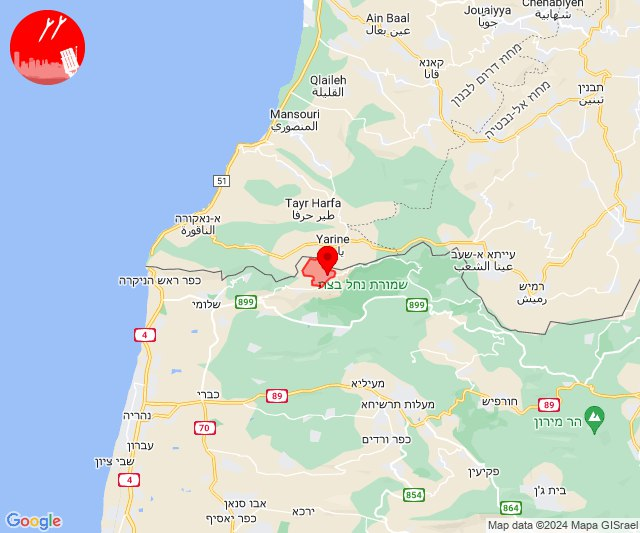

# Alerts for 2024-06-01

## 04:39

🔴 צבע אדום (01/06/2024):

07:39:
• קו העימות: יפתח, מרכז אזורי מבואות חרמון (מיידי)

צופר - צבע אדום

## 04:39

## 05:00

🔴 צבע אדום (01/06/2024):

08:00:
• קו העימות: משגב עם (מיידי)

צופר - צבע אדום

## 05:00

## 06:08

✈️ חדירת כלי טיס עוין (01/06/2024):

09:08:
• קו העימות: דישון, יפתח, מלכיה, מרכז אזורי מבואות חרמון, רמות נפתלי 

צופר - צבע אדום

## 06:08

## 06:12

✈️ חדירת כלי טיס עוין (01/06/2024):

09:11:
• קו העימות: בית הלל, מרגליות, כפר גלעדי, מנרה, מטולה, מלכיה, יפתח, רמות נפתלי, מרכז אזורי מבואות חרמון, מעיין ברוך, תל חי, כפר יובל, קריית שמונה, משגב עם, דישון 

09:12:
• קו העימות: בית הלל, כפר גלעדי, כפר יובל, מטולה, מנרה, מעיין ברוך, מרגליות, משגב עם, קריית שמונה, תל חי, דישון, יפתח, מלכיה, מרכז אזורי מבואות חרמון, רמות נפתלי 

צופר - צבע אדום

## 06:12

## 06:14

✈️ חדירת כלי טיס עוין (01/06/2024):

09:14:
• קו העימות: בית הלל, כפר גלעדי, כפר יובל, מטולה, מנרה, מעיין ברוך, מרגליות, משגב עם, קריית שמונה, תל חי, דישון, יפתח, מלכיה, מרכז אזורי מבואות חרמון, רמות נפתלי 

צופר - צבע אדום

## 06:14

## 06:23

✈️ חדירת כלי טיס עוין (01/06/2024):

09:23:
• קו העימות: מלכיה, יפתח, רמות נפתלי, מרכז אזורי מבואות חרמון, דישון 

צופר - צבע אדום

## 06:23

## 07:38

🔴 צבע אדום (01/06/2024):

10:38:
• קו העימות: נטועה, שתולה (מיידי)

צופר - צבע אדום

## 07:38

## 08:00

🔴 צבע אדום (01/06/2024):

11:00:
• קו העימות: קריית שמונה, תל חי (מיידי)

צופר - צבע אדום

## 08:00

## 12:33

✈️ חדירת כלי טיס עוין (01/06/2024):

15:33:
• קו העימות: בית הלל, כפר גלעדי, כפר יובל, מטולה, מנרה, מעיין ברוך, מרגליות, משגב עם, קריית שמונה, תל חי 

צופר - צבע אדום

## 12:33

## 15:52

🔴 צבע אדום (01/06/2024):

18:52:
• קו העימות: חניתה, אדמית (מיידי)

צופר - צבע אדום

## 15:52

## 16:21

🔴 צבע אדום (01/06/2024):

19:21:
• קו העימות: חניתה (מיידי)

צופר - צבע אדום

## 16:21

## 16:47

🔴 צבע אדום (01/06/2024):

19:47:
• גליל עליון: בוסתן הגליל, עכו (30 שניות)

צופר - צבע אדום

## 16:47

## 21:12

🔴 צבע אדום (02/06/2024):

00:12:
• קו העימות: ערב אל עראמשה (מיידי)

צופר - צבע אדום

## 21:12

