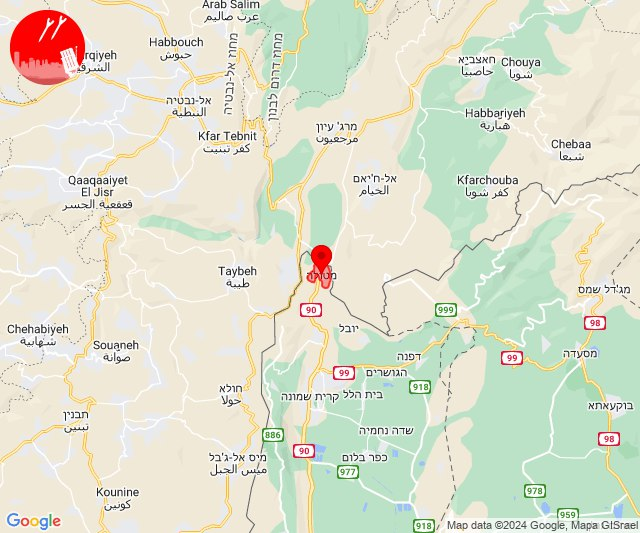

# Alerts for 2024-06-02

## 05:08

✈️ חדירת כלי טיס עוין (02/06/2024):

08:08:
• קו העימות: בית הלל, כפר גלעדי, כפר יובל, מטולה, מנרה, מעיין ברוך, מרגליות, משגב עם, קריית שמונה, תל חי, דפנה, הגושרים, ע'ג'ר, קיבוץ דן, שאר ישוב, שניר 

צופר - צבע אדום

## 05:08

## 05:11

✈️ חדירת כלי טיס עוין (02/06/2024):

08:10:
• קו העימות: גונן, כפר בלום, כפר סאלד, להבות הבשן, נאות מרדכי, עמיר, שדה נחמיה, שמיר 

08:11:
• צפון הגולן: קלע, שעל 

צופר - צבע אדום

## 05:11

## 05:14

✈️ חדירת כלי טיס עוין (02/06/2024):

08:14:
• צפון הגולן: שעל, קלע 
• קו העימות: להבות הבשן, גונן, שדה נחמיה, עמיר, כפר בלום, שמיר, כפר סאלד, נאות מרדכי 

צופר - צבע אדום

## 05:14

## 05:20

✈️ חדירת כלי טיס עוין (02/06/2024):

08:20:
• קו העימות: גונן, כפר בלום, כפר סאלד, להבות הבשן, נאות מרדכי, עמיר, שדה נחמיה, שמיר 
• צפון הגולן: קלע, שעל 

צופר - צבע אדום

## 05:20

## 05:22

✈️ חדירת כלי טיס עוין (02/06/2024):

08:22:
• דרום הגולן: קצרין, קדמת צבי, קצרין - אזור תעשייה 

צופר - צבע אדום

## 05:22

## 05:27

✈️ חדירת כלי טיס עוין (02/06/2024):

08:27:
• דרום הגולן: קצרין, קדמת צבי, קצרין - אזור תעשייה 

צופר - צבע אדום

## 05:27

## 08:03

🔴 צבע אדום (02/06/2024):

11:02:
• קו העימות: מרגליות (מיידי)

11:03:
• קו העימות: מרגליות (מיידי)

צופר - צבע אדום

## 08:03

## 11:49

🔴 צבע אדום (02/06/2024):

14:48:
• דרום הגולן: קצרין - אזור תעשייה (30 שניות)

14:49:
• דרום הגולן: קצרין (30 שניות)

צופר - צבע אדום

## 11:49

## 11:56

✈️ חדירת כלי טיס עוין (02/06/2024):

14:55:
• קו העימות: בן עמי, גשר הזיו, נהריה, סער, עברון 
• גליל עליון: שבי ציון, רגבה, לוחמי הגטאות, מזרעה 

14:56:
• קו העימות: בן עמי, גשר הזיו, נהריה, סער, עברון 
• גליל עליון: שבי ציון 

צופר - צבע אדום

## 11:56

## 11:58

✈️ חדירת כלי טיס עוין (02/06/2024):

14:58:
• גליל עליון: בוסתן הגליל, בית העמק, ג'דידה מכר, כפר מסריק, נס עמים, נתיב השיירה, עין המפרץ, עכו - אזור תעשייה, עכו, שומרת, שייח' דנון, לוחמי הגטאות, מזרעה, רגבה 

צופר - צבע אדום

## 11:58

## 11:58

🔴 צבע אדום (02/06/2024):

14:58:
• קו העימות: נהריה (15 שניות)

צופר - צבע אדום

## 11:58

## 12:02

✈️ חדירת כלי טיס עוין (02/06/2024):

15:02:
• גליל עליון: שבי ציון 
• קו העימות: בן עמי, סער, נהריה, גשר הזיו, עברון 

צופר - צבע אדום

## 12:02

## 13:09

🔴 צבע אדום (02/06/2024):

16:09:
• קו העימות: משגב עם, קריית שמונה, כפר גלעדי, תל חי, כפר יובל (מיידי)

צופר - צבע אדום

## 13:09

## 13:53

🔴 צבע אדום (02/06/2024):

16:52:
• קו העימות: קריית שמונה, מרגליות (מיידי)

16:53:
• קו העימות: קריית שמונה (מיידי)

צופר - צבע אדום

## 13:53

## 16:19

✈️ חדירת כלי טיס עוין (02/06/2024):

19:19:
• קו העימות: בן עמי, גשר הזיו, נהריה, סער, עברון 
• גליל עליון: שבי ציון 

צופר - צבע אדום

## 16:19

## 16:29

🔴 צבע אדום (02/06/2024):

19:29:
• קו העימות: שניר (מיידי)

צופר - צבע אדום

## 16:29

## 16:59

✈️ חדירת כלי טיס עוין (02/06/2024):

19:59:
• קו העימות: בן עמי, גשר הזיו, נהריה, סער, עברון, אזור תעשייה אכזיב מילואות, בצת, לימן, מצובה, ראש הנקרה, שלומי 
• גליל עליון: שבי ציון 

צופר - צבע אדום

## 16:59

## 16:59

🔴 צבע אדום (02/06/2024):

19:59:
• קו העימות: גשר הזיו, נהריה, סער, אזור תעשייה אכזיב מילואות (מיידי, 15 שניות)

צופר - צבע אדום

## 16:59

## 18:14

🔴 צבע אדום (02/06/2024):

21:14:
• קו העימות: מטולה (מיידי)

צופר - צבע אדום

## 18:14

