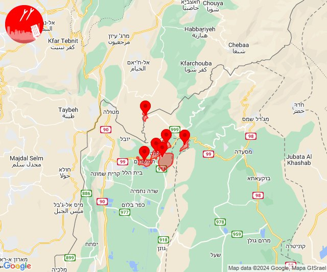
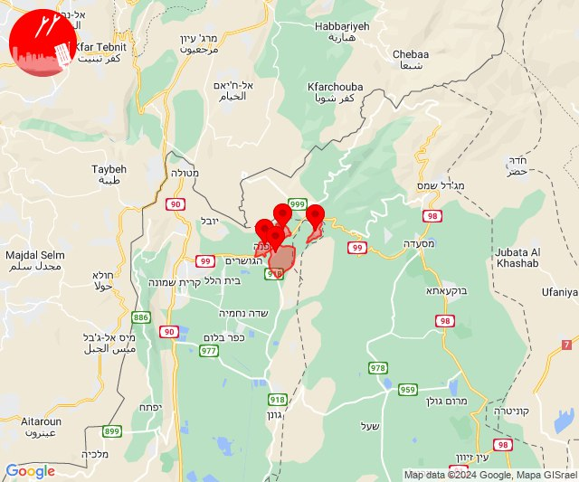
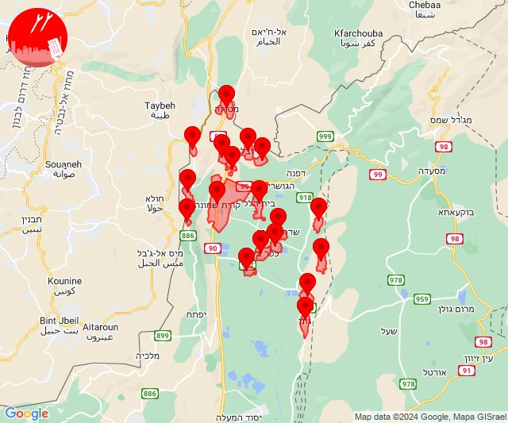
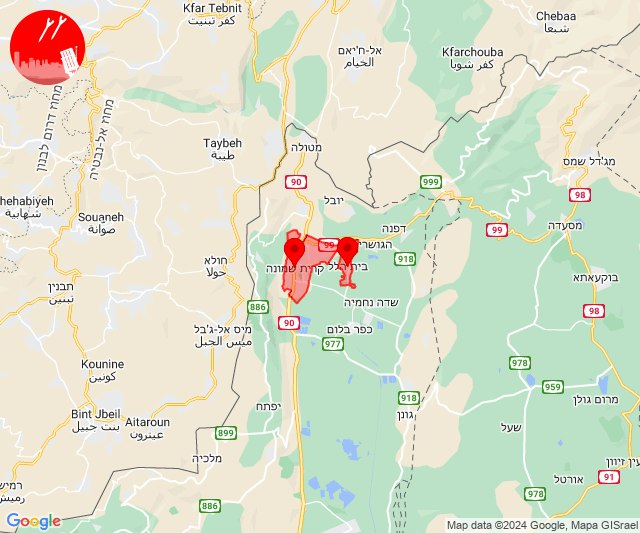
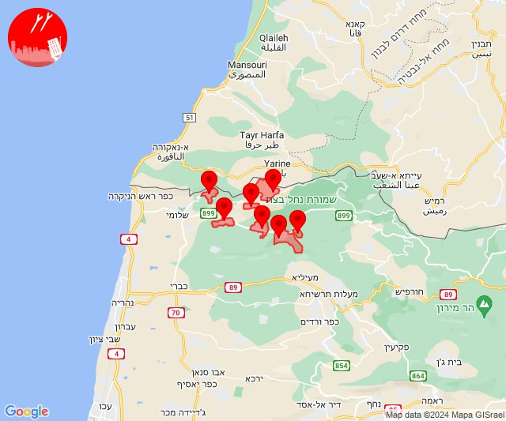
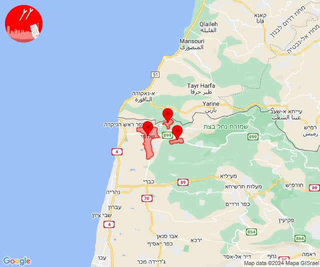
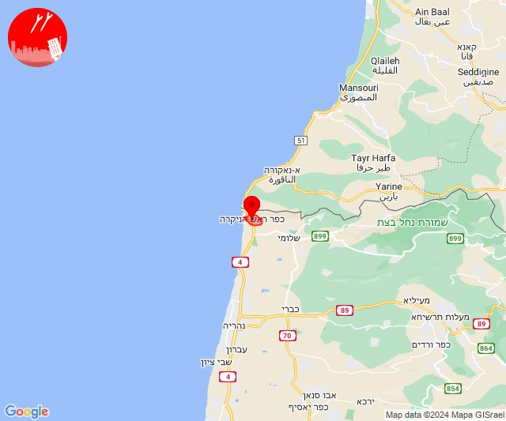
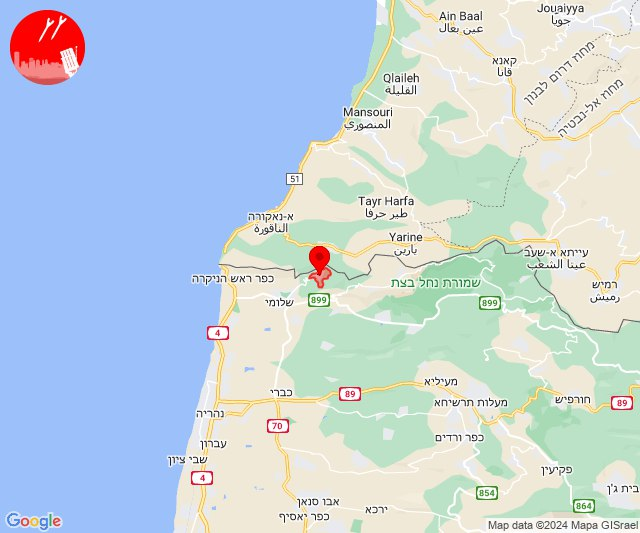
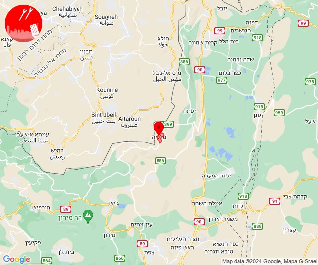

# Alerts for 2024-06-04

## 06:05

✈️ חדירת כלי טיס עוין (04/06/2024):

09:05:
• קו העימות: קיבוץ דן, ע'ג'ר, דפנה, הגושרים, שניר, שאר ישוב 

צופר - צבע אדום

## 06:05

## 06:07

✈️ חדירת כלי טיס עוין (04/06/2024):

09:07:
• קו העימות: קיבוץ דן, דפנה, שניר, שאר ישוב 

צופר - צבע אדום

## 06:07

## 06:09

✈️ חדירת כלי טיס עוין (04/06/2024):

09:08:
• קו העימות: נאות מרדכי, עמיר, כפר סאלד, שדה נחמיה, גונן, להבות הבשן, כפר בלום, שמיר 

09:09:
• קו העימות: מטולה, מעיין ברוך, מרגליות, משגב עם, בית הלל, מנרה, תל חי, קריית שמונה, כפר גלעדי, כפר יובל 

צופר - צבע אדום

## 06:09

## 06:12

🔴 צבע אדום (04/06/2024):

09:12:
• קו העימות: בית הלל, קריית שמונה (מיידי)

צופר - צבע אדום

## 06:12

## 06:14

✈️ חדירת כלי טיס עוין (04/06/2024):

09:14:
• קו העימות: דישון, יפתח, מלכיה, מרכז אזורי מבואות חרמון, רמות נפתלי 

צופר - צבע אדום

## 06:14

## 08:58

✈️ חדירת כלי טיס עוין (04/06/2024):

11:58:
• קו העימות: ערב אל עראמשה, יערה, חניתה, גורנות הגליל, אילון, גורן, אדמית 

צופר - צבע אדום

## 08:58

## 09:00

🔴 צבע אדום (04/06/2024):

12:00:
• קו העימות: שלומי, חניתה, יערה (מיידי)

צופר - צבע אדום

## 09:00

## 13:34

🔴 צבע אדום (04/06/2024):

16:34:
• קו העימות: ראש הנקרה (מיידי)

צופר - צבע אדום

## 13:34

## 15:34

🔴 צבע אדום (04/06/2024):

18:34:
• קו העימות: חניתה (מיידי)

צופר - צבע אדום

## 15:34

## 21:12

🔴 צבע אדום (05/06/2024):

00:12:
• קו העימות: מלכיה (מיידי)

צופר - צבע אדום

## 21:12

