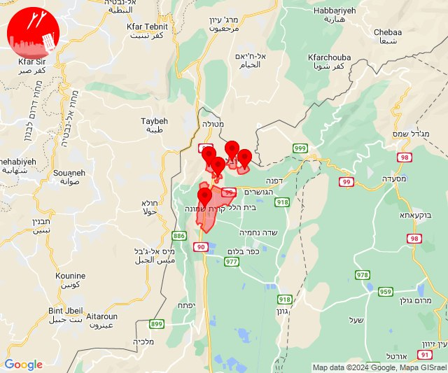

# Alerts for 2024-06-05

## 02:26

🔴 צבע אדום (05/06/2024):

05:26:
• עוטף עזה: נחל עוז (15 שניות)

צופר - צבע אדום

## 02:26

## 06:26

✈️ חדירת כלי טיס עוין (05/06/2024):

09:26:
• קו העימות: בית הלל, כפר גלעדי, כפר יובל, מטולה, מנרה, מעיין ברוך, מרגליות, משגב עם, קריית שמונה, תל חי, דישון, יפתח, מלכיה, מרכז אזורי מבואות חרמון, רמות נפתלי 

צופר - צבע אדום

## 06:26

## 07:51

✈️ חדירת כלי טיס עוין (05/06/2024):

10:51:
• קו העימות: בית הלל, כפר גלעדי, כפר יובל, מטולה, מנרה, מעיין ברוך, מרגליות, משגב עם, קריית שמונה, תל חי 

צופר - צבע אדום

## 07:51

## 07:51

🔴 צבע אדום (05/06/2024):

10:51:
• קו העימות: כפר גלעדי, כפר יובל, קריית שמונה, תל חי, מעיין ברוך (מיידי)

צופר - צבע אדום

## 07:51

## 07:55

✈️ חדירת כלי טיס עוין (05/06/2024):

10:55:
• קו העימות: מטולה, מעיין ברוך, מרגליות, משגב עם, בית הלל, מנרה, תל חי, קריית שמונה, כפר גלעדי, כפר יובל 

צופר - צבע אדום

## 07:55

## 07:57

🔴 צבע אדום (05/06/2024):

10:57:
• קו העימות: משגב עם (מיידי)

צופר - צבע אדום

## 07:57

## 07:59

🔴 צבע אדום (05/06/2024):

10:59:
• קו העימות: מרגליות (מיידי)

צופר - צבע אדום

## 07:59

## 10:36

🔴 צבע אדום (05/06/2024):

13:36:
• קו העימות: יפתח, מרכז אזורי מבואות חרמון, רמות נפתלי (מיידי)

צופר - צבע אדום

## 10:36

## 14:52

🔴 צבע אדום (05/06/2024):

17:52:
• קו העימות: ברעם (מיידי)

צופר - צבע אדום

## 14:52

## 17:52

🔴 צבע אדום (05/06/2024):

20:52:
• קו העימות: ערב אל עראמשה (מיידי)

צופר - צבע אדום

## 17:52

## 22:05

🔴 צבע אדום (06/06/2024):

01:05:
• קו העימות: מטולה (מיידי)

צופר - צבע אדום

## 22:05

