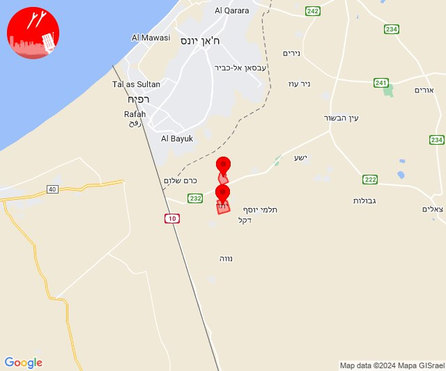

# Alerts for 2024-06-06

## 08:30

🔴 צבע אדום (06/06/2024):

11:30:
• עוטף עזה: יתד, חולית (15 שניות)

צופר - צבע אדום

## 08:30

## 09:02

🔴 צבע אדום (06/06/2024):

12:01:
• עוטף עזה: אבשלום, יבול, יתד (15 שניות)

צופר - צבע אדום

## 09:02

## 16:34

✈️ חדירת כלי טיס עוין (06/06/2024):

19:34:
• קו העימות: בית הלל, כפר גלעדי, כפר יובל, מטולה, מנרה, מעיין ברוך, מרגליות, משגב עם, קריית שמונה, תל חי 

צופר - צבע אדום

## 16:34

## 16:34

🔴 צבע אדום (06/06/2024):

19:34:
• קו העימות: קריית שמונה (מיידי)

צופר - צבע אדום

## 16:34

## 17:07

✈️ חדירת כלי טיס עוין (06/06/2024):

20:07:
• קו העימות: מעלות תרשיחא, יערה, חוסן, גורנות הגליל, אילון, אדמית, ערב אל עראמשה, כפר ורדים, חניתה, מעונה, הילה, גורן, מעיליא 

צופר - צבע אדום

## 17:07

## 18:28

🔴 צבע אדום (06/06/2024):

21:28:
• קו העימות: בית הלל, מעיין ברוך, הגושרים (מיידי)

צופר - צבע אדום

## 18:28

## 19:55

🔴 צבע אדום (06/06/2024):

22:55:
• קו העימות: זרעית (מיידי)

צופר - צבע אדום

## 19:56

