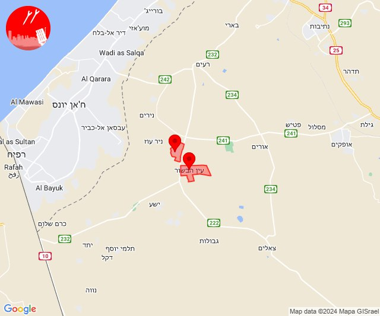
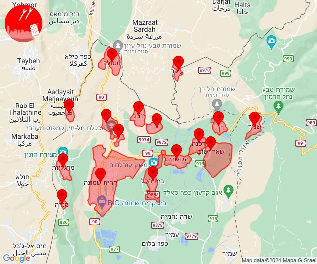
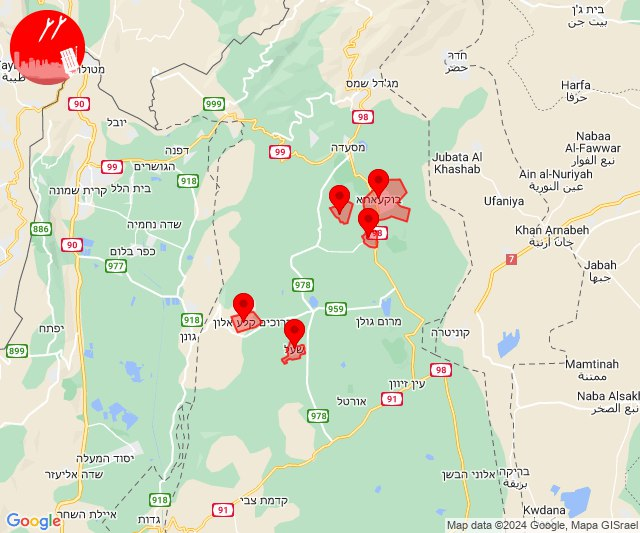
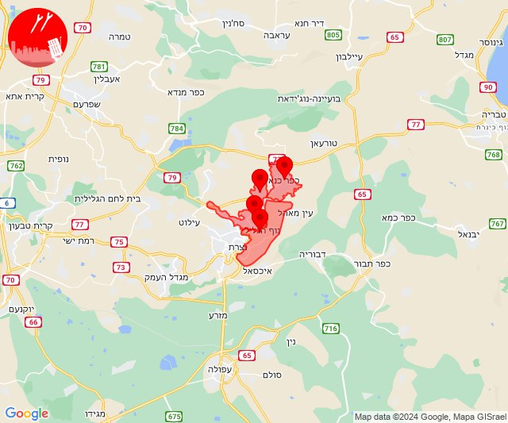
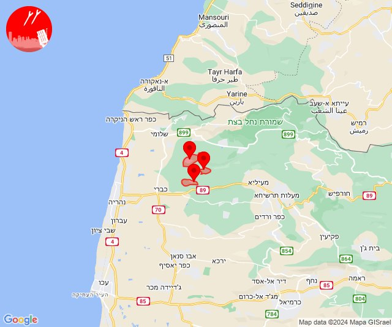
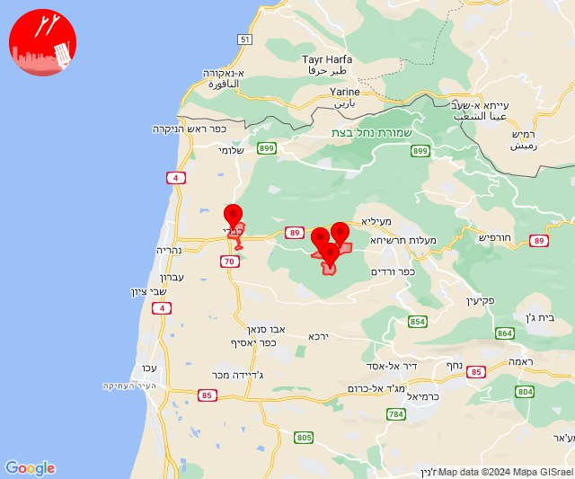
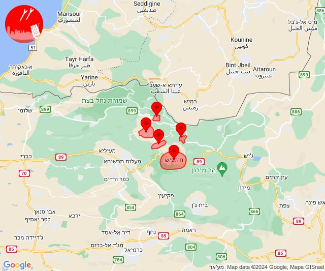
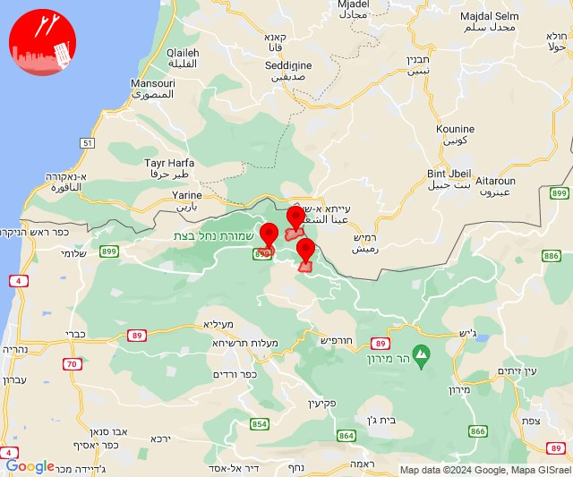

# Alerts for 2024-06-07

## 07:19

🔴 צבע אדום (07/06/2024):

10:19:
• עוטף עזה: מגן, עין הבשור (15 שניות)

צופר - צבע אדום

## 07:19

## 09:59

✈️ חדירת כלי טיס עוין (07/06/2024):

12:59:
• קו העימות: מטולה, מעיין ברוך, דפנה, תל חי, שניר, קיבוץ דן, שאר ישוב, ע'ג'ר, מרגליות, משגב עם, בית הלל, מנרה, קריית שמונה, הגושרים, כפר גלעדי, כפר יובל 

צופר - צבע אדום

## 09:59

## 10:35

✈️ חדירת כלי טיס עוין (07/06/2024):

13:35:
• צפון הגולן: נווה אטי''ב, עין קנייא, נמרוד, מסעדה, מג'דל שמס 

צופר - צבע אדום

## 10:35

## 10:39

✈️ חדירת כלי טיס עוין (07/06/2024):

13:39:
• צפון הגולן: קלע, שעל, אודם, אל רום, בוקעתא 

צופר - צבע אדום

## 10:39

## 11:24

🔴 צבע אדום (07/06/2024):

14:24:
• העמקים: כפר כנא, משהד, נוף הגליל, ריינה (דקה)

צופר - צבע אדום

## 11:24

## 17:10

✈️ חדירת כלי טיס עוין (07/06/2024):

20:10:
• קו העימות: עבדון, מנות, נווה זיו 

צופר - צבע אדום

## 17:10

## 17:13

✈️ חדירת כלי טיס עוין (07/06/2024):

20:13:
• קו העימות: יחיעם, עין יעקב, כברי, געתון 

צופר - צבע אדום

## 17:13

## 17:34

🔴 צבע אדום (07/06/2024):

20:34:
• קו העימות: חורפיש, אלקוש, מתת, נטועה, פסוטה (מיידי)

צופר - צבע אדום

## 17:34

## 22:13

🔴 צבע אדום (08/06/2024):

01:13:
• קו העימות: נטועה, אבן מנחם, שתולה (מיידי)

צופר - צבע אדום

## 22:13

